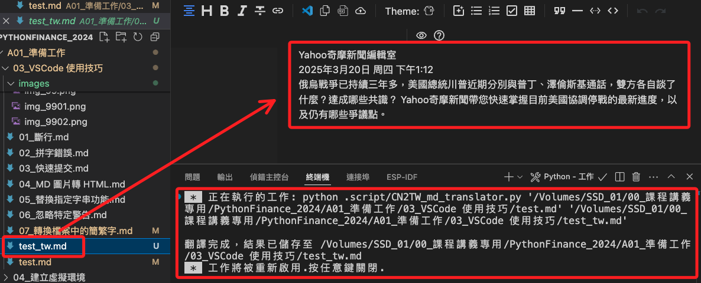

# 簡繁轉換操作指引

_建立腳本 `CN2TW_md_translator.py` 將 `.md` 文件中的 `簡體中文` 轉換為 `繁體中文`，並保持英文與程式碼內容不變。_

<br>

## 編寫腳本

_此腳本可用於快速進行 Markdown 文件的簡繁轉換。_

<br>

1. 安裝 `zhconv` 以支援簡繁轉換。

    ```bash
    pip install zhconv
    ```

<br>

2. 在專案根目錄中的 `.script` 資料夾內建立一個腳本命名為 `CN2TW_md_translator.py`，並使用以下代碼。

    ```python
    import sys
    import zhconv
    import re

    def simplify_to_traditional(text):
        # 將簡體中文轉換為繁體中文
        return zhconv.convert(text, 'zh-tw')

    def is_chinese(text):
        # 檢查字串是否包含中文
        return bool(re.search(r'[\u4e00-\u9fff]', text))

    def translate_md_file(input_file, output_file):
        # 讀取 `.md` 文件，將簡體轉換為繁體，並保持英文與程式碼不變
        with open(input_file, 'r', encoding='utf-8') as file:
            content = file.readlines()

        translated_lines = []
        # 用於標記是否在程式碼區塊內
        code_block = False

        for line in content:
            # 檢查是否進入或退出程式碼區塊 (```)
            if line.strip().startswith("```"):
                code_block = not code_block
                translated_lines.append(line)
                continue

            if code_block:
                # 在程式碼區塊內，但仍然轉換包含中文的部分
                translated_line = re.sub(r'([\u4e00-\u9fff]+)', lambda m: simplify_to_traditional(m.group(0)), line)
            else:
                # 非程式碼區塊，完全轉換
                translated_line = simplify_to_traditional(line)

            translated_lines.append(translated_line)

        # 寫入新的繁體中文 .md 文件
        with open(output_file, 'w', encoding='utf-8') as file:
            file.writelines(translated_lines)

        print(f"翻譯完成，結果已儲存至 {output_file}")

    if __name__ == "__main__":
        if len(sys.argv) != 3:
            print(
                "使用方式: "
                "python CN2TW_md_translator.py <輸入文件.md> "
                "<輸出文件.md>"
            )
            sys.exit(1)

        input_md = sys.argv[1]
        output_md = sys.argv[2]
        translate_md_file(input_md, output_md)
    ```

<br>

## 直接運行

1. 使用以下指令執行腳本進行轉換，`input.md` 是原始內含簡體中文的 `Markdown` 文件，`output.md` 是轉換後的繁體中文 `Markdown` 文件。

    ```bash
    python CN2TW_md_translator.py input.md output.md
    ```

<br>

## 建立快速鍵

_在 VSCode 中設置快捷鍵，以便快速執行轉換腳本。_

<br>

1. 進入 `.vscode` 目錄並編輯 `tasks.json` 文件新增以下內容；其中 `${file}` 是開啟當前的 `.md ` 文件，也就是要轉換的簡體版本文件，`"command": "python"` 會讓 VSCode 執行 `CN2TW_md_translator.py`；`${fileDirname}/${fileBasenameNoExtension}_tw.md` 會將轉換後的繁體 `.md 文件` 添加後綴儲存。

    ```json
    {
        "version": "2.0.0",
        "tasks": [
            {
                // 簡體轉繁體
                "label": "Translate Current Markdown (CN → TW)",
                "type": "shell",
                "command": "python",
                "args": [
                    ".script/CN2TW_md_translator.py",
                    "${file}",
                    "${fileDirname}/${fileBasenameNoExtension}_tw.md"
                ],
                "presentation": {
                    "reveal": "always",
                    "panel": "shared"
                },
                "problemMatcher": []
            }
        ]
    }
    ```

<br>

## 建立組合鍵

1. 使用組合鍵 `SHIFT + COMMAND + P` 開啟 `命令選擇區`，輸入關鍵字 `keyboard` 並選擇 `Open Keyboard Shortcuts`，VSCode 會開啟 `keybinding.json` 文件。

    

<br>

2. 編輯設定文件，在列表 `[]` 中添加以下 SJON 內容。

    ```json
    // 轉換簡繁
    {
        // 自定義快捷鍵
        "key": "shift+ctrl+cmd+t",
        "command": "workbench.action.tasks.runTask",
        // 任務名稱，必須與 `tasks.json` 中的 "label" 對應
        "args": "Translate Current Markdown (CN → TW)",
        // 可設定激活條件
        "when": "editorTextFocus"
    }
    ```

<br>

## 測試

1. 開啟任何具有簡體中文的 `md` 文件。

    ```txt
    Yahoo奇摩新闻编辑室
    2025年3月20日 周四 下午1:12
    俄乌战争已持续三年多，美国总统川普近期分别与普丁、泽伦斯基通话，双方各自谈了什么？达成哪些共识？ Yahoo奇摩新闻带您快速掌握目前美国协调停战的最新进度，以及仍有哪些争议点。
    ```

<br>

2. 使用快速鍵 `shift+ctrl+cmd+t`。

    

<br>

___

_END_

