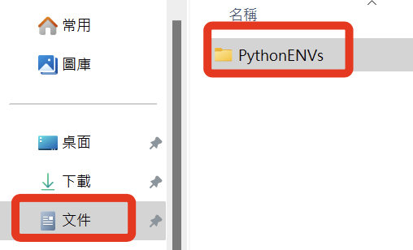
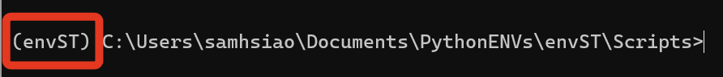
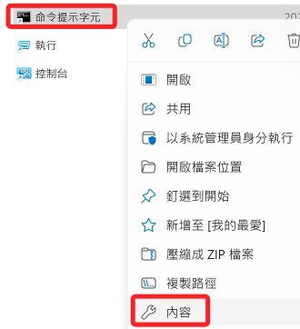
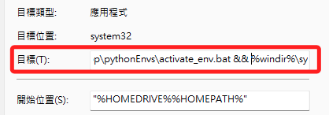
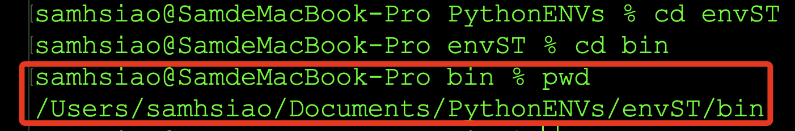

# 開機啟動虛擬環境

_以下分別針對 Windows 及 MacOS 進行說明_

<br>

## Windows

<br>

### 步驟

1. 建立虛擬環境統一管理資料夾，這裡示範位置在 `文件` 中建立 `PythonENVs`。

    

<br>

2. 進入資料夾，並使用以下指令建立虛擬環境。

    ```bash
    python -m venv envST
    ```

<br>

3. 在 Windows 系統中，命令行會顯示路徑，所以無需特別查詢，而啟動檔案 `activate` 在資料夾中的子資料夾 `Scripts` 之中，在 MacOS 系統則是 `bin`，以相對路徑或絕對路徑運行腳本 `activate` 即可啟動虛擬環境。

    

<br>

4. 接著使用指令 `cd ..` 退回到虛擬環境管理資料夾 `PythonENVs` 中，建立一個 `批次處理檔案`，命名為 `activate_env.bat`。

    ```bash
    echo > activate_env.bat
    ```

<br>

5. 編輯內容。

    ```ini
    @echo off
    call "<虛擬環境路徑>\Scripts\activate"
    ```

<br>

5. 在終端機圖標上點擊右鍵選取 `開啟檔案位置`。

     

<br>

5. 在捷徑上點擊右鍵選取 `內容`。

    

<br>

6. 複製批次檔檔案的路徑。

    

<br>

7. 在 `目標` 的指令前面加上批次腳本路徑，有無引號 `"` 皆可，並以 `&&` 串接原本的指令， `&&` 前後都要空格。

    

<br>

8. 再次啟動命令提示字元就會啟動預設的虛擬環境。

    

<br>

## MacOS

<br>

### 步驟

1. 建立管理資料夾、建立虛擬環境等基本步驟都相同。

<br>

2. 進入指定虛擬環境資料夾內的子資料夾 `bin`，透過 `pwd` 指令輸出當前絕對路徑。

    

<br>

3. 使用指令開啟設定文件，需輸入密碼。

    ```bash
    sudo nano ~/.zshrc
    ```

<br>

4. 在最後面輸入以下語句。

    ```bash
    source /Users/samhsiao/Documents/PythonENVs/envST/bin/activate
    ```

<br>

5. 退出後執行以下指令就會啟動虛擬環境，以後啟動終端機也會啟動預設的虛擬環境。

    ```bash
    source ~/.zshrc
    ```

<br>

---

_END_