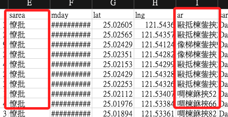
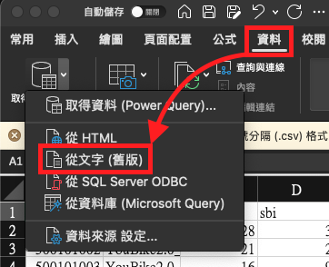
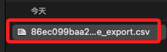
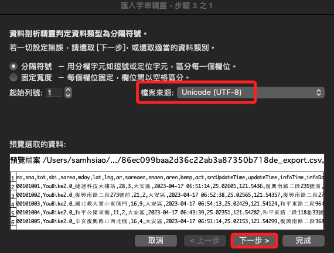
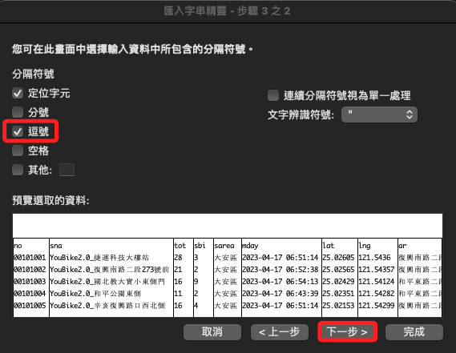
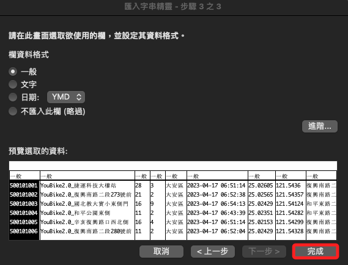
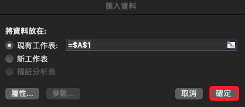
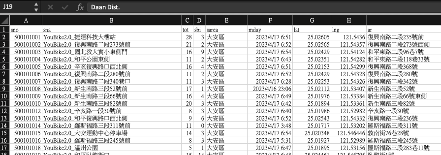

# CSV 亂碼

 

## 說明

1. 使用 Excel 直接開啟網路取得的 `.csv` 檔案時出現亂碼。

    

 

2. 開啟 Excel，點擊 `資料` 後選擇 `從文字`

    

 

3. 選擇下載的檔案。

    

 

4. 選取檔案來源 `UTF-8`，然後下一步。

    

 

5. 選取 `逗號`，然後下一步。

    

 

6. 點擊 `完成` 即可。

    

 

7. 點擊 `確定` 即可。
    
    

 

8. 轉換完成。
    
    

 

---

_END_