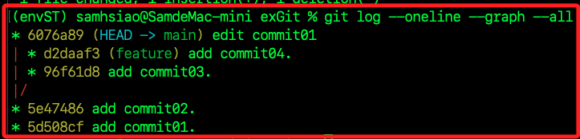
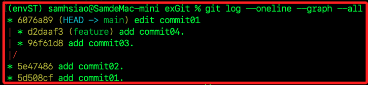

# rebase 變基

_進階的合併分支方法與互動模式，參考 [這篇文章](https://awdr74100.github.io/2020-05-04-git-rebase/) 彙整如下。_

<br>

## 說明

1. 一般的 `merge` 方法就是將兩個分支進行合併，而 `rebase` 可在沒有新建提交的狀況下進行合併。

<br>

2. 所謂的 `提交` 就是 `commit`，也就是將更改紀錄到 Git 倉庫的歷史中的動作，如此 Git 便能追蹤並管理文件的變更歷史，每個 `commit` 都會建立一個歷史紀錄點，如此便可在任何時候回到指定的 `紀錄點` 來查看或恢復文件狀態。

<br>

3. 每個 `commit` 都會被賦予一個唯一識別碼，通常會是一個哈希值，這個過程起因於修改，然後透過 `git add` 指令將修改加入暫存區 `stage`，最後透過 `git commit` 指令將暫存區做正式提交到 Git 倉庫。

<br>

## non-fast-forward

_建立倉庫並進行兩次提交_

1. 建立並進入專案，請自行選擇建立的位置，如 `桌面` 或 `文件`。

    ```bash
    cd ~/Desktop
    mkdir exGit && cd exGit
    ```

<br>

2. 初始化。

    ```bash
    git init
    ```

<br>

3. 建立文件、編輯內容。

    ```bash
    touch commit01.md && echo "commit01" > commit01.md
    ```

<br>

4. 將文件加入暫存區並提交。

    ```bash
    git add . && git commit -m 'add commit01.'
    ```

<br>

5. 重複上述步驟，建立檔案、加入暫存、建立提交。

    ```bash
    touch commit02.md && echo "commit02" > commit02.md
    git add .
    git commit -m 'add commit02.'
    ```

<br>

6. 建立分支 `feature`。

    ```bash
    git checkout -b feature
    ```

<br>

7. 重複兩次之前步驟， 新增檔案、編輯內容、加入暫存、提交兩次歷史提交紀錄。

    ```bash
    touch commit03.md
    git add .
    git commit -m 'add commit03.'
    touch commit04.md
    git add .
    git commit -m 'add commit04.'
    ```

<br>

8. 回到 main 分支並提交一個紀錄。

    ```bash
    git checkout main
    echo " edit commit01.md" > commit01.md
    git commit -am 'edit commit01'
    ```

<br>

9. 執行以下指令觀察 `git merge`。

    ```bash
    git log --oneline --graph --all
    ```

<br>

10. 結果如下，這時會採用 `non-fast-forward` 合併分支，並生成一個全新的 `commit` 節點。

    

<br>

## rebase feature

1. 執行以下指令，使用 `main` 合併 `feature`。

    ```bash
    git rebase feature
    ```

    

<br>

2. 觀察。

    ```bash
    git log --oneline --graph --all
    ```

    

<br>

3. 可知 `feature` 分支的路線不見了，合併的同時整合了 `commit` 紀錄，`main` 分支對 `feature` 分支進行了 Rebase，也就是重新定義 `main` 分支的參考基準為 `feature`。

<br>

## rebase main

1. 先回復，這裡使用 `ORIG_HEAD` 是因為 `rebase` 對於 `Git` 來說會改變原有的 commit 紀錄，所以 _屬於危險操作_ ，這類操作可使用 `ORIG_HEAD`，這是存放於路徑 `/.git/ORIG_HEAD` 裡的危險操作 `SHA-1`，所以可使用 `ORIG_HEAD` 回復到操作前的 `SHA-1`。

    ```bash
    git reset ORIG_HEAD --hard
    ```

    

<br>

2. 觀察。

    ```bash
    git log --oneline --graph --all
    ```

    

<br>

3. 切換到 `feature`，並使用 `feature` 合併 `main`。

    ```bash
    git checkout feature
    git rebase main
    ```

    

<br>

4. 再觀察一次。

    ```bash
    git log --oneline --graph --all
    ```

    

<br>

5. 由以上的操作可看出，使用 `git rebase` 的路線圖變得簡單很多，也可以保持線路圖的一致性。

<br>

___

_END_