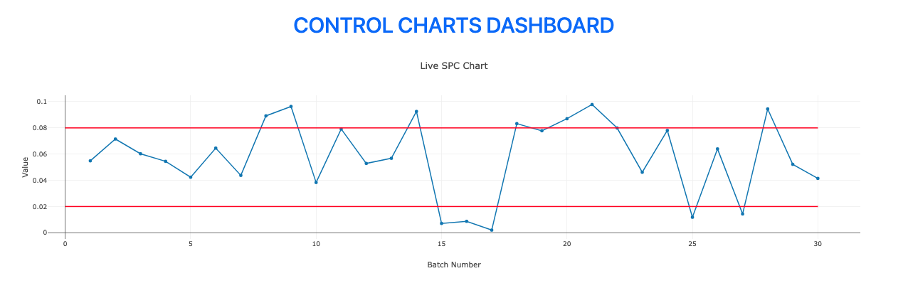
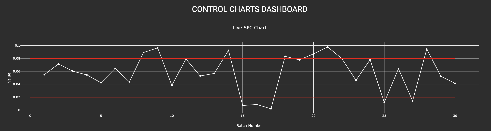

# 專案說明

_03_


<br>

## 範例

1. 網頁效果圖。

    _白色模式_
    

    _暗黑模式_
    

<br>

2. 完整程式碼：白色模式。

    ```python
    import dash
    from dash import dcc, html
    import dash_bootstrap_components as dbc
    import plotly.graph_objs as go
    import numpy as np


    # 模擬數據生成
    np.random.seed(0)
    batch_numbers = np.arange(1, 31)
    control_chart_data = np.random.rand(30) * 0.1
    control_chart_limits = [0.08, 0.02]

    # 建立 Dash 應用
    app = dash.Dash(__name__, external_stylesheets=[dbc.themes.BOOTSTRAP])

    # 應用佈局
    app.layout = dbc.Container(
        fluid=True,
        children=[
            dbc.Row(
                dbc.Col(
                    html.H1(
                        "CONTROL CHARTS DASHBOARD",
                        className="text-center text-primary mt-4",
                    ),
                    width=12,
                )
            ),
            dbc.Row(
                [
                    dbc.Col(
                        dcc.Graph(
                            id="process-control-chart",
                            figure={
                                "data": [
                                    go.Scatter(
                                        x=batch_numbers,
                                        y=control_chart_data,
                                        mode="lines+markers",
                                    )
                                ],
                                "layout": go.Layout(
                                    title="Live SPC Chart",
                                    xaxis={"title": "Batch Number"},
                                    yaxis={"title": "Value"},
                                    shapes=[
                                        {
                                            "type": "line",
                                            "y0": control_chart_limits[0],
                                            "y1": control_chart_limits[0],
                                            "x0": 0,
                                            "x1": batch_numbers[-1],
                                            "line": {"color": "red", "width": 2},
                                        },
                                        {
                                            "type": "line",
                                            "y0": control_chart_limits[1],
                                            "y1": control_chart_limits[1],
                                            "x0": 0,
                                            "x1": batch_numbers[-1],
                                            "line": {"color": "red", "width": 2},
                                        },
                                    ],
                                ),
                            },
                        ),
                        width=12,
                    )
                ]
            ),
        ],
    )

    if __name__ == "__main__":
        app.run_server(debug=True)

    ```

<br>

3. 完整程式碼：黑色模式。

    ```python
    import dash
    from dash import dcc, html
    import dash_bootstrap_components as dbc
    import plotly.graph_objs as go
    import numpy as np

    # 模擬數據生成
    np.random.seed(0)
    batch_numbers = np.arange(1, 31)
    control_chart_data = np.random.rand(30) * 0.1
    control_chart_limits = [0.08, 0.02]

    # 建立 Dash 應用，使用 CYBORG 主题
    app = dash.Dash(__name__, external_stylesheets=[dbc.themes.CYBORG])

    # 圖表樣式
    chart_layout = go.Layout(
        title="Live SPC Chart",
        xaxis={"title": "Batch Number"},
        yaxis={"title": "Value"},
        # 設定圖表的背景顏色為透明
        paper_bgcolor="rgba(0,0,0,0)",
        # 設定圖表內部的背景顏色為透明
        plot_bgcolor="rgba(0,0,0,0)",
        # 設定字體顏色為白色
        font=dict(color="white"),
        shapes=[
            {
                "type": "line",
                "y0": control_chart_limits[0],
                "y1": control_chart_limits[0],
                "x0": 0,
                "x1": batch_numbers[-1],
                "line": {"color": "red", "width": 2},
            },
            {
                "type": "line",
                "y0": control_chart_limits[1],
                "y1": control_chart_limits[1],
                "x0": 0,
                "x1": batch_numbers[-1],
                "line": {"color": "red", "width": 2},
            },
        ],
    )

    # 應用佈局
    app.layout = dbc.Container(
        fluid=True,
        children=[
            dbc.Row(
                dbc.Col(
                    html.H1(
                        "CONTROL CHARTS DASHBOARD",
                        className="text-center mt-4",
                        style={"fontSize": "30px", "color": "white"},
                    ),
                    width=12,
                )
            ),
            dbc.Row(
                [
                    dbc.Col(
                        dcc.Graph(
                            id="process-control-chart",
                            figure={
                                "data": [
                                    go.Scatter(
                                        x=batch_numbers,
                                        y=control_chart_data,
                                        mode="lines+markers",
                                        # 設定折線圖顏色為白色
                                        line=dict(color="white"),
                                    )
                                ],
                                "layout": chart_layout,
                            },
                        ),
                        width=12,
                    )
                ]
            ),
        ],
        # 設定整個頁面的背景顏色為深色
        style={"backgroundColor": "#333"},
    )

    if __name__ == "__main__":
        app.run_server(debug=True)

    ```

<br>

---

_END_