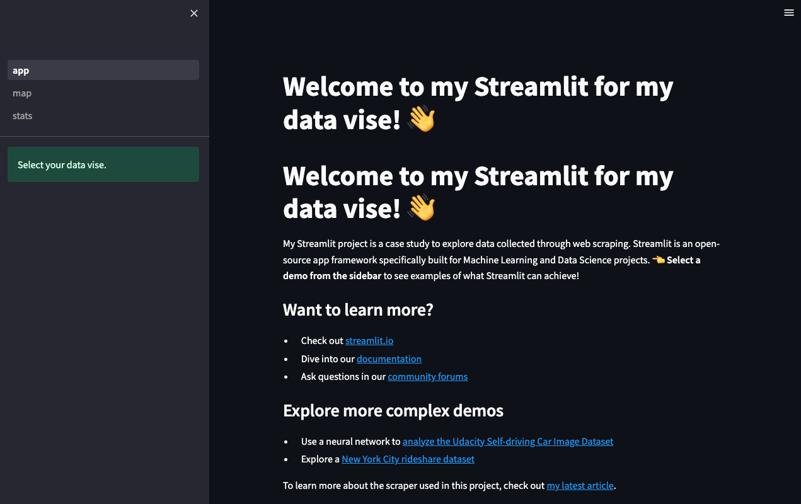
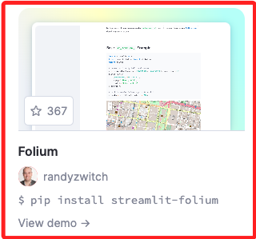

# 簡易版

<br>

## 說明

1. 參考 [文章](https://medium.com/@hmufraggi/exploring-data-with-streamlit-in-python-89d4ea637c03)，以下步驟基於該內容彙整。

    

<br>

2. 針對 `Streamlit` 要建立專用的虛擬環境以利套件管理，建立好虛擬環境後，安裝套件。

    ```bash
    python -m pip install streamlit
    ```

<br>

3. 建立專案所需資料夾與文件。

    ```bash
    # 建立並進入專案資料夾
    mkdir earthquakesInfo && cd earthquakesInfo
    # 建立文件
    touch home.py
    # 建立分頁資料夾與文件
    mkdir pages && touch pages/stats.py && touch pages/map.py
    ```

<br>

4. 編輯 `app.py`，以下內容複製教程內容，可自行修改。

    ```python
    import streamlit as st

    st.set_page_config(page_title="Home immo data vise", page_icon="🏠")

    st.write("# Welcome to my Streamlit for my data vise! 👋")
    st.write("# Welcome to my Streamlit for my data vise! 👋")

    st.sidebar.success("Select your data vise.")

    article_url = "https://medium.com/p/09d9a643a27f"
    st.markdown(
        f"""
        My Streamlit project is a case study to explore data collected through web scraping. Streamlit is an open-source app framework specifically built for Machine Learning and Data Science projects. **👈 Select a demo from the sidebar** to see examples of what Streamlit can achieve!

        ### Want to learn more?
        - Check out [streamlit.io](https://streamlit.io)
        - Dive into our [documentation](https://docs.streamlit.io)
        - Ask questions in our [community forums](https://discuss.streamlit.io)

        ### Explore more complex demos
        - Use a neural network to [analyze the Udacity Self-driving Car Image Dataset](https://github.com/streamlit/demo-self-driving)
        - Explore a [New York City rideshare dataset](https://github.com/streamlit/demo-uber-nyc-pickups)

        To learn more about the scraper used in this project, check out [my latest article]({article_url}).
        """
    )
    ```

<br>

5. 可嘗試運行。

    ```bash
    streamlit run app.py
    ```

<br>

6. 顯示以下畫面。

    

<br>

7. Streamlit 擁有一個由社群開發維護的 [元件庫](https://streamlit.io/components)，這個範例使用了其中的 `folium`，同時可以參考其 [說明文件](https://folium.streamlit.app/) 或 [專案範例](https://github.com/randyzwitch/streamlit-folium)。

    

<br>

_未完待續_