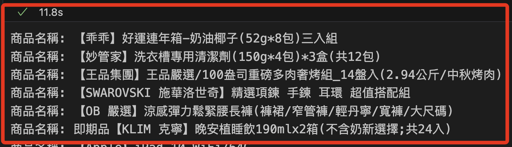

# Playwright

_爬取動態網頁_

<br>

## 說明

1. `Playwright` 是一個自動化瀏覽器工具，可用來模擬人類使用瀏覽器的行為，並處理 `JavaScript` 生成的 `動態內容`，它支持多個瀏覽器引擎如 `Chromium、Firefox、WebKit`，相較於 `Selenium`，`Playwright` 更快、更現代。

<br>

2. 安裝 Playwright。

    ```bash
    pip install playwright
    ```

<br>

3. 下載必要的瀏覽器。

    ```bash
    playwright install
    ```

<br>

## 範例

_使用 Playwright 爬取 momo 購物網首頁中 `口碑推薦` 的商品標題_

<br>


1. 程式碼，使用 Playwright 自動打開 momo 購物網，模擬瀏覽器行為，並使用 BeautifulSoup 來解析網頁內容。

<br>

2. Playwright 分為同步 API 和 異步 API 兩種，以下代碼要使用 `python` 指令在終端機中運行，在 `Jupyter Notebook` 中運行會報錯。

    ```python
    from playwright.sync_api import sync_playwright
    from bs4 import BeautifulSoup

    # 啟動 Playwright
    with sync_playwright() as p:
        # 使用 Chromium 瀏覽器引擎
        # headless=True 表示無頭瀏覽器，不會顯示 UI
        browser = p.chromium.launch(headless=False)
        page = browser.new_page()

        # 打開 momo 購物網首頁
        page.goto("https://www.momoshop.com.tw/main/Main.jsp")

        # 等待頁面完全加載，確保動態內容載入完成
        page.wait_for_load_state('networkidle')

        # 取得頁面的 HTML 內容
        content = page.content()

        # 使用 BeautifulSoup 解析頁面內容
        soup = BeautifulSoup(content, 'html.parser')

        # 提取商品標題
        # 口碑推薦商品的 class 為 `prdName`
        titles = soup.select('.prdName')

        # 輸出標題
        for title in titles:
            print("商品名稱:", title.get_text())

        # 關閉瀏覽器
        browser.close()
    ```

<br>

3. 在 `Jupyter Notebook` 中不能使用 `asyncio.run()` 來啟動 `非同步` 代碼，需要使用 `await` 直接執行 `非同步` 函數，修改如下。

    ```python
    import asyncio
    from playwright.async_api import async_playwright
    from bs4 import BeautifulSoup

    async def run():
        # 啟動 Playwright
        async with async_playwright() as p:
            # 使用 Chromium 瀏覽器引擎
            # headless=True 表示無頭瀏覽器
            browser = await p.chromium.launch(headless=False)
            page = await browser.new_page()

            # 打開 momo 購物網首頁
            await page.goto("https://www.momoshop.com.tw/main/Main.jsp")

            # 等待頁面完全加載
            await page.wait_for_load_state('networkidle')

            # 取得頁面的 HTML 內容
            content = await page.content()

            # 使用 BeautifulSoup 解析頁面內容
            soup = BeautifulSoup(content, 'html.parser')

            # 提取商品標題
            # 可根據需求進行調整
            titles = soup.select('.prdName')

            # 輸出標題
            for title in titles:
                print("商品名稱:", title.get_text())

            # 關閉瀏覽器
            await browser.close()

    # 如果是在 Jupyter Notebook 或其他運行事件循環的環境中
    # 直接使用 await 而不是 asyncio.run()
    await run()
    ```

    _輸出：得到相同結果_

    

<br>

___

_END_