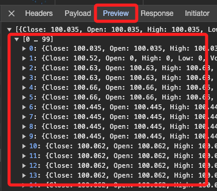

# Markets Insider

US02209SBE28

## 說明

這個講義要從這個網站得到的資訊是歷史交易紀錄，這裡先以 `US02209SBE28` 為例。

## 搜尋所需的封包

1. [官網](https://markets.businessinsider.com/)。

搜尋

會有一個圖表，以下就是要來取得這張圖表中的歷史紀錄

開啟檢視 `F12`

點擊 `Network` 然後切換到 `Fetch/XHR`

在 `Name` 欄位內任意選取一個項目，然後右邊切換到 `Respopnse`

在這個步驟需要逐一人工檢查，然後會在 `` 的項目下看到所需的歷史交易紀錄，也是網頁中用來繪製圖表的數據。

也可以直接點擊

會在瀏覽器中展開這個資料

可以點擊 `Preview` 來展開資料查看，至此已經找到所需的封包。

切換到 `Headers`，在 `Request URL` 的部分，使用的方法是 `GET`，這些都是重要的資訊，後面都還會用到。
