# MongoDB

[官網](https://www.mongodb.com/zh-cn)

<br>

## 第一次申請使用步驟

<br>

1. 點擊 `開始免費試用`。

    

<br>

2. 右側顯示 `註冊`。

    

<br>

3. 滑動到最下方，勾選 `同意` 並使用 Google 帳號登入。

    

<br>

4. 勾選 `接受` 後再點擊 `Submit`。

    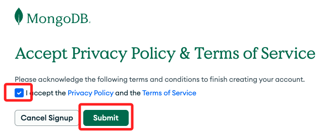

<br>

5. 任意填寫以下內容之後點擊 `Finish`。

    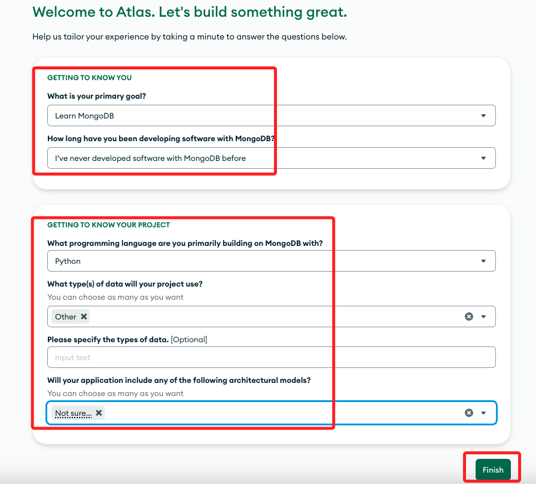

<br>

6. 接下來延續下面 `已經有帳號` 的第七個步驟，特別注意，這時所建立的專案預設為 `PROJECT0`。

    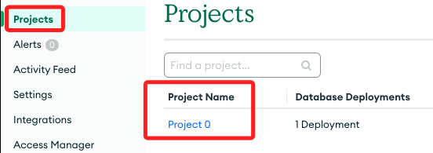

<br>

## 已經有帳號者的步驟

<br>

1. 點擊 `免費開始使用`。

    

<br>

2. 使用 Google 帳號登入。

    

<br>

3. 建立專案。

    

<br>

4. 自訂專案名稱，然後點擊 `下一步`。

    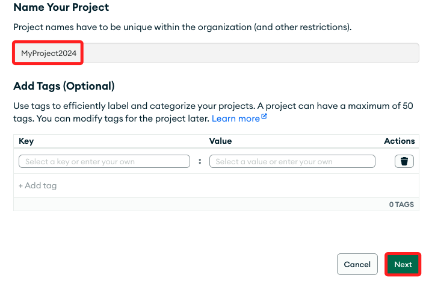

<br>

5. 建立專案。
    
    

<br>

6. 建立一個 `Cluster`。

    

<br>

7. 選取 `免費`，其餘用預設值即可，其中 `Cluster` 的名稱預設為 `Cluster0`，之後可再更改，另外，預設的 Provider 是 `AWS`，點擊 `Create Deployment` 繼續下一個步驟。

    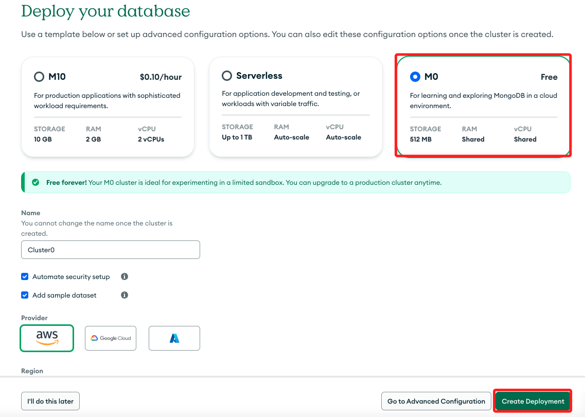

<br>


8. 若是初次建立預設的專案名稱，之後都可以再更改。

    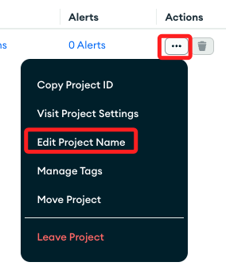

<br>

9. 建立資料庫使用者，這裡使用者名稱自訂為 `myname`，密碼自訂為 `mypassword`，同學請自行命名，然後點擊 `Create Database User`。

    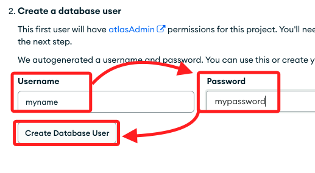

<br>

10. 選擇連線方法。

    

<br>

11. 點擊後可查看連線指引。

    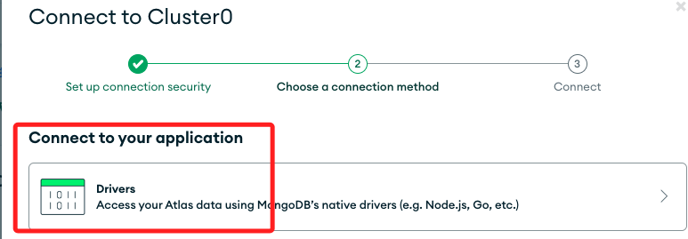

<br>

12. 選取所使用的語言及版本，這裡選取 `Python` 以及 `3.6 or later`。

    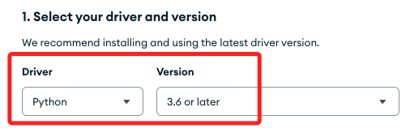

<br>

13. 接著可看到 Python 安裝指令，並指定了 MogoDB 套件的版本，可修改雙等號 `==` 後面的數字來指定版本，不指定代表為最新版本。

    ```bash
    python -m pip install "pymongo[srv]"==3.6
    ```

<br>

14. 開啟 `View full code sample` 功能查可看腳本。

    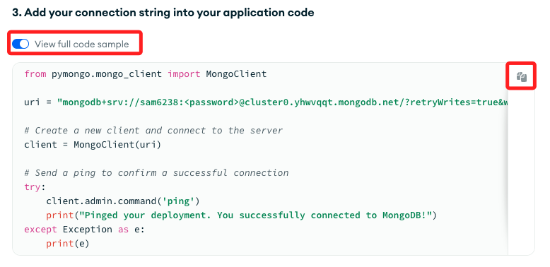

<br>

15. 以下是複製下來的腳本，我另外加入一些說明，帳號密碼部分 `<輸入自己的帳號>:<輸入自己的密碼>` 務必修改為自己的帳號密碼，輸入時不要包含括號 `< >`，假如有自訂 `cluster` 名稱，也要修改 `appName` 之後的 `Cluster0`，範例如下。

    ```python
    # 導入庫
    from pymongo.mongo_client import MongoClient
    # 改為自己的密碼
    uri = "mongodb+srv://<輸入自己的帳號>:<輸入自己的密碼>@cluster0.yhwvqqt.mongodb.net/?retryWrites=true&w=majority&appName=Cluster0"

    # 建立連線實體
    client = MongoClient(uri)

    # 傳送連線請求
    try:
        client.admin.command('ping')
        print("成功連線到 MongoDB.")
    except Exception as e:
        print(e)
    ```

<br>

16. 在 `Jupyter NB` 中測試這個腳本，成功回傳表示連線成功，特別注意以下的 `uri` 中的帳號密碼表達式是沒有 `< >` 的，這裡繞過安全檢查提供截圖作為參考，後續不再提示。

    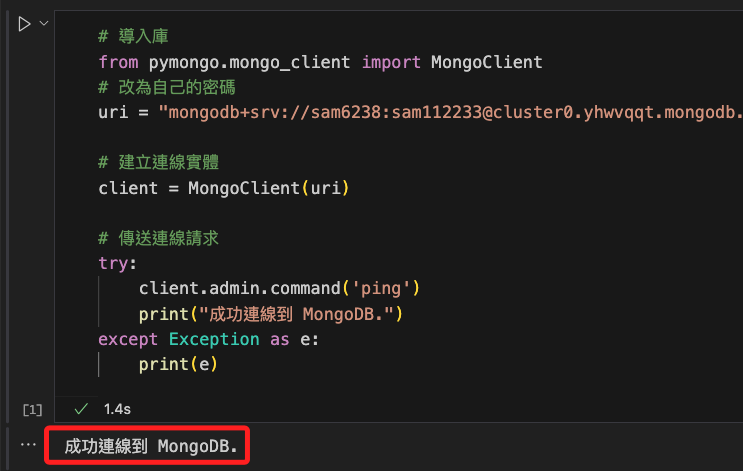

<br>

_以上連線 MongoDB 完成_

___

_END_