# 刪除帳號

_依序完成以下步驟便可刪除帳號。_

 

## 終止集群

1. 在 `Projects` 頁籤中點擊專案。

    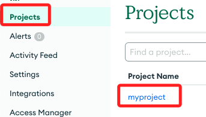

 

2. 進入 `Database` 中，將對應的集群 `Cluster0` 終止。

    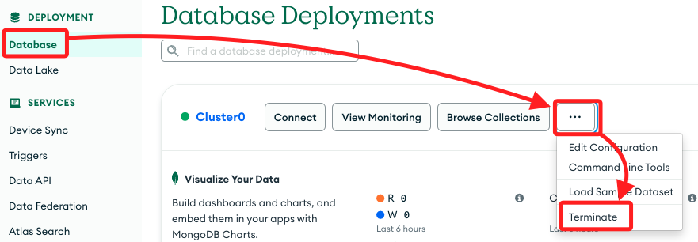

 

3. 複製貼上 Cluster 名稱後進行終止。

    

 

4. 終止後會是空的。

    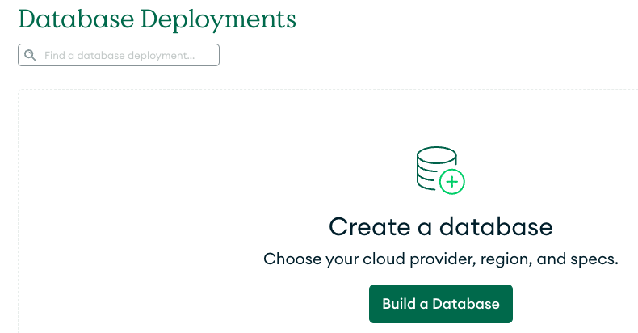

 

## 刪除專案

1. 完成集群終止後就可以刪除專案。

    

 

2. 複製貼上專案名稱後刪除專案。

    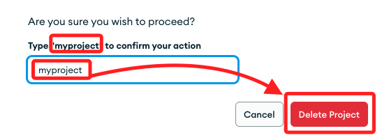

 

3. 專案會是空的。

    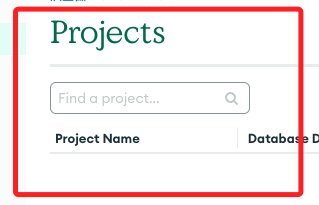

 

## 刪除組織

1. 必須先刪除專案才可以刪除組織。

    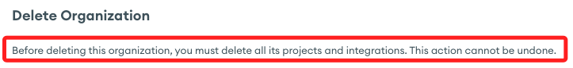

 

2. 進入 `Atlas` 後點擊 `Settings`。

    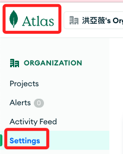

 

3. 滑動到下方 `Delete Organization`，假如有未完成的前置步驟，按鍵會是反白不可點擊的。

    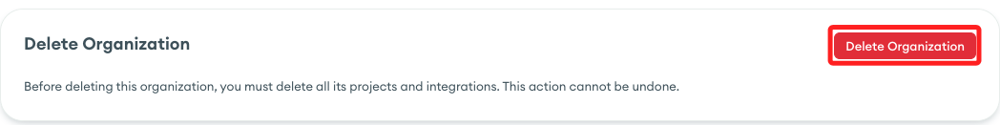

 

4. 再次確認。

    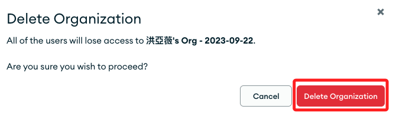

 

## 刪除帳號

1. 進入管理帳號頁面。

    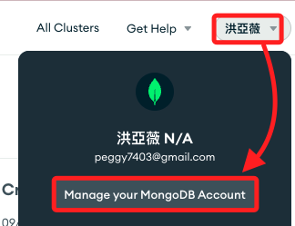

 

2. 左側切換到 `Profile Info` 後，點擊刪除帳號。

    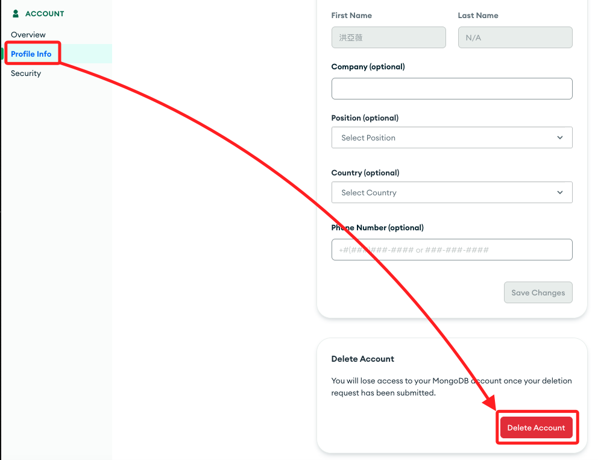

 

3. 確認刪除。

    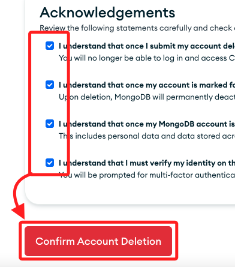

 

4. 透過 Email 收到驗證碼輸入。

    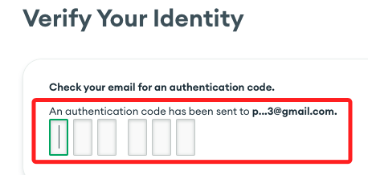

 

5. 完成後顯示已經刪除並退出。

    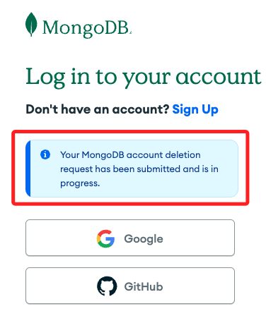

 

___

_END_