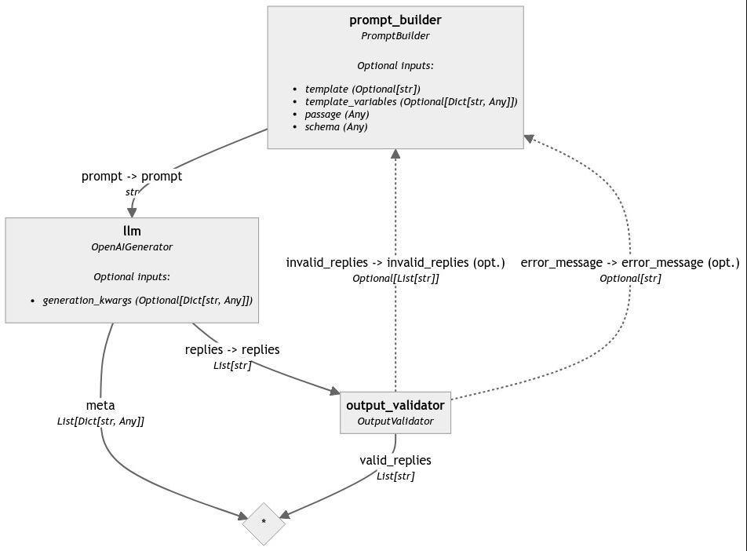

# 生成結構化輸出

_使用循環自動校正生成結構化輸出_


_Generating Structured Output with Loop-Based Auto-Correction_

<br>

## 說明 

1. 參考 `2024/04/25` 的 [官方教程](https://haystack.deepset.ai/tutorials/28_structured_output_with_loop)，目標是結合 `LLM` 建立一個 `循環管道` 來進行動態的數據處理，透過 `LLM` 從 `非結構化數據` 中提取 `結構化數據`，並驗證生成的輸出是否符合預定義的結構。

<br>

2. 使用 `GPT 模型` 將 `非結構化` 段落轉換為符合 `Pydantic` 結構的 `JSON 輸出`，並使用自定義的組件 `OutputValidator` 進行驗證與校正。

<br>

3. 這類的 `預定義格式` 的 `結構化數據` 可提供跨系統、跨平台的數據交換和分析使用。

<br>

## 使用組件

1. `PromptBuilder`：用於建立和組合生成模型所需的提示，根據指定模板生成輸入。

<br>

2. `OpenAIGenerator`：使用 OpenAI API 進行文本生成，根據提示生成自然語言回答或文本。

<br>

3. `OutputValidator`：驗證生成模型的輸出是否符合預期，確保結果的準確性和有效性。

<br>

## 開始開發

1. 安裝 `Haystack 2.0` 和 `colorama`，這個指令是透過 Github 來安裝最新版本分支上的程式碼，若要從 `PyPI` 安裝已經發佈的穩定版則使用 `pip install haystack`。

    ```bash
    pip install git+https://github.com/deepset-ai/haystack.git@main
    pip install colorama
    ```

<br>

2. 這安裝的是 `2.3.0rc0`，已發佈的最新版則是 `2.2.1`。

    

<br>

3. 建立環境變數，細節不再贅述。

    ```python
    from getpass import getpass
    import os
    from dotenv import load_dotenv

    # 環境變數
    load_dotenv()
    os.environ["OPENAI_API_KEY"] = os.getenv("OPENAI_API_KEY")

    if "OPENAI_API_KEY" not in os.environ:
        os.environ["OPENAI_API_KEY"] = getpass("Enter OpenAI API key:")
    ```

<br>

## 定義解析 JSON 對象的結構

1. 定義一個簡單的 JSON 結構，用於從文本段落中使用 `LLM` 提取數據，在下方的程式碼中會定義兩個 `Pydantic 模型`，分別是 `City` 和 `CitiesData`，並設置合適的欄位和類型。

    ```python
    from typing import List
    from pydantic import BaseModel

    class City(BaseModel):
        # 城市名稱
        name: str
        # 國家
        country: str
        # 人口
        population: int

    class CitiesData(BaseModel):
        # 城市列表
        cities: List[City]
    ```

<br>

2. 可以根據需要從文本中提取的格式更改這些模型，然後使用 `schema_json()` 從 `Pydantic 模型` 生成 JSON 結構，並在後續步驟中在提示內使用這個結構來指導 `LLM`。

    ```python
    json_schema = CitiesData.schema_json(indent=2)
    json_schema
    ```

<br>

3. 得到一個 JSON 字串，定義了用於引用的內部模式。

    ```python
    {
    "$defs": {
        "City": {
        "properties": {
            "name": {
            "title": "Name",
            "type": "string"
            },
            "country": {
            "title": "Country",
            "type": "string"
            },
            "population": {
            "title": "Population",
            "type": "integer"
            }
        },
        "required": [
            "name",
            "country",
            "population"
        ],
        "title": "City",
        "type": "object"
        }
    },
    "properties": {
        "cities": {
        "items": {
            "$ref": "#/$defs/City"
        },
        "title": "Cities",
        "type": "array"
        }
    },
    "required": [
        "cities"
    ],
    "title": "CitiesData",
    "type": "object"
    }
    ```

<br>

## 建立自定義組件 OutputValidator

1. `OutputValidator` 是一個自定義組件，用於驗證 `LLM` 生成的 `JSON` 對象是否符合提供的 `Pydantic` 模型，如果不符合，`OutputValidator` 會返回錯誤消息以及不正確的 JSON 對象，並在下一個循環中進行修正。可參考官方對於 [建立自定義組件](https://docs.haystack.deepset.ai/docs/custom-components) 的說明。

    ```python
    import json
    import random
    import pydantic
    from pydantic import ValidationError
    from typing import Optional, List
    from colorama import Fore
    from haystack import component

    # 定義組件的輸入參數
    @component
    class OutputValidator:
        def __init__(self, pydantic_model: pydantic.BaseModel):
            self.pydantic_model = pydantic_model  # 儲存 Pydantic 模型
            self.iteration_counter = 0  # 初始化循環計數器

        # 定義組件的輸出
        @component.output_types(valid_replies=List[str], invalid_replies=Optional[List[str]], error_message=Optional[str])
        def run(self, replies: List[str]):
            self.iteration_counter += 1  # 增加循環計數器

            ## 嘗試解析 LLM 的回覆 ##
            # 如果 LLM 的回覆是一個有效的對象，返回 `"valid_replies"`
            try:
                output_dict = json.loads(replies[0])  # 解析回覆為字典
                self.pydantic_model.parse_obj(output_dict)  # 使用 Pydantic 模型進行驗證
                print(
                    Fore.GREEN
                    + f"OutputValidator at Iteration {self.iteration_counter}: Valid JSON from LLM - No need for looping: {replies[0]}"
                )
                return {"valid_replies": replies}

            # 如果 LLM 的回覆損壞或無效，返回 "invalid_replies" 和 "error_message" 以便 LLM 重試
            except (ValueError, ValidationError) as e:
                print(
                    Fore.RED
                    + f"OutputValidator at Iteration {self.iteration_counter}: Invalid JSON from LLM - Let's try again.\n"
                    f"Output from LLM:\n {replies[0]} \n"
                    f"Error from OutputValidator: {e}"
                )
                return {"invalid_replies": replies, "error_message": str(e)}
    ```

<br>

2. 接著，使用之前建立的 `CitiesData` 建立一個 `OutputValidator` 實例。

    ```python
    output_validator = OutputValidator(pydantic_model=CitiesData)
    print(output_validator)
    ```

<br>

3. 輸出結果，這段輸出是對 `OutputValidator` 類的一個實例的描述，以及該類的輸入輸出規範。

    ```python
    <__main__.OutputValidator object at 0x1453c1ba0>
    Inputs:
        - replies: List[str]
    Outputs:
        - valid_replies: List[str]
        - invalid_replies: Optional[List[str]]
        - error_message: Optional[str]
    ```

<br>

## 建立模板

1. 建立一個模板，引導 `LLM` 編寫將段落轉換為 `JSON` 格式的指令，並明確指示如果 JSON 不符合要求的結構，必須進行識別和修正錯誤。

    ```python
    prompt_template = """
        根據此段落中存在的資訊建立一個 JSON 對象：
        {{passage}}.
        僅使用段落中存在的資訊。
        遵循此 JSON 架構，但僅傳回實際實例，無需任何其他架構定義：
        {{schema}}
        確保自己的答案是字典而不是列表。
        
        您在先前的嘗試中已經建立了以下輸出：
        {{invalid_replies}}
        但是，這不符合上面的格式要求並觸發了此 Python 異常：
        {{error_message}}
        更正輸出並重試。只需返回正確的輸出，無需任何額外的解釋。
        
    """
    ```

<br>

2. 建立提示生成器，並將前一步驟建立的模板作為參數傳入。

    ```python
    from haystack.components.builders import PromptBuilder

    prompt_builder = PromptBuilder(template=prompt_template)
    ```

<br>

## 初始化生成器

1. 建立語言模型生成器對象 `OpenAIGenerator`，並使用指定的 OpenAI 模型來生成文本。

    ```python
    from haystack.components.generators import OpenAIGenerator

    # 初始化 OpenAI 生成器
    generator = OpenAIGenerator(model="gpt-4-turbo")
    ```

<br>

## 建立管道

1. 建立管道，設置最大迴圈次數參數 `max_loops_allowed` 為 `5` 以避免無限循環。

    ```python
    from haystack import Pipeline

    pipeline = Pipeline(max_loops_allowed=5)
    ```

<br>

2. 添加組件。

    ```python
    # 添加組件到管道
    pipeline.add_component(
        instance=prompt_builder, name="prompt_builder"
    )
    pipeline.add_component(
        instance=generator, name="llm"
    )
    pipeline.add_component(
        instance=output_validator, name="output_validator"
    )
    ```

<br>

3. 連接組件，將 `output_validator` 的輸出連接回 `prompt_builder`，以便在生成的 JSON 不符合 JSON 結構時進行校正。

    ```python
    # 現在，將組件之間進行連接
    pipeline.connect(
        "prompt_builder", "llm"
    )
    pipeline.connect(
        "llm", "output_validator"
    )
    # 如果一個組件有多個輸出或輸入，請明確指定連接：
    pipeline.connect(
        "output_validator.invalid_replies",
        "prompt_builder.invalid_replies"
    )
    pipeline.connect(
        "output_validator.error_message",
        "prompt_builder.error_message"
    )
    ```

<br>

4. 輸出。

    ```bash
    <haystack.core.pipeline.pipeline.Pipeline object at 0x3003632e0>

    🚅 Components
        - prompt_builder: PromptBuilder
        - llm: OpenAIGenerator
        - output_validator: OutputValidator

    🛤️ Connections
        - prompt_builder.prompt -> llm.prompt (str)
        - llm.replies -> output_validator.replies (List[str])
        - output_validator.invalid_replies -> prompt_builder.invalid_replies (Optional[List[str]])
        - output_validator.error_message -> prompt_builder.error_message (Optional[str])
    ```

<br>

5. 使用拓展的函數觀察管道圖。

    ```python
    pipeline.draw("auto-correct-pipeline.png")
    from utils.draw_pipeline import draw_and_display

    draw_and_display(pipeline, "ex08_1_pipe.png")
    ```

    

<br>

## 測試管道

1. 使用一個範例文本來運行管道，將其轉換為 JSON 格式以及 `CitiesData` 的 `json_schema`。

    ```python
    # passage = "Berlin is the capital of Germany. It has a population of 3,850,809. Paris, France's capital, has 2.161 million residents. Lisbon is the capital and the largest city of Portugal with the population of 504,718."
    passage = "柏林是德國的首都。人口3,850,809。法國首都巴黎，居民216.1萬。里斯本是葡萄牙首都和最大城市，人口 504,718 人。"
    ```

<br>

2. 將測試輸入傳遞給管道進行處理，並且指定需要遵循的 JSON 結構 `json_schema`。

    ```python
    result = pipeline.run({
        "prompt_builder": {
            "passage": passage,
            "schema": json_schema
        }
    })
    ```

<br>

3. 結果輸出如下，確認這個步驟會讓管道中的各個組件按設計的流程處理輸入數據，並生成符合指定格式的 JSON。

    ```json
    OutputValidator at Iteration 1: Valid JSON from LLM - No need for looping: {
        "cities": [
            {
            "name": "柏林",
            "country": "德國",
            "population": 3850809
            },
            {
            "name": "巴黎",
            "country": "法國",
            "population": 2161000
            },
            {
            "name": "里斯本",
            "country": "葡萄牙",
            "population": 504718
            }
        ]
    }
    ```

<br>

4. 在某些情況下，管道可能會多次嘗試生成正確的輸出，如果嘗試次數超過參數中設置的最大循環次數則會報錯，此時可以考慮調整參數上限，或進一步分析並修正管道中的錯誤。 

    ```bash
    `PipelineMaxLoops: Maximum loops count (5) exceeded for component 'prompt_builder'.
    ```

<br>

5. 如果沒有遇到錯誤，可以輸出已校正的 JSON。

    ```python
    valid_reply = result["output_validator"]["valid_replies"][0]
    valid_json = json.loads(valid_reply)
    print(valid_json)
    ```

<br>

6. 結果同上。

    ```json
    {
        'cities': [
            {
                'name': '柏林',
                'country': '德國',
                'population': 3850809
            },
            {
                'name': '巴黎',
                'country': '法國', 
                population': 2161000
            },
            {
                'name': '里斯本',
                'country': '葡萄牙',
                'population': 504718
            }
        ]
    }
    ```

<br>

##  複雜的文本

1. 以維基百科對 `台灣` 的介紹文本來演繹。

    ```python
    introduction_tw = "臺灣（俗字寫作台灣），西方國家亦稱福爾摩沙（葡萄牙語：Formosa），是位於東亞、太平洋西北側的島嶼，地處琉球群島與菲律賓群島之間，西隔臺灣海峽與中國大陸相望，海峽距離約130公里，周圍海域從3點鐘方向以順時鐘排序分別為太平洋（菲律賓海）、巴士海峽、南海、臺灣海峽、東海。面積約3.6萬平方公里，在當前全球各島嶼面積排名中位居第38（或39），島上約七成面積之地形為山地與丘陵，平原主要集中於西部沿海，地形海拔變化大，最高點3952公尺。全島被北迴歸線貫穿，氣候炎熱，夏季偏長，介於熱帶與亞熱帶地帶之間，北迴歸線以北為副熱帶季風氣候、以南為熱帶季風氣候[6][7]，自然景觀與生態系資源豐富多元[8]。臺灣面積約3.6萬平方公里，在當前全球各島嶼面積排名中位居第38（或39），為板塊碰撞隆起形成的大陸島，是東亞島弧之一部分（由菲律賓板塊潛入歐亞板塊形成）。島上約七成面積之地形為山地與丘陵，平原主要集中於西部沿海，地形海拔變化大，最高點3952公尺。全島被北迴歸線貫穿，氣候炎熱，夏季偏長，介於熱帶與亞熱帶地帶之間，北迴歸線以北為副熱帶季風氣候、以南為熱帶季風氣候[9][10]，自然景觀與生態系資源豐富多元[8]。人口約2300萬人，超過七成集中於西部的五大都會區，其中以行政中心臺北為核心的臺北都會區最大，約700萬人。族群構成以漢族、原住民族為主：原住民族由多個屬於南島民族的部族組成，漢族則依民系及移民年代的不同而分為閩南（河洛）、客家與外省族群，其中閩南裔為臺灣最大族群。約三萬年前冰河時期開始有人類遷移至台灣活動，自古為原住民族世居之地[11]，原住民族在17世紀中葉以前一直居於主體民族地位；隨著漢族不斷從中國大陸移入與墾殖，漢族遂取代原住民族成為臺灣的最大民族。自有信史記錄以來，臺灣歷史上曾經歷多個原住民聯盟和政權、荷西時期、明鄭時期、清治時期、日治時期等多次政權遞嬗，最近一次為1945年進入戰後時期由中華民國統治。1949年中華民國政府播遷臺灣造成兩岸分治的局面後，臺灣成為中華民國有效統治領土的主要部分[d]。隨著1987年戒嚴時代結束，臺灣逐漸淡化過往戒嚴時代形塑的中國史觀，政治上走向自由化與民主化，以中國國民黨及民主進步黨兩黨為首的政黨政治、統獨議題、以及公民社會的形成，加之以東南亞新住民的定居，產生出多元文化主義[12][13]，使得臺灣文化呈現多元並立的面貌。而由此原因再加上一中原則，使得現今「臺灣」成為中華民國的通稱。歷經1860年臺灣開港以來至日治時期所打下的現代化基礎[14]，以及中華民國政府遷臺後運用美援所進行的一系列的經濟建設，加上國際上冷戰對峙的格局，臺灣自1960年代起在經濟與社會發展上突飛猛進，締造「臺灣奇蹟」，名列亞洲四小龍之一；之後在1990年代躋身已開發國家之列，目前無論人均所得或人類發展指數均具世界先進國家水準[15]。臺灣擁有蓬勃的製造業及尖端科技，在半導體、資訊科技、通訊、電子精密製造等領域執牛耳。貿易方面主要透過高科技產業賺取外匯，經濟發展上以高科技產業與服務業為中心，亦朝向文化產業及觀光業發展[16]。台灣以移民為主的人文結構，亦帶來多元的政治觀點。自大航海時代以來，台灣文化就在明鄭、清朝的統治與西方列強的衝擊中經歷多次大變動，並在近代開始產生臺灣主體意識思想。"
    ```

<br>

2. 透過原本的管道來運行。

    ```python
    result_tw = pipeline.run({
        "prompt_builder": {
            "passage": introduction_tw,
            "schema": json_schema
        }
    })
    ```

    _結果：_

    ```bash
    OutputValidator at Iteration 2: Valid JSON from LLM - No need for looping: {
    "cities": [
        {
        "name": "臺北",
        "country": "中華民國",
        "population": 7000000
        }
    ]
    }
    ```

<br>

3. 格式化輸出。

    ```python
    valid_reply_tw = result_tw["output_validator"]["valid_replies"][0]
    valid_json_tw = json.loads(valid_reply_tw)
    print(valid_json_tw)
    ```

    _結果：_

    ```json
    {
        'cities': [{
            'name': '臺北',
            'country': '中華民國',
            'population': 7000000
        }]
    }
    ```

<br>

___

_END_