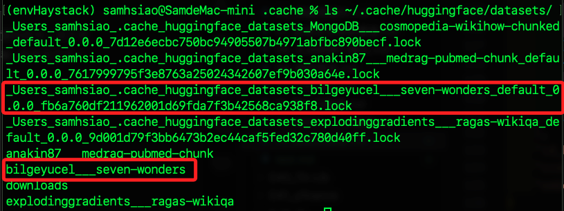

# 抽取式問答 Extractive QA


<br>

## 簡介

1. 本範例使用 `自然語言處理技術` 來理解問題的語義，然後結合 `向量檢索技術` 從大量文本中搜尋並提取問題的 `最相關的文字片段`，由於不是生成新的文本來回答，可確保答案的準確性和可驗證性。同時還可標示出答案在原文本中的位置，使得用戶可以查閱或核實答案的來源。

<br>

2. 這是官方在 `2024/04/25` 發佈的 [官方教程](https://haystack.deepset.ai/tutorials/34_extractive_qa_pipeline)，使用了 `Wikipedia` 的 `古代世界七大奇蹟數據集`，而最終目標是建立一個使用 `抽取模型` 來顯示查詢答案所在位置的 `Haystack` 管道，根據提供的文件提取問題的答案。

<br>

3. 範例所使用的嵌入模型是 `sentence-transformers/multi-qa-mpnet-base-dot-v1`，這是專門設計用於多任務問答（Multi-QA）場景的嵌入模型。

## 主要組件

1. `ExtractiveReader`：專門用來進行抽取式問答的組件，主要功能是從文本中提取出具體的答案。

<br>

2. `InMemoryDocumentStore`：是一個記憶體中的文件儲存，它用來儲存和管理文件數據，方便後續的檢索和查詢操作。

<br>

3. `InMemoryEmbeddingRetriever`：一個用來檢索相關文件的組件，它會根據查詢和文件的嵌入向量來搜尋最相關的文件。

<br>

4. `DocumentWriter`：是一個負責將文件寫入到文件儲存的組件，通常用於將處理後的文件儲存到記憶體或資料庫中。

<br>

5. `SentenceTransformersDocumentEmbedder`：是用來將文件轉換為嵌入向量的組件，這些向量可以用於後續的檢索和查詢。

<br>

6. `SentenceTransformersTextEmbedder`：是用來將查詢文本轉換為嵌入向量的組件，它通常用於將查詢轉換為與文件同樣的向量表示。

<br>

## 流程說明

1. 取得數據：在建立索引管道之前，需要先取得數據，並且對數據進行基本的預處理。這步驟直接使用 `datasets` 庫來載入數據集，所以不需要特定的 `Haystack` 組件進行處理。

<br>

2. 文本嵌入：將清理好的文本通過嵌入模型轉換成嵌入向量，這些嵌入向量將用於計算文本之間的相似度，並進行相關的檢索操作；範例中使用了 `SentenceTransformersDocumentEmbedder` 組件將文件轉換為嵌入向量。

<br>

3. 檢索：使用 `InMemoryEmbeddingRetriever` 組件進行檢索，這個組件會根據查詢的嵌入向量從文件儲存中檢索出最相關的文件。檢索器負責找查相關的文件，讀取器則負責從文件中抽取具體的答案，並返回答案的位置和信心分數。

<br>

4. 問答：使用 `ExtractiveReader` 組件進行問答。這個組件會從檢索到的文件中抽取出具體的答案，並提供答案的置信度分數。

<br>

5. 文件管理：使用 `DocumentWriter` 將向量化的文件寫入 `DocumentStore`，以確保這些文件可以在需要時快速檢索和使用。這裡使用的文件儲存事記憶體文件儲存（`InMemoryDocumentStore`）。

<br>

## 開始專案編輯

1. 安裝庫。

    ```bash
    # 安裝所需的庫
    pip install haystack-ai accelerate "sentence-transformers>=2.2.0" "datasets>=2.6.1"
    ```

<br>

2. 載入數據集並導入範例所需的依賴庫。

    ```python
    # 載入數據集
    from datasets import load_dataset
    # 導入相關庫
    from haystack import Document, Pipeline
    from haystack.document_stores.in_memory import InMemoryDocumentStore
    from haystack.components.retrievers.in_memory import InMemoryEmbeddingRetriever
    from haystack.components.readers import ExtractiveReader
    from haystack.components.embedders import SentenceTransformersDocumentEmbedder
    from haystack.components.writers import DocumentWriter
    ```

<br>

3. 載入與儲存資料，數據載入後會儲存在記憶體中，也就是本地的 `.cache` 目錄。

    ```python
    # 載入 "古代世界七大奇蹟" 數據集
    dataset = load_dataset(
        "bilgeyucel/seven-wonders",
        split="train"
    )
    ```

<br>

4. 查看數據集的前兩個樣本。

    ```python
    print(dataset[:2])
    ```

<br>

5. 顯示結果，有兩筆資料。

    ```python
    {
        "id": [
            "b3de1a673c1eb2876585405395a10c3d",
            "5dcd01886fcb24322578ceb49c96cc3e"
        ],
        "content": [
            "The Colossus of Rhodes ...(省略)",
            "[6]\nIn 653, an Arab force ...(省略)\n\n",
        ],
        "content_type": ["text", "text"],
        "meta": [
            {
                "url": "https://en.wikipedia.org/wiki/Colossus_of_Rhodes",
                "_split_id": 0
            },
            {
                "url": "https://en.wikipedia.org/wiki/Colossus_of_Rhodes",
                "_split_id": 1
            },
        ],
        "id_hash_keys": [["content"], ["content"]],
        "score": [None, None],
        "embedding": [None, None],
    }
    ```

<br>

6. 緩存位在本地的 `.cache` 目錄，可透過指令查看。

    ```bash
    ls ~/.cache/huggingface/datasets/
    ```

    

<br>

7. 也透過程式碼查看。

    ```python
    # 查看緩存目錄
    print(dataset.cache_files)
    ```

<br>

8. 結果。

    ```python
    [{
        'filename': '/Users/samhsiao/.cache/huggingface/datasets/bilgeyucel___seven-wonders/default/0.0.0/fb6a760df211962001d69fda7f3b42568ca938f8/seven-wonders-train.arrow'
    }]
    ```

<br>

## 轉換數據格式

1. 將數據集轉換為 Haystack 文件格式。

    ```python
    # 將數據集轉換為 Haystack 文件格式
    documents = [
        Document(content=doc["content"], meta=doc["meta"])
        for doc in dataset
    ]

    # 定義嵌入模型
    model = "sentence-transformers/multi-qa-mpnet-base-dot-v1"

    # 初始化記憶體文件儲存
    document_store = InMemoryDocumentStore()
    ```

<br>

4. 建立管道。

    ```python
    # 建立索引管道
    indexing_pipeline = Pipeline()

    # 添加嵌入組件到管道
    indexing_pipeline.add_component(instance=SentenceTransformersDocumentEmbedder(model=model), name="embedder")
    # 添加文件寫入組件到管道
    indexing_pipeline.add_component(instance=DocumentWriter(document_store=document_store), name="writer")

    # 連接嵌入組件和文件寫入組件
    indexing_pipeline.connect("embedder.documents", "writer.documents")

    # 執行索引管道
    indexing_pipeline.run({"documents": documents})
    ```

<br>

5. 下載模型需要一點時間。

    

<br>

## 建立抽取式問答管道

_`抽取式問答管道` 包含三個組件：`嵌入器`、`檢索器` 和 `讀取器`。_

<br>

1. 嵌入器 `SentenceTransformersTextEmbedder` 會使用前面所定義的 `嵌入模型` 將`查詢` 轉換為 `向量`。

<br>

2. 進行 `向量搜索` 時，檢索器會從文件儲存中高效地返回相關文件，所以檢索器與文件儲存是緊密耦合的，這裡使用檢索器 `InMemoryEmbeddingRetriever` 來搭配 `InMemoryDocumentStore`。

<br>

3. 最後透過閱讀器 `ExtractiveReader` 查詢並返回的答案，包含答案在源文件中的位置和置信度分數。

<br>

4. 程式碼。

    ```python
    # 從 Haystack 模組中導入需要的組件
    from haystack.components.retrievers.in_memory import InMemoryEmbeddingRetriever
    from haystack.components.readers import ExtractiveReader
    from haystack.components.embedders import SentenceTransformersTextEmbedder

    # 初始化檢索器
    retriever = InMemoryEmbeddingRetriever(document_store=document_store)

    # 初始化讀取器
    reader = ExtractiveReader()
    # 預熱讀取器
    reader.warm_up()

    # 建立抽取式問答管道
    extractive_qa_pipeline = Pipeline()

    # 添加嵌入組件到管道
    extractive_qa_pipeline.add_component(
        instance=SentenceTransformersTextEmbedder(model=model),
        name="embedder"
    )
    # 添加檢索組件到管道
    extractive_qa_pipeline.add_component(
        instance=retriever,
        name="retriever"
    )
    # 添加讀取組件到管道
    extractive_qa_pipeline.add_component(
        instance=reader,
        name="reader"
    )

    # 連接嵌入組件和檢索組件
    extractive_qa_pipeline.connect(
        "embedder.embedding",
        "retriever.query_embedding"
    )
    # 連接檢索組件和讀取組件
    extractive_qa_pipeline.connect(
        "retriever.documents",
        "reader.documents"
    )
    ```

<br>

5. 顯示結果。

    ```python
    <haystack.core.pipeline.pipeline.Pipeline object at 0x16a6bbbe0>

    🚅 Components
        - embedder: SentenceTransformersTextEmbedder
        - retriever: InMemoryEmbeddingRetriever
        - reader: ExtractiveReader

    🛤️ Connections
        - embedder.embedding -> retriever.query_embedding (List[float])
        - retriever.documents -> reader.documents (List[Document])
    ```

<br>

## 定義查詢

1. 提問。

    ```python
    query = "Who was Pliny the Elder?"

    # 執行抽取式問答管道，並返回答案
    result = extractive_qa_pipeline.run(
        data={
            "embedder": {"text": query},
            "retriever": {"top_k": 3},
            "reader": {
                "query": query,
                "top_k": 2
            }
        }
    )
    # 輸出查看
    print(result)
    ```

<br>

2. 下載模型需要一點時間。

    

<br>

3. 結果。

    ```python
    {'reader': {
        'answers': [
            ExtractedAnswer(
                query='Who was Pliny the Elder?',
                score=0.8306005597114563,
                data='Roman writer',
                document=Document(
                    id='bb2c5f3d2e2...',
                    content: 'The Roman writer Pliny the Elder, writing in the first century AD, argued that the Great Pyramid had...',
                    meta: {
                        'url': 'https://en.wikipedia.org/wiki/Great_Pyramid_of_Giza',
                        '_split_id': 16
                    },
                    score: 21.66772941840059
                ),
                context=None,
                document_offset=ExtractedAnswer.Span(start=4, end=16),
                context_offset=None,
                meta={}
            ),
            ExtractedAnswer(
                query='Who was Pliny the Elder?',
                score=0.7280887365341187,
                data='a Roman author',
                document=Document(
                    id='8910f21f7...',
                    content: '[21]Pliny the Elder (AD 23/24 – 79) was a Roman author, a naturalist and natural philosopher, a nav...',
                    meta: {
                        'url': 'https://en.wikipedia.org/wiki/Colossus_of_Rhodes',
                        '_split_id': 8
                    },
                    score: 26.857539924645973
                ),
                context=None,
                document_offset=ExtractedAnswer.Span(start=41, end=55),
                context_offset=None,
                meta={}
            ),
            # 以下省略 ...
        ]
    }}
    ```

<br>

## 優化回答格式

1. 提問及回答。

    ```python
    # 優化輸出答案格式
    def format_extracted_answers(answers):
        formatted_answers = []
        for answer in answers:
            data = answer.data if answer.data else "No answer provided."
            document_content = answer.document.content if answer.document else "No document found."
            document_url = answer.document.meta['url'] if answer.document and 'url' in answer.document.meta else "No URL available."
            score = answer.score
            
            try:
                start = int(answer.document_offset.start) if answer.document_offset else None
                end = int(answer.document_offset.end) if answer.document_offset else None
                excerpt = document_content[start:end] if start is not None and end is not None else "No excerpt available."
            except (ValueError, TypeError):
                excerpt = "Invalid indices for excerpt."
            
            formatted_answer = f"""
            Query: {answer.query}
            Answer: {data}
            Score: {score:.4f}
            Document Excerpt: {excerpt}
            Document URL: {document_url}
            Context (Start-End): {start}-{end}
            """
            formatted_answers.append(formatted_answer)
        return "\n".join(formatted_answers)

    # 檢視結果
    answers = result["reader"]["answers"]
    print("提取的答案：\n", format_extracted_answers(answers))
    ```

<br>

2. 答案。

    ```bash
    提取的答案：
    
            Query: Who was Pliny the Elder?
            Answer: Roman writer
            Score: 0.8306
            Document Excerpt: Roman writer
            Document URL: https://en.wikipedia.org/wiki/Great_Pyramid_of_Giza
            Context (Start-End): 4-16
            

            Query: Who was Pliny the Elder?
            Answer: a Roman author
            Score: 0.7281
            Document Excerpt: a Roman author
            Document URL: https://en.wikipedia.org/wiki/Colossus_of_Rhodes
            Context (Start-End): 41-55
            

            Query: Who was Pliny the Elder?
            Answer: No answer provided.
            Score: 0.0461
            Document Excerpt: No excerpt available.
            Document URL: No URL available.
            Context (Start-End): None-None
    ```

<br>

___

_END_