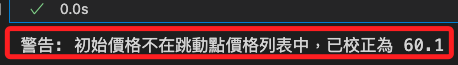
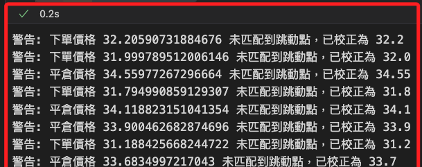
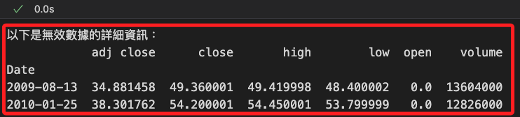
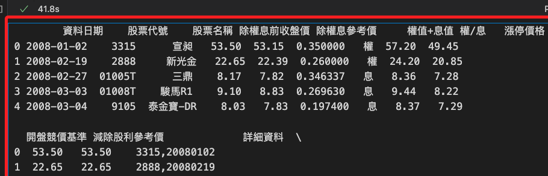
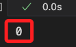
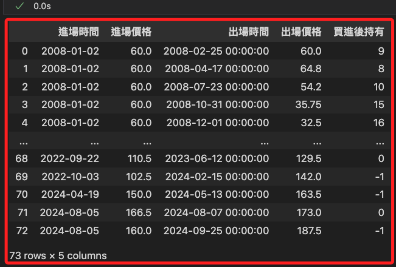

# 網格交易

<br>

## 開始進行 

1. 設置 `網格交易策略` 的初始狀態，包括 `交易起點的時間和價格`，以及 `初始化交易管理物件`。

    ```python
    # 取得回測數據中第一筆數據的時間索引
    # 設定交易的初始時間，這是網格交易的起始點
    init_time = data.index[0]
    # 取得初始交易價格，這將作為網格交易策略中的基準價格
    init_price = data.loc[data.index[0], 'open']
    # 建立一個 Trade 實例，並初始化交易狀態
    trade_position = Trade(init_time, init_price, init_unit)
    ```

<br>

2. 假如價格有違犯，會顯示並校正。

    

<br>

3. 查看物件，可知這是一個 `Trade` 類的對象。

    ```python
    trade_position
    ```

    

<br>

## 跳動點價格列表

_`跳動點價格列表` 是指股票價格在交易市場中允許的最小變動單位所構成的價格清單，也就是所有可能的交易價格，考慮了市場規則中的 `價格跳動單位（Tick Size）`，在程式中，`self.stock_price_list` 就是這個跳動點價格列表。_

<br>

## 網格交易演算

1. 展開演算，並加入排除無效欄位的邏輯。

    ```python
    # 設置最大迴圈次數，防止無限迴圈
    max_iterations = 100
    # 設置最小價格限制
    min_price_limit = 1e-2

    for index, row in data.iterrows():
        # 跳過數據異常的行
        if row["open"] == 0 or pd.isna(row["open"]):
            print(f"Skipping {index} due to invalid 'open' value.")
            continue

        # 優先執行比較差的狀況(賣出)
        iterations = 0
        while row["open"] >= init_price * (1 + grid_gap * up_down_grid_gap_diff):
            if iterations > max_iterations:
                print(f"Reached max iterations at {index} (sell: open >= target).")
                print(f"Current open: {row['open']}, init_price: {init_price}, target: {init_price * (1 + grid_gap * up_down_grid_gap_diff)}")
                break
            # 模擬網格交易策略中，當價格達到某個條件，更新基準價格。
            # 如價格上漲到設定的網格，基準價格需要上調以匹配網格間距。
            init_price *= 1 + grid_gap * up_down_grid_gap_diff
            # 確保 init_price 不會因多次計算而變得過小，導致非理性結果或浮點數精度問題
            if init_price < min_price_limit:
                print(f"Resetting init_price to minimum at {index}.")
                init_price = min_price_limit
            trade_position.cover(index, row["open"])
            iterations += 1

        iterations = 0
        while row["high"] >= init_price * (1 + grid_gap * up_down_grid_gap_diff):
            if iterations > max_iterations:
                print(f"Reached max iterations at {index} (sell: high >= target).")
                print(f"Current high: {row['high']}, init_price: {init_price}, target: {init_price * (1 + grid_gap * up_down_grid_gap_diff)}")
                break
            # 更新基準價格，根據網格間距和上升比例調整
            init_price *= 1 + grid_gap * up_down_grid_gap_diff
            # 如果更新後的基準價格小於設定的最低限制
            if init_price < min_price_limit:
                print(f"Resetting init_price to minimum at {index}.")
                init_price = min_price_limit
            # 執行賣出操作，按當前基準價格進行交易
            trade_position.cover(index, init_price)
            # 增加迴圈計數器，記錄迴圈執行次數
            iterations += 1

        # 再考慮(買進)
        iterations = 0
        while row["open"] <= init_price * (1 - grid_gap):
            if iterations > max_iterations:
                print(f"Reached max iterations at {index} (buy: open <= target).")
                print(f"Current open: {row['open']}, init_price: {init_price}, target: {init_price * (1 - grid_gap)}")
                break
            init_price *= 1 - grid_gap
            if init_price < min_price_limit:
                print(f"Resetting init_price to minimum at {index}.")
                init_price = min_price_limit
            if trade_position.position() < 100 / grid_unit:
                trade_position.order(index, row["open"])
            iterations += 1

        iterations = 0
        while row["low"] <= init_price * (1 - grid_gap):
            if iterations > max_iterations:
                print(f"Reached max iterations at {index} (buy: low <= target).")
                print(f"Current low: {row['low']}, init_price: {init_price}, target: {init_price * (1 - grid_gap)}")
                break
            init_price *= 1 - grid_gap
            if init_price < min_price_limit:
                print(f"Resetting init_price to minimum at {index}.")
                init_price = min_price_limit
            if trade_position.position() < 100 / grid_unit:
                trade_position.order(index, init_price)
            iterations += 1
    ```

    

<br>

2. 假如數據中有遺漏值，就會啟動 `跳過` 的機制。

    

<br>

3. 查看有疑問的數據，確認其數據狀態是否為提供方的遺漏值；若無問題數據可省略該步驟。

    ```python
    # 過濾出無效數據的行
    invalid_data = data.loc[(data['open'] == 0) | (data['open'].isna())]

    # 輸出無效數據
    print("以下是無效數據的詳細資訊：")
    print(invalid_data)
    ```

    

<br>

## 處理遺漏值

1. 取得標的的除權息數據，並將其處理為適當的 DataFrame。

    ```python
    import requests

    # 取得除權息資料
    dividend_url = f"https://www.twse.com.tw/rwd/zh/exRight/TWT49U?startDate=20080101&endDate=20241231&response=json"
    dividend_data = requests.get(dividend_url).json()

    # 檢查 API 回應狀態
    if dividend_data.get('stat') != 'OK':
        raise ValueError(
            "除權息數據取得失敗，請檢查 API URL 或網路連線。"
        )

    # 將數據轉換為 DataFrame
    dividend_table = pd.DataFrame(
        dividend_data["data"], 
        columns=dividend_data["fields"]
    )

    # 轉換民國年為西元年
    def convert_to_gregorian(date_str):
        parts = date_str.split('年')
        # 民國年轉換為西元年
        year = int(parts[0]) + 1911
        rest = parts[1]  # 包含月日部分
        return f"{year}年{rest}"

    # 轉換日期格式
    dividend_table["資料日期"] = dividend_table["資料日期"].apply(
        convert_to_gregorian
    )
    dividend_table["資料日期"] = pd.to_datetime(
        dividend_table["資料日期"], 
        format="%Y年%m月%d日"
    )

    # 取得所有除權息日期
    dividend_dates = dividend_table["資料日期"].tolist()

    # 驗證結果
    print(dividend_table.head())
    print(f"總計取得除權息日期: {len(dividend_dates)}")
    ```

    

<br>

2. 處理開牌價出現遺漏值的問題，確保是否為除權息日，若不是則以前一日收盤價作為開盤價，若確實為除權息日，則計算當日開盤價。

    ```python
    # 檢查並清洗異常數據
    for index, row in data.iterrows():
        # 當 open 為 0 或 NaN
        if row["open"] == 0 or pd.isna(row["open"]):
            # 如果是除權息日
            if index in dividend_dates:
                # 查找當日的除權息金額
                dividend_info = dividend_table.loc[
                    dividend_table["資料日期"] == index
                ]
                if not dividend_info.empty:
                    # 提取權值+息值
                    dividend_amount = float(
                        dividend_info["權值+息值"].values[0]
                    )
                    # 查找前一日有效的收盤價
                    previous_index = index - pd.Timedelta(days=1)
                    while previous_index not in data.index or pd.isna(
                        data.loc[previous_index, "close"]
                    ):
                        # 繼續往前找
                        previous_index -= pd.Timedelta(days=1)

                    previous_close = data.loc[previous_index, "close"]
                    if previous_close == 0 or pd.isna(previous_close):
                        print(
                            f"異常：日期 {previous_index} 的收盤價也無效，跳過處理。"
                        )
                        continue

                    # 計算開盤價（前一日收盤價 - 除權息金額）
                    calculated_open = round(
                        previous_close - dividend_amount,
                        2
                    )
                    data.at[index, "open"] = calculated_open
                    print(
                        f"處理除權息日: 日期 {index}，"
                        f"開盤價計算為 {calculated_open}"
                        f"（前一日收盤價 {previous_close} "
                        f"減去除權息金額 {dividend_amount}）"
                    )
                else:
                    print(
                        f"異常：日期 {index} 的除權息金額缺失，無法處理。"
                    )
            else:
                # 如果不是除權息日
                # 尋找前一日有效的數據
                previous_index = index - pd.Timedelta(days=1)
                while previous_index not in data.index or pd.isna(
                    data.loc[previous_index, "close"]
                ):
                    # 繼續往前找
                    previous_index -= pd.Timedelta(days=1)

                # 確保找到的收盤價不為 0 或 NaN
                previous_close = data.loc[previous_index, "close"]
                if previous_close == 0 or pd.isna(previous_close):
                    print(
                        f"異常：日期 {previous_index} 的收盤價也無效，跳過處理。"
                    )
                    continue

                # 填補開盤價並格式化浮點數
                data.at[index, "open"] = round(previous_close, 2)
                print(
                    f"補充異常值: 日期 {index}，"
                    f"使用前一日有效日期 {previous_index} 的"
                    f"收盤價 {round(previous_close, 2)} 作為開盤價"
                )
    ```

    

<br>

3. 檢查是否仍有異常數據。

    ```python
    remaining_anomalies = data[(data["open"] == 0) | (data["open"].isna())]
    print(f"剩餘異常數據: {remaining_anomalies}")
    ```

    

<br>

## 確認清倉

1. 基於計算最終的績效指標如 `總收益` 或 `年化報酬率`，當網格交易演算進行到最後一天時清空所有部位，以確保回測結束時沒有任何持倉。

    ```python
    # 檢查目前的持倉是否大於 0
    while trade_position.position() > 0:
        # 假如存有部位，執行清倉操作
        # 將剩餘部位以當前收盤價 (row['close']) 賣出
        trade_position.cover(index, row['close'])
    # 輸出
    trade_position.position()
    ```

    

<br>

2. 確認所有部位已清除。

    ```python
    remaining_positions = trade_position.position_table[
        trade_position.position_table['出場時間'].isna()
    ]

    if remaining_positions.empty:
        print("所有部位已清除，無剩餘持倉。")
    else:
        print("仍有未清除的持倉：")
        print(remaining_positions)
    ```

    

<br>

3. 查看進出紀錄，總共出現 `73` 次交易進出。

    ```python
    trade_position.position_table
    ```

    

<br>

## 計算報酬率

1. 試算期間的總報酬率及年化報酬率。

    ```python
    position_table_0 = trade_position.position_table
    position_table_0['單筆報酬'] = (
        position_table_0['出場價格'] - \
        position_table_0['進場價格']
    )
    position_table_0['單筆報酬率'] = \
        position_table_0['單筆報酬'] / \
        position_table_0['進場價格'] * \
        (grid_unit/100)
    total_return_0 = (position_table_0['單筆報酬率']).sum() + 1
    print(f'總報酬率:{round(total_return_0 - 1, 4)}')
    yearly_return_0 = total_return_0 ** (1 / (data.shape[0] / 252)) - 1
    print(f'年化報酬率:{round(yearly_return_0, 4)}')
    ```

    

<br>

___

_接續下一單元_