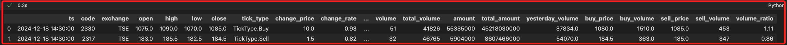

# `Snapshot`

_快照；快速取得 `即時行情資訊`_

<br>

## 簡介

1. `snapshot` 是用於快速取得即時行情資訊的結構，與 `ticks` 不同之處在於 `snapshot` 是 `當下` 的整體狀態，而 `ticks` 是逐筆成交紀錄。

<br>

2. 在 API 中，股票、期貨、選擇權等交易商品 皆可透過 `Snapshot` 取得一組描述當前狀態的資料結構，內容包含該商品目前的 `開盤價(open)`、`最高價(high)`、`最低價(low)` 等資訊，詳細內容可查看後續說明。

<br>

3. 要同時對多個商品取得 `snapshot`，僅需將多個合約物件先放入一個列表 `list`，再將列表傳入 `api.snapshots` 即可，依據 API 限制，一次可查詢最多 `500` 個合約的資訊。

<br>

4. 與其他類型數據相同，`snapshot` 可轉換為 `DataFrame` 進一步進行繪圖、統計或分析。

<br>

## 函數與參數說明

1. `快照` 主要有三個參數，分別是 `商品列表`、`請求逾時`、`回調函數`；若有多個商品時，`回調函數` 會在每個商品快照取得後都調用一次；該函數的 `回傳值` 是一個 `Snapshot` 的列表 `(List[Snapshot])`。

    ```python
    # 取得快照
    api.snapshots(
        # 建立商品合約列表，可同時包含股票、期貨、選擇權、指數等合約
        contracts: List[
            Union[
                shioaji.contracts.Option, 
                shioaji.contracts.Future, 
                shioaji.contracts.Stock, 
                shioaji.contracts.Index
            ]
        ],
        # 設定請求逾時，單位是 `毫秒`，預設為 `30000` 毫秒。
        timeout: int = 30000,
        # 回調函式，這會在取得每個 snapshot 後調用一次
        cb: Callable[[shioaji.data.Snapshot], NoneType] = None,
        # 回傳值是快照列表
    ) -> List[shioaji.data.Snapshot]
    ```

<br>

## 實作

1. 載入套件並登入；這裡使用 `模擬模式`。

    ```python
    # 導入庫
    import MyShioaji as msj

    # 登入
    api = msj.login_Shioaji()
    ```

<br>

2. 先建立合約清單。

    ```python
    # 建立合約合約清單
    contracts = [
        api.Contracts.Stocks['2330'],
        api.Contracts.Stocks['2317']
    ]
    ```

<br>

3. 將合約清單傳入函數 `snapshots()`。

    ```python
    # 取得合約清單的當前 snapshot 資料
    snapshots = api.snapshots(contracts)

    # 查看 snapshots 結果
    snapshots
    ```

    _輸出_

    ```python
    [
        Snapshot(
            ts=1734532200000000000, 
            code='2330', 
            exchange='TSE', 
            open=1075.0, 
            high=1090.0, 
            low=1070.0, 
            close=1085.0, 
            tick_type=<TickType.Buy: 'Buy'>, 
            change_price=10.0, 
            change_rate=0.93, 
            change_type=<ChangeType.Up: 'Up'>, 
            average_price=1081.1, 
            volume=51, 
            total_volume=41826, 
            amount=55335000, 
            total_amount=45218030000, 
            yesterday_volume=37834.0, 
            buy_price=1080.0, 
            buy_volume=1510.0, 
            sell_price=1085.0, 
            sell_volume=453, 
            volume_ratio=1.11
        ),
        # 略
    ]
    ```

<br>

## 輸出為 DataFrame 

1. 因為 `snapshots` 是一個列表 List，所以可遍歷列表並取出每個 snapshot 物件的指定屬性，再透過 `s.__dict__` 轉為字典，最終以此建立 `DataFrame`

    ```python
    import pandas as pd

    # 每個 snapshot 的屬性以字典方式展開並轉換為 DataFrame
    df = pd.DataFrame(s.__dict__ for s in snapshots)
    # 將時間欄位 ts 轉為 datetime 格式
    df.ts = pd.to_datetime(df.ts)
    df
    ```

    

<br>

## Snapshot 屬性說明

1. ts (int)：時間戳記 (Timestamp)，通常為奈秒(nanosecond)級別的 Unix time，可轉為可讀日期時間。

<br>

2. code (str)：商品代碼 (Contract id)，如「2330」代表台積電。

<br>

3. exchange (Exchange)：交易所代碼，如 TSE (臺灣證交所)。

<br>

4. open (float)：開盤價。

<br>

5. high (float)：最高價。

<br>

6. low (float)：最低價。

<br>

7. close (float)：最後成交價 (收盤價)。

<br>

8. tick_type (TickType)：最後一筆成交是買方主動還是賣方主動。可能值包括：None, Buy, Sell。

<br>

9. change_price (float)：與前日收盤價相比的漲跌金額。

<br>

10. change_rate (float)：與前日收盤價相比的漲跌百分比。

<br>

11. change_type (ChangeType)：漲跌型態，可為 LimitUp, Up, Unchanged, Down, LimitDown。

<br>

12. average_price (float)：加權平均成交價。

<br>

13. volume (int)：最後一筆成交量（單位股數或口數，視商品而定）。

<br>

14. total_volume (int)：當日累計成交量。

<br>

15. amount (int)：最後一筆成交金額。

<br>

16. total_amount (int)：當日累計成交金額。

<br>

17. yesterday_volume (float)：昨日累計成交量。

<br>

18. buy_price (float)：當前買方掛單價格。

<br>

19. buy_volume (float)：當前買方掛單數量。

<br>

20. sell_price (float)：當前賣方掛單價格。

<br>

21. sell_volume (int)：當前賣方掛單數量。

<br>

22. volume_ratio (float)：`total_volume / yesterday_volume`，即當日累計成交量與昨日累計成交量比例。

<br>

___

_接續下一單元_