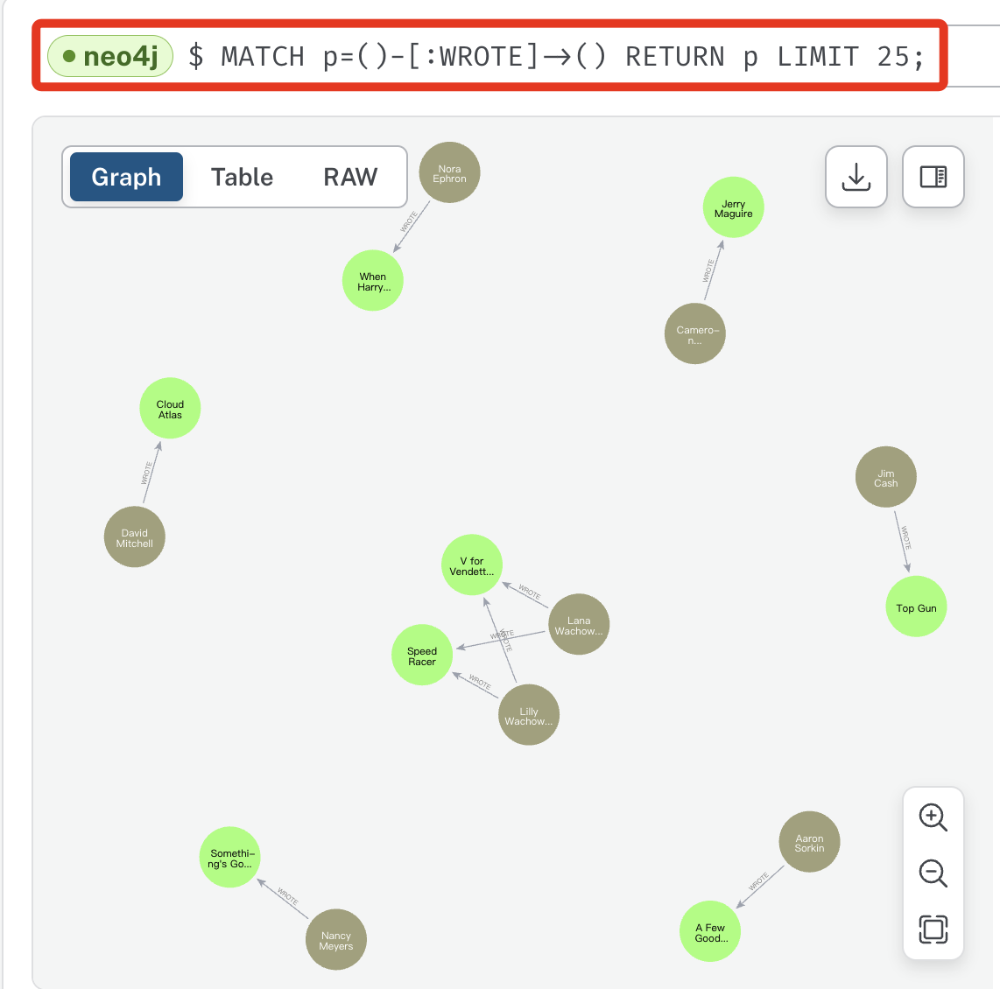
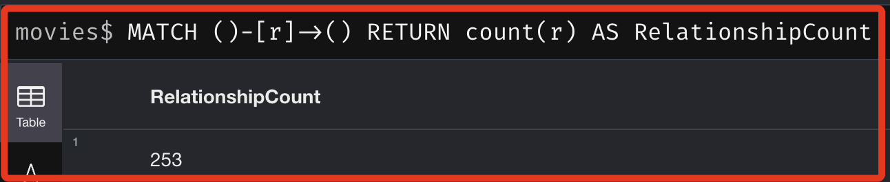
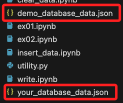
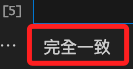
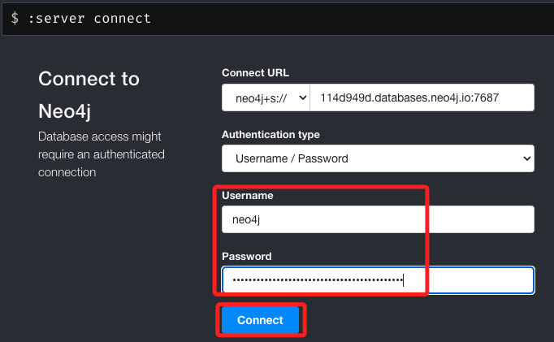
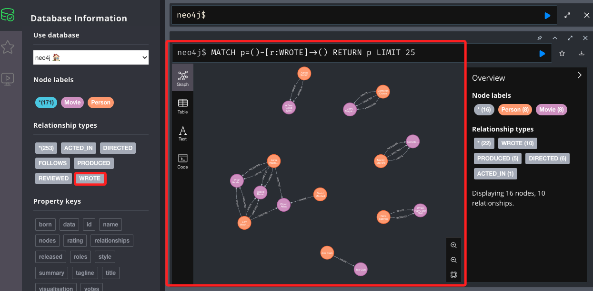

# 官方資料庫

<br>

## 說明

_參考 [官方說明](https://neo4j.com/docs/getting-started/appendix/example-data/) 以及 [官方 GitHub 腳本](https://github.com/neo4j-graph-examples/movies/blob/main/code/python/example.py)_

<br>

1. 查詢已安裝的 `neo4j` 驅動器版本。

    ```bash
    pip show neo4j
    ```

<br>

2. 結果為 `5.20.0`，這是當前最新版本。

    ```bash
    Name: neo4j
    Version: 5.20.0
    Summary: Neo4j Bolt driver for Python
    Home-page: 
    Author: 
    Author-email: "Neo4j, Inc." <drivers@neo4j.com>
    License: Apache License, Version 2.0
    Location: /Users/samhsiao/Documents/PythonVenv/envST/lib/python3.10/site-packages
    Requires: pytz
    Required-by: 
    ```

<br>

## 讀取資料庫

1. 連接到官方的 `movies` 資料庫 `datasets`，可參考 [官方說明文件](https://neo4j.com/docs/getting-started/appendix/example-data/)，範例檔案可從 [官方 GitHub 倉庫](https://github.com/neo4j-examples/movies-python-bolt) 取得。

<br>

2. 程式碼。

    ```python
    from neo4j import GraphDatabase
    import os
    from dotenv import load_dotenv

    # 載入環境變數
    load_dotenv()

    # 官方範例資料庫的連接設定
    DEMO_URI = "neo4j+s://demo.neo4jlabs.com:7687"
    DEMO_DATABASE = "movies"
    DEMO_USER = "movies"
    DEMO_PASSWORD = "movies"

    # 建立連接
    demo_driver = GraphDatabase.driver(DEMO_URI, auth=(DEMO_USER, DEMO_PASSWORD))

    def fetch_data():
        # 取得數據的指令
        query = """
        MATCH (n) RETURN n LIMIT 25
        """
        try:
            with demo_driver.session(database=DEMO_DATABASE) as session:
                results = session.run(query)
                nodes = [{"type": record["n"].labels, "properties": dict(record["n"].items())} for record in results]
                return nodes
        except Exception as e:
            print(f"An error occurred: {e}")
            return []

    if __name__ == "__main__":
        nodes = fetch_data()
        if nodes:
            print(f"Retrieved {len(nodes)} nodes from the database.")
            # 輸出節點的訊息
            for node in nodes:
                print("Node Type:", node["type"], "| Properties:", node["properties"])
        else:
            print("No nodes retrieved.")

    ```

<br>

3. 結果如下，從資料庫中取得 25 個節點資訊，節點的資料型態是 `frozenset`。
    
    ```bash
    Retrieved 25 nodes from the database.
    Node Type: frozenset({'Movie'}) | Properties: {'tagline': 'Welcome to the Real World', 'votes': 5254, 'title': 'The Matrix', 'released': 1999}
    Node Type: frozenset({'Person'}) | Properties: {'born': 1964, 'name': 'Keanu Reeves'}
    Node Type: frozenset({'Person'}) | Properties: {'born': 1967, 'name': 'Carrie-Anne Moss'}
    Node Type: frozenset({'Person'}) | Properties: {'born': 1961, 'name': 'Laurence Fishburne'}
    Node Type: frozenset({'Person'}) | Properties: {'born': 1960, 'name': 'Hugo Weaving'}
    Node Type: frozenset({'Person'}) | Properties: {'born': 1967, 'name': 'Lilly Wachowski'}
    Node Type: frozenset({'Person'}) | Properties: {'born': 1965, 'name': 'Lana Wachowski'}
    Node Type: frozenset({'Person'}) | Properties: {'born': 1952, 'name': 'Joel Silver'}
    Node Type: frozenset({'Person'}) | Properties: {'born': 1978, 'name': 'Emil Eifrem'}
    Node Type: frozenset({'Movie'}) | Properties: {'tagline': 'Free your mind', 'votes': 1537, 'title': 'The Matrix Reloaded', 'released': 2003}
    Node Type: frozenset({'Movie'}) | Properties: {'tagline': 'Everything that has a beginning has an end', 'votes': 1229, 'title': 'The Matrix Revolutions', 'released': 2003}
    Node Type: frozenset({'Movie'}) | Properties: {'tagline': 'Evil has its winning ways', 'votes': 191, 'title': "The Devil's Advocate", 'released': 1997}
    Node Type: frozenset({'Person'}) | Properties: {'born': 1975, 'name': 'Charlize Theron'}
    Node Type: frozenset({'Person'}) | Properties: {'born': 1940, 'name': 'Al Pacino'}
    Node Type: frozenset({'Person'}) | Properties: {'born': 1944, 'name': 'Taylor Hackford'}
    Node Type: frozenset({'Movie'}) | Properties: {'tagline': "In the heart of the nation's capital, in a courthouse of the U.S. government, one man will stop at nothing to keep his honor, and one will stop at nothing to find the truth.", 'votes': 367, 'title': 'A Few Good Men', 'released': 1992}
    Node Type: frozenset({'Person'}) | Properties: {'born': 1962, 'name': 'Tom Cruise'}
    Node Type: frozenset({'Person'}) | Properties: {'born': 1937, 'name': 'Jack Nicholson'}
    Node Type: frozenset({'Person'}) | Properties: {'born': 1962, 'name': 'Demi Moore'}
    Node Type: frozenset({'Person'}) | Properties: {'born': 1958, 'name': 'Kevin Bacon'}
    Node Type: frozenset({'Person'}) | Properties: {'born': 1966, 'name': 'Kiefer Sutherland'}
    Node Type: frozenset({'Person'}) | Properties: {'born': 1971, 'name': 'Noah Wyle'}
    Node Type: frozenset({'Person'}) | Properties: {'born': 1968, 'name': 'Cuba Gooding Jr.'}
    Node Type: frozenset({'Person'}) | Properties: {'born': 1957, 'name': 'Kevin Pollak'}
    Node Type: frozenset({'Person'}) | Properties: {'born': 1943, 'name': 'J.T. Walsh'}
    ```

<br>

## 讀取後寫入自己的資料庫

1. 程式碼：讀取官方範例並寫入自己的資料庫。

    ```python
    # neo4j 庫
    from neo4j import GraphDatabase
    # 處理敏感資訊
    import os
    from dotenv import load_dotenv

    # 載入環境變數
    load_dotenv()

    # 官方範例連接設定
    DEMO_URI = "neo4j+s://demo.neo4jlabs.com:7687"
    DEMO_DATABASE = "movies"
    DEMO_USER = "movies"
    DEMO_PASSWORD = "movies"

    # 自己的資料庫設定：可從憑證上取得
    YOUR_URI = os.getenv("NEO4J_URI")
    YOUR_USER = os.getenv("NEO4J_USERNAME")
    YOUR_PASSWORD = os.getenv("NEO4J_PASSWORD")

    # 連接官方資料庫
    demo_driver = GraphDatabase.driver(
        DEMO_URI,
        auth=(DEMO_USER, DEMO_PASSWORD)
    )
    # 連接自己的資料庫
    your_driver = GraphDatabase.driver(
        YOUR_URI,
        auth=(YOUR_USER, YOUR_PASSWORD)
    )

    def fetch_data():
        # 語法：從官方資料庫取得節點 `node` 跟關係 `relation`
        query = """
        MATCH (n)-[r]->(m) RETURN n, r, m
        """
        try:
            with demo_driver.session(database=DEMO_DATABASE) as session:
                results = session.run(query)
                data = []
                for record in results:
                    data.append({
                        "start_node": {
                            "labels": list(record["n"].labels),
                            "properties": dict(record["n"].items())
                        },
                        "relationship": {
                            "type": record["r"].type,
                            "properties": dict(record["r"].items())
                        },
                        "end_node": {
                            "labels": list(record["m"].labels),
                            "properties": dict(record["m"].items())
                        }
                    })
                return data
        except Exception as e:
            print(f"An error occurred: {e}")
            return []

    def insert_data(data):
        # 将节点和关系数据插入到自己的数据库
        try:
            with your_driver.session() as session:
                for item in data:
                    start_node_props = ', '.join(f'{k}: ${k}' for k in item['start_node']['properties'].keys())
                    start_query = f"MERGE (n:{':'.join(item['start_node']['labels'])} {{{start_node_props}}}) RETURN id(n)"
                    start_node_id = session.run(start_query, **item['start_node']['properties']).single()[0]
                    
                    end_node_props = ', '.join(f'{k}: ${k}' for k in item['end_node']['properties'].keys())
                    end_query = f"MERGE (n:{':'.join(item['end_node']['labels'])} {{{end_node_props}}}) RETURN id(n)"
                    end_node_id = session.run(end_query, **item['end_node']['properties']).single()[0]
                    
                    rel_props = ', '.join(f'{k}: ${k}' for k in item['relationship']['properties'].keys())
                    rel_query = f"MATCH (a), (b) WHERE id(a) = $start_id AND id(b) = $end_id CREATE (a)-[r:{item['relationship']['type']} {{{rel_props}}}]->(b)"
                    session.run(rel_query, start_id=start_node_id, end_id=end_node_id, **item['relationship']['properties'])

                print("Data and relationships have been inserted into your database.")
        except Exception as e:
            print(f"An error occurred while inserting data: {e}")

    if __name__ == "__main__":
        data = fetch_data()
        if data:
            print(f"Retrieved {len(data)} items from the database.")
            insert_data(data)
        else:
            print("No data retrieved.")

    ```
    _結果_
    ```bash
    Retrieved 253 items from the database.
    Data and relationships have been inserted into your database.
    ```

<br>

2. 點擊資料庫下方的 `刷新`。

    

<br>

3. 出現數據的相關資訊。

    

<br>

4. 點擊 `Relationships` 中的 `ACTED_IN` 觀察圖形化訊息。

    

<br>

5. 這裡可觀察 `WROTE` 關係節點中所顯示的結果，自己資料庫與官方資料庫似乎不同，下方是寫入自己資料庫後顯示的圖形。

    

<br>

6. 以下是官方資料庫在相同節點關係中顯示的結果，可進入 [官方資料庫](https://demo.neo4jlabs.com:7473/browser/) 中使用 `movies` 作為 `Username` 及 `Password` 建立連線。

    

<br>

7. 但透過以下兩個指令查詢，結果顯示資料數是相同的。

    ```bash
    MATCH (n)
    RETURN count(n) AS NodeCount
    ```
    

    ```bash
    MATCH ()-[r]->()
    RETURN count(r) AS RelationshipCount
    ```
    

<br>

8. 使用以下腳本，同時將 `官方與自己` 的資料下載並儲存在本地的 `JSON` 文件中。

    ```python
    from neo4j import GraphDatabase
    import os
    from dotenv import load_dotenv
    import json

    load_dotenv()

    # 官方和自己資料庫的連接訊息
    DEMO_URI = "neo4j+s://demo.neo4jlabs.com:7687"
    DEMO_DATABASE = "movies"
    DEMO_USER = "movies"
    DEMO_PASSWORD = "movies"
    YOUR_URI = os.getenv("NEO4J_URI")
    YOUR_USER = os.getenv("NEO4J_USERNAME")
    YOUR_PASSWORD = os.getenv("NEO4J_PASSWORD")

    # 建立連線
    demo_driver = GraphDatabase.driver(DEMO_URI, auth=(DEMO_USER, DEMO_PASSWORD))
    your_driver = GraphDatabase.driver(YOUR_URI, auth=(YOUR_USER, YOUR_PASSWORD))

    def fetch_and_sort_data(driver, database):
        """從指定資料庫取得所有節點和關係，並進行排序"""
        query_nodes = "MATCH (n) RETURN n"
        query_relationships = "MATCH ()-[r]->() RETURN r"
        data = {"nodes": [], "relationships": []}
        with driver.session(database=database) as session:
            # 获取节点
            nodes = session.run(query_nodes)
            for node in nodes:
                data["nodes"].append({"labels": list(node["n"].labels), "properties": dict(node["n"].items())})
            
            # 获取关系
            relationships = session.run(query_relationships)
            for rel in relationships:
                data["relationships"].append({"type": rel["r"].type, "properties": dict(rel["r"].items())})
        
        sort_data(data)  # 排序数据
        return data

    def sort_data(data):
        """對資料進行排序"""
        data["nodes"].sort(key=lambda x: (sorted(x["labels"]), sorted((k, v) for k, v in x["properties"].items())))
        data["relationships"].sort(key=lambda x: (x["type"], sorted((k, v) for k, v in x["properties"].items())))

    def save_data(data, filename):
        """將資料儲存為JSON文件"""
        with open(filename, 'w') as f:
            json.dump(data, f, indent=4)

    if __name__ == "__main__":
        # 從兩個資料庫中取得並保存數據
        demo_data = fetch_and_sort_data(demo_driver, DEMO_DATABASE)
        save_data(demo_data, "demo_database_data.json")
        # 假設資料庫沒有指定不同的資料庫上下文
        your_data = fetch_and_sort_data(your_driver, None)
        save_data(your_data, "your_database_data.json")
        
        print("Data has been fetched and saved.")
    ```

    

<br>

9. 下載後，透過以下腳本可進行 `JSON` 文件內容的比對。

    ```python
    import json


    def compare_json(file1, file2):
        """比較兩個 JSON 文件並將不同之處輸出，或輸出 `完全一致`"""
        with open(file1, 'r') as f1, open(file2, 'r') as f2:
            data1 = json.load(f1)
            data2 = json.load(f2)

        # 跟踪是否發現差異，發現不同就設定為 `True`
        differences_found = False

        # 比對節點
        for item1, item2 in zip(data1["nodes"], data2["nodes"]):
            if item1 != item2:
                print(f"Difference in nodes: {item1} != {item2}")
                differences_found = True

        # 比對關係
        for item1, item2 in zip(data1["relationships"], data2["relationships"]):
            if item1 != item2:
                print(f"Difference in relationships: {item1} != {item2}")
                differences_found = True

        if not differences_found:
            print("完全一致")


    if __name__ == "__main__":
        compare_json("demo_database_data.json", "your_database_data.json")

    ```

    

<br>

10. 進一步嘗試，使用 [Neo4j Browser](https://demo.neo4jlabs.com:7473/browser/) 來訪問自己的資料庫，在以下的欄位中，依據憑證進行連線。

    

<br>

11. 輸入相關查詢，發現跟官方資料庫的結果就一致了，至此可確認資料是一致的，只是這兩個官方平台 `Neo4j Browser` 跟 `Neo4j Workspace` 查詢的結果在顯示上略有不同，其中 `Neo4j Workspace` 整合了 `Neo4j Browser`、`Neo4j Bloom` 和 `Neo4j Data Importer` 的功能到一個介面中。

    

<br>

12. 關於連線 Neo4j 應用的方式，官方也有做 [說明](https://neo4j.com/docs/aura/aurads/connecting/neo4j-applications/#_neo4j_desktop)，也提到了 `Python` 的 [連線說明](https://neo4j.com/docs/aura/aurads/connecting/python/)。

<br>

13. 官方還提供了很多的圖形開發工具給使用者 [下載](https://install.graphapp.io/)，下一小節將簡單介紹 `Neo4j Desktop`。

    

<br>

___

_END_