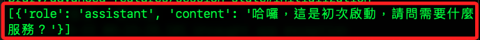
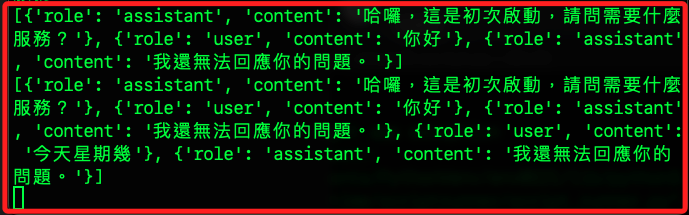

# Session State

_Streamlit 中的 `session_state`_

<br>

## 說明

1. `session_state` 在使用者與應用互動時可對數據進行持久化，以便在頁面刷新或其他操作後仍然保留這些狀態。

<br>

2. 對 `st.session_state` 採用操作字典一樣的方式進行訪問和設置。

    ```python
    import streamlit as st

    # 初始化一個 session state 變數
    if 'key' not in st.session_state:
        st.session_state.key = '初始化值'

    # 訪問 session state 的值
    st.write(f'當前的值是： {st.session_state.key}')

    # 更新 session state 的值
    st.session_state.key = '新的值'
    st.write(f'當前的值是： {st.session_state.key}')
    ```

<br>

3. 除了儲存基本的 `鍵值對`，session_state 還可以儲存更複雜的數據結構，如列表和字典，並且可以在整個應用中共享狀態。

    ```python
    import streamlit as st

    # 初始化一個模擬的字典數據
    if 'my_dict' not in st.session_state:
        st.session_state.my_dict = {
            'name': 'John Doe',
            'age': 30,
            'occupation': 'Engineer'
        }

    # 初始化一個模擬的列表數據
    if 'my_list' not in st.session_state:
        st.session_state.my_list = ['Item 1', 'Item 2', 'Item 3']

    # 更新字典中的一個值
    st.session_state.my_dict['age'] = 31

    # 添加一個元素到列表中
    st.session_state.my_list.append('新元素')

    # 顯示字典中的所有鍵值對
    st.write("字典中的數據:")
    for key, value in st.session_state.my_dict.items():
        st.write(f"{key}: {value}")

    # 顯示列表中的所有元素
    st.write("列表中的所有元素:")
    st.write(st.session_state.my_list)
    ```

<br>

## 回到專案

_延續前一小節最後的腳本_

<br>

1. `使用者` 當前可以在下方的 `對話框` 中輸入訊息，透過 `上下文管理`，每次輸入後都會在上方 `訊息框` 中顯示使用者所輸入的訊息，重新輸入之後會覆蓋原本的訊息，並維持顯示最後一條訊息。

<br>

2. 重新編輯原本的 `st.soinner`，每次使用者輸入訊息後，系統會模擬思考一秒鐘後自動回覆一則訊息，也就是添加一個對話中的 `助理 assistant` 角色。

    ```python
    import streamlit as st
    from time import sleep

    st.set_page_config(
        page_title="柱子",
        page_icon=":tada:",
        layout="wide"
    )

    if prompt := st.chat_input("怎麼了？有話就說吧～"):

        with st.chat_message("user"):
            st.markdown(prompt)

        with st.spinner('讓我思考一下...'):
            sleep(1)
            with st.chat_message("assistant"):
                st.markdown("我還無法回應你的問題。")
    ```

<br>

3. 接下來要將每一次的對話都存入 `session_state`，所以在 `session_state` 中加入一個鍵 `messages` 來紀錄對話，必須先對這個鍵做初始化，所以設置一個機制檢查這個鍵值是否存在，假如不存在就進行初始化，並透過 `助理` 傳送歡迎簡訊。

    ```python
    import streamlit as st
    from time import sleep

    st.set_page_config(
        page_title="柱子",
        page_icon=":tada:",
        layout="wide"
    )

    # 檢查
    if "messages" not in st.session_state:
        _text = "哈囉，這是初次啟動，請問需要什麼服務？"
        st.session_state.messages = [{
            "role": "assistant",
            "content": _text
        }]
        with st.chat_message("assistant"):
            st.markdown(_text)

    if prompt := st.chat_input("怎麼了？有話就說吧～"):

        with st.chat_message("user"):
            st.markdown(prompt)

        with st.spinner("讓我思考一下..."):
            sleep(1)
            with st.chat_message("assistant"):
                st.markdown("我還無法回應你的問題。")

    ```

<br>

4. 應用程式啟動就會看到以下畫面。

    

<br>

5. 接下來要加入 session_state，為了便於觀察，先在腳本最下方添加以下程式碼。

    ```python
    # 查看
    print(st.session_state.messages)
    ```

<br>

6. 無論應用啟動或是進行對話，都會在終端機中輸出全部的 `messages`。

    

<br>

7. 分別修改將 `with st.chat_message("user")` 與 `with st.spinner('讓我思考一下...')` 添加寫入 `session_state` 的機制。

    ```python
    import streamlit as st
    from time import sleep

    st.set_page_config(
        page_title="柱子",
        page_icon=":tada:",
        layout="wide"
    )


    # 自訂函數 `寫入訊息`：參數有 `角色`、`內容`
    def write_message(_role, _text):
        # 顯示訊息
        st.chat_message(_role).markdown(_text)
        # 若需要保存，則保存訊息
        st.session_state.messages.append(
            {"role": _role, "content": _text}
        )


    # 檢查
    if "messages" not in st.session_state:
        _text = "哈囉，這是初次啟動，請問需要什麼服務？"
        st.session_state.messages = [{
            "role": "assistant",
            "content": _text
        }]
        with st.chat_message("assistant"):
            st.markdown(_text)

    if prompt := st.chat_input("怎麼了？有話就說吧～"):
        # 用戶
        with st.chat_message("user"):
            st.markdown(prompt)
            st.session_state.messages.append({
                "role": "user", "content": prompt
            })
        # 助理
        with st.spinner('讓我思考一下...'):
            sleep(1)
            with st.chat_message("assistant"):
                _text = "我還無法回應你的問題。"
                st.markdown(_text)
                st.session_state.messages.append({
                    "role": "assistant", "content": _text
                })

    # 查看
    print(st.session_state.messages)

    ```

<br>

8. 可查看可確實寫入 session_state。

    

<br>

9. 目前有三個程式碼區塊重複了類似的功能，基於 `重用` 機制，可將這個寫入 session_state 的功能封裝為獨立的方法 `write_message`，同時將判斷是否初次啟用的程式碼區塊也納入。

    ```python
    # 自訂函數 `寫入訊息`：參數有 `角色`、`內容`
    def write_message(_role, _text=""):
        # 檢查是否為初次啟動應用
        if "messages" not in st.session_state:
            _text = "哈囉，這是初次啟動，請問需要什麼服務？"
            _role = "assistant"
            # 顯示並寫入歡迎訊息
            with st.chat_message(_role):
                # 顯示
                st.markdown(_text)
                # 寫入
                st.session_state.messages = [{
                    "role": _role,
                    "content": _text
                }]
        # 只有當 _text 非空時才顯示並存入角色訊息
        elif _text:
            # 顯示並存入角色訊息
            with st.chat_message(_role):
                # 顯示
                st.markdown(_text)
                # 若需要保存，則保存訊息
                st.session_state.messages.append(
                    {"role": _role, "content": _text}
                )

    ```

<br>

10. 使用封裝的函數改寫腳本。

    ```python
    import streamlit as st
    from time import sleep

    st.set_page_config(
        page_title="柱子",
        page_icon=":tada:",
        layout="wide"
    )


    # 自訂函數 `寫入訊息`：參數有 `角色`、`內容`
    def write_message(_role, _text=""):
        # 檢查是否為初次啟動應用
        if "messages" not in st.session_state:
            _text = "哈囉，這是初次啟動，請問需要什麼服務？"
            _role = "assistant"
            # 顯示並寫入歡迎訊息
            with st.chat_message(_role):
                # 顯示
                st.markdown(_text)
                # 寫入
                st.session_state.messages = [{
                    "role": _role,
                    "content": _text
                }]
        # 只有當 _text 非空時才顯示並存入角色訊息
        elif _text:
            # 顯示並存入角色訊息
            with st.chat_message(_role):
                # 顯示
                st.markdown(_text)
                # 若需要保存，則保存訊息
                st.session_state.messages.append(
                    {"role": _role, "content": _text}
                )


    # 檢查是否為初次
    write_message("assistant")

    if prompt := st.chat_input("怎麼了？有話就說吧～"):
        # 用戶
        write_message("user", prompt)
        # 助理
        with st.spinner('讓我思考一下...'):
            sleep(1)
            _reponse = "我還無法回應你的問題。"
            write_message("assistant", _reponse)

    # 查看
    print(st.session_state.messages)

    ```

<br>

## 處理訊息

1. 目前使用 `st.spinner` 上下文管理區塊模擬助理的回應，便於日後的封裝，雖還沒實質編寫功能，但可先定義一個提交使用者訊息並取得應的函數 `handle_submit()` 更改當前程式碼。

    ```python
    # 自訂函數：處理提交訊息
    def handle_submit(message):
        # 助理
        with st.spinner('讓我思考一下...'):
            sleep(1)
            _reponse = "我還無法回應你的問題。"
            write_message("assistant", _reponse)
    ```

<br>

2. 更改原本助理回應的區塊，其餘不變。

    ```python
    if prompt := st.chat_input("怎麼了？有話就說吧～"):
        # 用戶
        write_message("user", prompt)
        # 助理
        handle_submit(prompt)
    ```

<br>

## 小結

1. 當前完整腳本。

    ```python
    import streamlit as st
    from time import sleep

    st.set_page_config(
        page_title="柱子",
        page_icon=":tada:",
        layout="wide"
    )


    # 自訂函數 `寫入訊息`：參數有 `角色`、`內容`
    def write_message(_role, _text=""):
        # 檢查是否為初次啟動應用
        if "messages" not in st.session_state:
            _text = "哈囉，這是初次啟動，請問需要什麼服務？"
            _role = "assistant"
            # 顯示並寫入歡迎訊息
            with st.chat_message(_role):
                # 顯示
                st.markdown(_text)
                # 寫入
                st.session_state.messages = [{
                    "role": _role,
                    "content": _text
                }]
        # 只有當 _text 非空時才顯示並存入角色訊息
        elif _text:
            # 顯示並存入角色訊息
            with st.chat_message(_role):
                # 顯示
                st.markdown(_text)
                # 若需要保存，則保存訊息
                st.session_state.messages.append(
                    {"role": _role, "content": _text}
                )


    # 自訂函數：處理提交訊息
    def handle_submit(message):
        # 助理
        with st.spinner('讓我思考一下...'):
            sleep(1)
            _reponse = "我還無法回應你的問題。"
            write_message("assistant", _reponse)


    # 檢查是否為初次
    write_message("assistant")

    if prompt := st.chat_input("怎麼了？有話就說吧～"):
        # 用戶
        write_message("user", prompt)
        # 助理
        handle_submit(prompt)

    # 查看
    print(st.session_state.messages)
    ```

___

_END_

