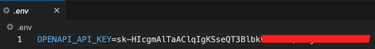

_尚未完成_

# 專案說明

_來源的部分先省略，之後再補上，這裡先說我的解析_。

<br>

## 專案介紹

1. 此專案利用現代 NLP 工具和圖形資料庫技術來建立高互動性的應用程序，它不僅提供了豐富的用戶互動方式，同時也利用了 `LLM` 的強大語言理解能力來提升訊息檢索和數據解釋的效率。 

2. 這個專案的主要設計概念是結合 `Streamlit` 和 `Langchain` 來實現一個互動式的對話式界面，這個界面可以通過 `OpenAI` 的語言模型 `LLM` 與 `Neo4j` 圖形資料庫進行互動，以提供基於圖數據的問答和數據視覺化。

<br>

## 使用套件說明

1. Streamlit：在這個專案中，`Streamlit` 用作應用程序的前端和用戶界面，允許用戶通過網頁與系統互動。
   
2. Langchain：用於快速建立和部署數據驅動的 Web 應用程序，這是一個用於結合語言模型與外部資料來源的 Python 庫。在這個專案中，`Langchain` 用來整合 OpenAI 的 `GPT-4` 模型與 Neo4j 圖形資料庫，實現智能的問答系統。
   
3. Neo4j：一個高性能的圖形資料庫，支持儲存複雜的網絡結構的數據，這個專案中使用 Neo4j 來儲存和管理圖形數據，並通過查詢語言 `Cypher` 來檢索相關訊息。
   
4. Graphviz：用於生成和呈現圖形結構的工具，這在專案中用於將圖形數據視覺化，以便於用戶理解數據之間的關聯和結構。

<br>

## 相關錯誤排除

_關於範例腳本運行時出現的錯誤，以下進行排除紀錄_

<br>

1. 更新套件

    ```bash
    pip install -U langchain-openai
    ```

<br>

2. 更新導入庫。

    ```python
    # from langchain.chat_models import ChatOpenAI
    from langchain_openai import ChatOpenAI
    # from langchain.graphs import Neo4jGraph
    from langchain_community.graphs import Neo4jGraph
    ```

<br>

3. 在容器中安裝套件。

    ```bash
    sudo apt-get update && sudo apt-get install curl telnet -y
    ```

<br>

4. 測試。

    ```bash
    telnet demo.neo4jlabs.com 7687
    ```

<br>

## 關於 `graphviz` 安裝

1. 指令。

    ```bash
    pip install graphviz && brew install graphviz
    ```

<br>

2. 當在 Python 中使用 `graphviz` 庫時，實際上需要調用  `graphviz`  的系統級二進制文件來執行操作。因此，除了在 Python 虛擬環境中安裝 `graphviz` Python 庫，仍然需要在系統層面安裝其相應的二進制文件和庫，以確保所有功能都可以正常工作，特別注意，這並不代表可以省去在虛擬環境安裝套件。

<br>

## 步驟記錄

_包含了容器的重建_

<br>

1. 因為使用容器，所以不用建立或指定虛擬環境，建立專案資料夾並啟動 VSCode。

  ```bash
  cd ~/Desktop && mkdir neo4jBot && cd neo4jBot && code .
  ```

<br>

2. 在當前路徑中建立容器資料夾，並建立`開發容器配置文件`，檔名為 `devcontainer.json`，這是用來配置 VSCode 中的開發容器環境所用，進階用戶可參考使用 `Dockerfile` 進行環境建置。

  ```bash
  mkdir .devcontainer && touch .devcontainer/devcontainer.json
  ```

<br>

3. 關於使用 `映像檔案`、`Dockerfiles` 或 `Docker Compose` 安裝的相關技術可參考 [ Dev Container 官方說明](https://containers.dev/guide/dockerfile)。

<br>

4. 編輯 `devcontainer.json` 內容如下。

  ```json
  {
    // 指定開發環境名稱，這是可以自訂的
    "name": "Python 3",
    // 容器基於的映像，當前設定使用微軟的 `python:1-3.11-bullseye`
    "image": "mcr.microsoft.com/devcontainers/python:1-3.11-bullseye",
    "customizations": {
      // 指定在 Codespace 中要使用的設定，特別注意這裡是相對於根目錄的路徑
      "codespaces": {
        "openFiles": ["README.md", "app.py"]
      },
      // 在 VScode 中的設定與拓展插件
      "vscode": {
        "settings": {},
        "extensions": ["ms-python.python", "ms-python.vscode-pylance"]
      }
    },
    // 檢查 `packages.txt` 並安裝其中列出的 Debian 軟體包
    // 檢查 `requirements.txt` 並安裝指定的 Python 套件
    // 安裝 `streamlit` 以及相關更新
    "updateContentCommand": "[ -f packages.txt ] && sudo apt update && sudo apt upgrade -y && sudo xargs apt install -y <packages.txt; [ -f requirements.txt ] && pip3 install --user -r requirements.txt; pip3 install --user streamlit; echo '✅ Packages installed and Requirements met'",
    // 這個指令是在附加容器後運行
    "postAttachCommand": {
      // --server.enableCORS 具有跨域資源共享(CORS)功能
      // 這個設定是在受控環境中執行服務並希望避免可能使開發互動複雜化的安全措施時使用
      "server": "streamlit run app.py --server.enableCORS false --server.enableXsrfProtection false"
    },
    // 定義如何處理容器內的特定連接埠
    "portsAttributes": {
      "7687": {
        "label": "Neo4j Bolt Port",
        "onAutoForward": "ignore"
      },
      "8501": {
        "label": "Streamlit Application",
        "onAutoForward": "openPreview"
      }
    },
    // 列出容器啟動時應自動轉送的連接埠
    "forwardPorts": [8501, 7687]
  }
  ```

<br>

5. 延續上一點，特別留意鍵值 `postAttachCommand` 中的指令是有路徑的，當前在同級路徑所以是 `streamlit run app.py`，若將 `app.py` 置於不同層級路徑，則需進行修改，例如將其至於子目錄 `src` 中，則是 `streamlit run sec/app.py`

<br>

6. 建立套件統籌文件 `requirements.txt`。

  ```bash
  touch requirements.txt
  ```

<br>

7. 加入以下套件。

  ```bash
  streamlit==1.26.0
  openai
  langchain
  langchain-openai
  neo4j
  graphviz==0.20.1
  pydantic==2.3.0
  python-dotenv
  ```

<br>

8. 建立 .env 文件，並寫入 OpenAI 的 API Key。

  ```bash
  touch .env
  ```

  

<br>

9. 點擊 `在容器中重新開啟`，這時便會啟動容器的建立。

  

<br>

10. 特別注意，`Neo4jGraph` 的實體不支援 `with` 作為上下文管理（context manager），所以也沒有 `close` 等關閉方法，所以也無法使用 `try-except` 中的 `finally` 來達到執行完畢時退出的機制。

<br>

11. 當前的 `app.py`。

  ```python
  """
  這是一個完整的 Streamlit 和 Langchain 的集成腳本；
  可利用 OpenAI 的語言模型和 Neo4j 圖形資料庫進行對話。
  """

  #
  from typing import List, Union
  import streamlit as st

  # 用於建立和呈現圖形結構
  import graphviz

  # 從Langchain引入用於OpenAI聊天模型的封裝
  # from langchain.chat_models import ChatOpenAI
  from langchain_openai import ChatOpenAI


  # 引入Langchain對Neo4j圖形資料庫的封裝
  # from langchain.graphs import Neo4jGraph
  from langchain_community.graphs import Neo4jGraph


  # 引入Langchain消息架構
  from langchain.schema import HumanMessage, AIMessage

  # 引入自定義的Cypher鏈和提問提示
  from cypher_chain import CYPHER_QA_PROMPT, CustomCypherChain

  import os
  # 載入 dotenv
  from dotenv import load_dotenv

  # 載入環境變數
  load_dotenv()

  # 設置 OpenAI API Key
  openai_api_key = os.getenv("OPENAPI_API_KEY")
  # 將API鍵設定為環境變數
  os.environ["OPENAI_API_KEY"] = openai_api_key

  # 設定Streamlit頁面標題
  st.title("VC Chatbot")

  # 設定Neo4j資料庫的連接訊息
  # url = "neo4j+s://demo.neo4jlabs.com"
  url = "neo4j+s://demo.neo4jlabs.com:7687"
  username = "companies"
  password = "companies"
  database = "companies"

  # 建立一個Neo4j圖形資料庫實例
  graph = Neo4jGraph(username=username, password=password, url=url, database=database)

  # 從語言模型建立自定義的Cypher查詢鏈
  graph_search = CustomCypherChain.from_llm(
      # 設置OpenAI聊天模型
      cypher_llm=ChatOpenAI(temperature=0.0, model_name="gpt-4"),
      # 設置用於問答的OpenAI模型
      qa_llm=ChatOpenAI(temperature=0.0),
      # 指定圖形資料庫，傳入前一個步驟建立的資料庫實例
      graph=graph,
      # 設置查詢提示，這是從自訂模組中導入的
      qa_prompt=CYPHER_QA_PROMPT,
  )

  # 初始化 session state，確保每次執行應用程式時，相關的數據和變數都被正確設置和跟踪
  # 在 Streamlit 應用中，`st.session_state`` 是用在跨頁面請求時保存狀態的工具
  # 檢查是否包含了特定的 key，如果沒有就初始化並賦予一個空列表
  # 可確保這些鍵在後續操作中已經被定義並可用於儲存數據。
  if "generated" not in st.session_state:
      st.session_state["generated"] = []

  if "user_input" not in st.session_state:
      st.session_state["user_input"] = []

  if "viz_data" not in st.session_state:
      st.session_state["viz_data"] = []

  if "database" not in st.session_state:
      st.session_state["database"] = []

  if "cypher" not in st.session_state:
      st.session_state["cypher"] = []

  # 生成聊天機器下回應的上下文
  # 參數與回傳值：
  # prompt: 字串，表示當前用戶的輸入。
  # context_data: 字串，預設為 "generated"，用來指定從 st.session_state 中讀取哪個對話數據，通常是用來指定是從哪類型的消息中抽取歷史數據。
  # 返回一個列表，包含混合類型的 AIMessage 和 HumanMessage 對象，這些對象代表了生成回應所需的上下文。

  def generate_context(
      prompt: str, context_data: str = "generated"
  ) -> List[Union[AIMessage, HumanMessage]]:
      # 建立空列表用來儲存對話的上下文
      context = []
      # 假如有歷史對話
      if st.session_state["generated"]:
          # 先計算歷史對話的數量
          size = len(st.session_state["generated"])
          # 只取最後三條對話進行上下文生成
          for i in range(max(size - 3, 0), size):
              # 把每條對話中 `用戶的輸入`與`AI的回應`添加到 `context` 列表
              context.append(HumanMessage(content=st.session_state["user_input"][i]))
              context.append(AIMessage(content=st.session_state[context_data][i]))
      # 先將當前用戶的輸入 `prompt` 轉換為 `HumanMessage` 物件，
      # 再將用戶的輸入，然後添加到 `context`
      context.append(HumanMessage(content=str(prompt)))
      # 傳出
      return context


  # 動態生成多個響應標籤（Tabs），並根據用戶與 AI 對話的內容和結果來展示相應的數據和視覺化訊息
  # 參數 i：表示要展示的對話和相關數據在列表中的索引
  def dynamic_response_tabs(i):
      # 建立一個列表 tabs_to_add，預設包含 `💬Chat` 標籤，此標籤用於展示用戶和 AI 的對話
      tabs_to_add = ["💬Chat"]
      # 定義一個字典來儲存各類數據的存在檢查
      data_check = {
          # 展示生成的 Cypher 查詢語句
          "🔍Cypher": st.session_state["cypher"][i],
          # 展示從資料庫查詢的結果
          "🗃️Database results": st.session_state["database"][i],
          # 展示數據的視覺化，此處使用了 `短路評估` 確保對應數據索引存在
          "🕸️Visualization": st.session_state["viz_data"][i]
          and st.session_state["viz_data"][i][0],
      }

      # 遍歷 data_check，將有數據的標籤加入到前面建立的列表 `tabs_to_add`
      for tab_name, has_data in data_check.items():
          if has_data:
              tabs_to_add.append(tab_name)

      # 建立一個對話框來展示用戶的輸入
      with st.chat_message("user"):
          # 展示指定索引的用戶輸入
          st.write(st.session_state["user_input"][i])
      # 建立一個對話框來展示助理的回應
      with st.chat_message("assistant"):
          # 建立多個標籤，根據先前檢查的數據類型動態添加
          selected_tabs = st.tabs(tabs_to_add)
          # 遍歷並展示每個標籤對應的內容
          with selected_tabs[0]:
              st.write(st.session_state["generated"][i])
          # 假如數量多於 1
          if len(selected_tabs) > 1:
              # 第一個標籤始終展示 AI 生成的回應
              with selected_tabs[1]:
                  st.code(st.session_state["cypher"][i], language="cypher")
          # 如果有額外的標籤，則根據其類型展示 Cypher 語句、資料庫結果或視覺化內容
          if len(selected_tabs) > 2:
              with selected_tabs[2]:
                  st.write(st.session_state["database"][i])
          if len(selected_tabs) > 3:
              with selected_tabs[3]:
                  # 若存在視覺化數據，則使用 graphviz.Digraph() 建立一個有向圖
                  graph_object = graphviz.Digraph()
                  # 添加節點和邊
                  # 根據 st.session_state["viz_data"][i] 儲存的視覺化數據建立圖形
                  for final_entity in st.session_state["viz_data"][i][1]:
                      graph_object.node(
                          final_entity, fillcolor="lightblue", style="filled"
                      )
                  for record in st.session_state["viz_data"][i][0]:
                      graph_object.edge(
                          record["source"], record["target"], label=record["type"]
                      )
                  # 在 Streamlit 應用中渲染視覺化圖形
                  st.graphviz_chart(graph_object)


  # 提供用戶輸入界面
  user_input = st.chat_input("Who is the CEO of Neo4j?")

  if user_input:
      # 顯示載入動畫
      with st.spinner("Processing"):
          # 生成對話上下文
          context = generate_context(user_input)
          # 執行圖形搜索和語言模型處理
          output = graph_search({"query": user_input, "chat_history": context})

          # 儲存結果到session state
          st.session_state.user_input.append(user_input)
          st.session_state.generated.append(output["result"])
          st.session_state.viz_data.append(output["viz_data"])
          st.session_state.database.append(output["database"])
          st.session_state.cypher.append(output["cypher"])

  # 展示生成的對話
  if st.session_state["generated"]:
      size = len(st.session_state["generated"])
      for i in range(max(size - 3, 0), size):
          dynamic_response_tabs(i)
  ```

<br>

## 其他文件

1. 導入自訂模組 `cypher_chain.py`。

  ```python
  # cypher_chain.py
  import os

  from typing import Any, Dict, List, Optional, Tuple
  from langchain.chains.graph_qa.cypher import extract_cypher
  from langchain.chains.openai_functions import create_structured_output_chain
  from langchain.schema import SystemMessage
  from langchain.prompts import ChatPromptTemplate, PromptTemplate

  from langchain.chains import GraphCypherQAChain
  from langchain.callbacks.manager import CallbackManagerForChainRun

  try:
      from pydantic.v1.main import BaseModel, Field
  except ImportError:
      from pydantic.main import BaseModel, Field

  from cypher_validator import CypherQueryCorrector, Schema


  def remove_entities(doc):
      """
      Replace named entities in the given text with their corresponding entity labels.

      Parameters:
      - doc (Spacy Document): processed SpaCy document of the input text.

      Returns:
      - str: The modified text with named entities replaced by their entity labels.

      Example:
      >>> replace_entities_with_labels("Apple is looking at buying U.K. startup for $1 billion.")
      'ORG is looking at buying GPE startup for MONEY .'
      """
      # Initialize an empty list to store the new tokens
      new_tokens = []
      # Keep track of the end index of the last entity
      last_end = 0

      # Iterate through entities, replacing them with their entity label
      for ent in doc.ents:
          # Add the tokens that come before this entity
          new_tokens.extend([token.text for token in doc[last_end : ent.start]])
          # Replace the entity with its label
          new_tokens.append(f"{ent.label_}")
          # Update the last entity end index
          last_end = ent.end

      # Add any remaining tokens after the last entity
      new_tokens.extend([token.text for token in doc[last_end:]])
      # Join the new tokens into a single string
      new_text = " ".join(new_tokens)
      return new_text


  AVAILABLE_RELATIONSHIPS = [
      Schema("Person", "HAS_PARENT", "Person"),
      Schema("Person", "HAS_CHILD", "Person"),
      Schema("Organization", "HAS_SUPPLIER", "Organization"),
      Schema("Organization", "IN_CITY", "City"),
      Schema("Organization", "HAS_CATEGORY", "IndustryCategory"),
      Schema("Organization", "HAS_CEO", "Person"),
      Schema("Organization", "HAS_SUBSIDIARY", "Organization"),
      Schema("Organization", "HAS_COMPETITOR", "Organization"),
      Schema("Organization", "HAS_BOARD_MEMBER", "Person"),
      Schema("Organization", "HAS_INVESTOR", "Organization"),
      Schema("Organization", "HAS_INVESTOR", "Person"),
      Schema("City", "IN_COUNTRY", "Country"),
      Schema("Article", "HAS_CHUNK", "Chunk"),
      Schema("Article", "MENTIONS", "Organization")
  ]

  CYPHER_SYSTEM_TEMPLATE = """
  Purpose:
  Your role is to convert user questions concerning data in a Neo4j database into accurate Cypher queries.
  """

  cypher_query_corrector = CypherQueryCorrector(AVAILABLE_RELATIONSHIPS)

  CYPHER_QA_TEMPLATE = """You are an assistant that helps to form nice and human understandable answers.
  The information part contains the provided information that you must use to construct an answer.
  The provided information is authoritative, you must never doubt it or try to use your internal knowledge to correct it.
  Make the answer sound as a response to the question. Do not mention that you based the result on the given information.
  If the provided information is empty, say that you don't know the answer.
  Even if the question doesn't provide full person or organization names, you should use the full names from the provided
  information to construct an answer.
  Information:
  {context}

  Question: {question}
  Helpful Answer:"""
  CYPHER_QA_PROMPT = PromptTemplate(
      input_variables=["context", "question"], template=CYPHER_QA_TEMPLATE
  )


  class Entities(BaseModel):
      """Identifying information about entities."""

      name: List[str] = Field(
          ...,
          description="All the person, organization, or business entities that appear in the text",
      )


  class CustomCypherChain(GraphCypherQAChain):
      def process_entities(self, text: str) -> List[str]:
          prompt = ChatPromptTemplate.from_messages(
              [
                  (
                      "system",
                      "You are extracting organization and person entities from the text.",
                  ),
                  (
                      "human",
                      "Use the given format to extract information from the following input: {input}",
                  ),
              ]
          )

          entity_chain = create_structured_output_chain(
              Entities, self.qa_chain.llm, prompt
          )
          entities = entity_chain.run(text)
          print(entities)
          return entities.name

      def get_viz_data(self, entities: List[str]) -> List[Tuple[str, str]]:
          viz_query = """
          MATCH (n:Person|Organization) WHERE n.name IN $entities
          CALL {
              WITH n
              MATCH (n)-[r:!MENTIONS]->(m)
              WHERE m.name IS NOT NULL
              RETURN n.name AS source, type(r) AS type, m.name AS target
              LIMIT 5
              UNION
              WITH n
              MATCH (n)<-[r:!MENTIONS]-(m)
              WHERE m.name IS NOT NULL
              RETURN n.name AS target, type(r) AS type, m.name AS source
              LIMIT 5
          }
          RETURN source, type, target LIMIT 20
          """
          results = self.graph.query(viz_query, {"entities": entities})
          return results

      def find_entity_match(self, entity: str, k: int = 3) -> List[str]:
          fts_query = """
          CALL db.index.fulltext.queryNodes('entity', $entity + "*", {limit:$k})
          YIELD node,score
          RETURN node.name AS result
          """

          return [
              el["result"]
              for el in self.graph.query(
                  fts_query, {"entity": "AND ".join(entity.split()), "k": k}
              )
          ]

      def generate_system_message(
          self, relevant_entities: str = "", fewshot_examples: str = ""
      ) -> SystemMessage:
          system_message = CYPHER_SYSTEM_TEMPLATE
          system_message += (
              f"Database Schema: Please refer to the provided database schema {self.graph_schema} for reference. "
              "Guidelines: Relationships & Properties: Utilize only the relationship types "
              "and properties specified in the provided schema. Do not introduce new ones.\n"
          )
          if relevant_entities:
              system_message += (
                  f"Entity Substitution: If the question mentions specific entities, replace them in the query with corresponding entities from "
                  f"the given list. Given list of entities is: {relevant_entities}\n"
                  "Example: If the list contains John: ['John Goodman'], replace 'John' in the query with 'John Goodman'."
                  "Flexible Queries: Ensure your Cypher queries can capture all relevant entities.\n"
                  "Correct: MATCH (p:Person) WHERE p.name IN ['John Goodman', 'John Stockton'] MATCH (p)<-[:BOARD_MEMBER]-(o:Organization)"
              )
          if fewshot_examples:
              system_message += (
                  f"Example Queries: Please refer to the provided example queries for constructing Cypher statements:\n"
                  f"{fewshot_examples}\n"
              )

          system_message += (
              "Informative Responses: Ensure your responses contain sufficient information to answer the question for anyone lacking context.\n"
              "Include details about both persons and organizations, if applicable. \n"
              "Text Search: To search text, avoid using the CONTAINS clause. "
              "Instead, employ apoc.ml.openai.embedding and gds.similarity.cosine functions or db.index.vector.queryNodes.\n"
              "Note: If you use apoc.ml.openai.embedding, it must be the first operation in your query.\n"
              "Result Chunking: When returning text, always provide exactly three chunks—no more, no less.\n"
              "By following these guidelines, you'll ensure the generated Cypher queries accurately reflect the database entities and relationships."
              "Solve it step by step."
          )
          return SystemMessage(content=system_message)

      def get_fewshot_examples(self, question):
          results = self.graph.query(
              """
          CALL apoc.ml.openai.embedding([$question], $openai_api_key)
                                      YIELD embedding                             
          CALL db.index.vector.queryNodes('fewshot', 3, embedding)
                                      YIELD node, score
          RETURN node.Question AS question, node.Cypher as cypher
                                      """,
              {"question": question, "openai_api_key": os.environ["OPENAI_API_KEY"]},
          )

          fewshot = "\n".join([f"#{el['question']}\n{el['cypher']}" for el in results])
          print("-" * 30)
          print(fewshot)
          return fewshot

      def _call(
          self,
          inputs: Dict[str, Any],
          run_manager: Optional[CallbackManagerForChainRun] = None,
      ) -> Dict[str, Any]:

          _run_manager = run_manager or CallbackManagerForChainRun.get_noop_manager()
          callbacks = _run_manager.get_child()
          question = inputs[self.input_key]
          chat_history = inputs["chat_history"]
          # Extract mentioned people and organizations and match them to database values
          entities = self.process_entities(question)
          print(f"NER found: {entities}")
          relevant_entities = dict()
          for entity in entities:
              relevant_entities[entity] = self.find_entity_match(entity)
          print(f"Relevant entities are: {relevant_entities}")

          # Get few-shot examples using vector search
          fewshots = self.get_fewshot_examples(question)

          system = self.generate_system_message(str(relevant_entities), fewshots)
          generated_cypher = self.cypher_generation_chain.llm.predict_messages(
              [system] + chat_history
          )
          print(generated_cypher.content)
          generated_cypher = extract_cypher(generated_cypher.content)
          validated_cypher = cypher_query_corrector(
              generated_cypher
          )
          print(validated_cypher)
          # If Cypher statement wasn't generated
          # Usually happens when LLM decides it can't answer
          if not "RETURN" in validated_cypher:
              chain_result: Dict[str, Any] = {
                  self.output_key: validated_cypher,
                  "viz_data": (None, None),
                  "database": None,
                  "cypher": None,
              }
              return chain_result

          # Retrieve and limit the number of results
          context = self.graph.query(
              validated_cypher, {"openai_api_key": os.environ["OPENAI_API_KEY"]}
          )[: self.top_k]

          result = self.qa_chain(
              {"question": question, "context": context}, callbacks=callbacks
          )
          final_result = result[self.qa_chain.output_key]

          final_entities = self.process_entities(final_result)
          if final_entities:
              viz_data = self.get_viz_data(final_entities)
          else:
              viz_data = None

          chain_result: Dict[str, Any] = {
              self.output_key: final_result,
              "viz_data": (viz_data, final_entities),
              "database": context,
              "cypher": validated_cypher,
          }
          return chain_result
  ```

<br>

2. 導入自訂模組 `cypher_validator.py`。

  ```python
  # cypher_validator.py
  import re
  from collections import namedtuple
  from typing import Any, Dict, List, Optional, Tuple

  Schema = namedtuple("Schema", ["left_node", "relation", "right_node"])


  class CypherQueryCorrector:
      """
      Used to correct relationship direction in generated Cypher statements.
      This code is copied from the winner's submission to the Cypher competition:
      https://github.com/sakusaku-rich/cypher-direction-competition
      """

      property_pattern = re.compile(r"\{.+?\}")
      node_pattern = re.compile(r"\(.+?\)")
      path_pattern = re.compile(r"\(.*\).*-.*-.*\(.*\)")
      node_relation_node_pattern = re.compile(
          r"(\()+(?P<left_node>[^()]*?)\)(?P<relation>.*?)\((?P<right_node>[^()]*?)(\))+"
      )
      relation_type_pattern = re.compile(r":(?P<relation_type>.+?)?(\{.+\})?]")

      def __init__(self, schemas: List[Schema]):
          """
          Args:
              schemas: list of schemas
          """
          self.schemas = schemas

      def clean_node(self, node: str) -> str:
          """
          Args:
              node: node in string format
          """
          node = re.sub(self.property_pattern, "", node)
          node = node.replace("(", "")
          node = node.replace(")", "")
          node = node.strip()
          return node

      def detect_node_variables(self, query: str) -> Dict[str, List[str]]:
          """
          Args:
              query: cypher query
          """
          nodes = re.findall(self.node_pattern, query)
          nodes = [self.clean_node(node) for node in nodes]
          res: Dict[str, Any] = {}
          for node in nodes:
              parts = node.split(":")
              if parts == "":
                  continue
              variable = parts[0]
              if variable not in res:
                  res[variable] = []
              res[variable] += parts[1:]
          return res

      def extract_paths(self, query: str) -> "List[str]":
          """
          Args:
              query: cypher query
          """
          return re.findall(self.path_pattern, query)

      def judge_direction(self, relation: str) -> str:
          """
          Args:
              relation: relation in string format
          """
          direction = "BIDIRECTIONAL"
          if relation[0] == "<":
              direction = "INCOMING"
          if relation[-1] == ">":
              direction = "OUTGOING"
          return direction

      def extract_node_variable(self, part: str) -> Optional[str]:
          """
          Args:
              part: node in string format
          """
          part = part.lstrip("(").rstrip(")")
          idx = part.find(":")
          if idx != -1:
              part = part[:idx]
          return None if part == "" else part

      def detect_labels(
          self, str_node: str, node_variable_dict: Dict[str, Any]
      ) -> List[str]:
          """
          Args:
              str_node: node in string format
              node_variable_dict: dictionary of node variables
          """
          splitted_node = str_node.split(":")
          variable = splitted_node[0]
          labels = []
          if variable in node_variable_dict:
              labels = node_variable_dict[variable]
          elif variable == "" and len(splitted_node) > 1:
              labels = splitted_node[1:]
          return labels

      def verify_schema(
          self,
          from_node_labels: List[str],
          relation_types: List[str],
          to_node_labels: List[str],
      ) -> bool:
          """
          Args:
              from_node_labels: labels of the from node
              relation_type: type of the relation
              to_node_labels: labels of the to node
          """
          valid_schemas = self.schemas
          if from_node_labels != []:
              from_node_labels = [label.strip("`") for label in from_node_labels]
              valid_schemas = [
                  schema for schema in valid_schemas if schema[0] in from_node_labels
              ]
          if to_node_labels != []:
              to_node_labels = [label.strip("`") for label in to_node_labels]
              valid_schemas = [
                  schema for schema in valid_schemas if schema[2] in to_node_labels
              ]
          if relation_types != []:
              relation_types = [type.strip("`") for type in relation_types]
              valid_schemas = [
                  schema for schema in valid_schemas if schema[1] in relation_types
              ]
          return valid_schemas != []

      def detect_relation_types(self, str_relation: str) -> Tuple[str, List[str]]:
          """
          Args:
              str_relation: relation in string format
          """
          relation_direction = self.judge_direction(str_relation)
          relation_type = self.relation_type_pattern.search(str_relation)
          if relation_type is None or relation_type.group("relation_type") is None:
              return relation_direction, []
          relation_types = [
              t.strip().strip("!")
              for t in relation_type.group("relation_type").split("|")
          ]
          return relation_direction, relation_types

      def correct_query(self, query: str) -> str:
          """
          Args:
              query: cypher query
          """
          node_variable_dict = self.detect_node_variables(query)
          paths = self.extract_paths(query)
          for path in paths:
              original_path = path
              start_idx = 0
              while start_idx < len(path):
                  match_res = re.match(self.node_relation_node_pattern, path[start_idx:])
                  if match_res is None:
                      break
                  start_idx += match_res.start()
                  match_dict = match_res.groupdict()
                  left_node_labels = self.detect_labels(
                      match_dict["left_node"], node_variable_dict
                  )
                  right_node_labels = self.detect_labels(
                      match_dict["right_node"], node_variable_dict
                  )
                  end_idx = (
                      start_idx
                      + 4
                      + len(match_dict["left_node"])
                      + len(match_dict["relation"])
                      + len(match_dict["right_node"])
                  )
                  original_partial_path = original_path[start_idx : end_idx + 1]
                  relation_direction, relation_types = self.detect_relation_types(
                      match_dict["relation"]
                  )

                  if relation_types != [] and "".join(relation_types).find("*") != -1:
                      start_idx += (
                          len(match_dict["left_node"]) + len(match_dict["relation"]) + 2
                      )
                      continue

                  if relation_direction == "OUTGOING":
                      is_legal = self.verify_schema(
                          left_node_labels, relation_types, right_node_labels
                      )
                      if not is_legal:
                          is_legal = self.verify_schema(
                              right_node_labels, relation_types, left_node_labels
                          )
                          if is_legal:
                              corrected_relation = "<" + match_dict["relation"][:-1]
                              corrected_partial_path = original_partial_path.replace(
                                  match_dict["relation"], corrected_relation
                              )
                              query = query.replace(
                                  original_partial_path, corrected_partial_path
                              )
                          else:
                              return ""
                  elif relation_direction == "INCOMING":
                      is_legal = self.verify_schema(
                          right_node_labels, relation_types, left_node_labels
                      )
                      if not is_legal:
                          is_legal = self.verify_schema(
                              left_node_labels, relation_types, right_node_labels
                          )
                          if is_legal:
                              corrected_relation = match_dict["relation"][1:] + ">"
                              corrected_partial_path = original_partial_path.replace(
                                  match_dict["relation"], corrected_relation
                              )
                              query = query.replace(
                                  original_partial_path, corrected_partial_path
                              )
                          else:
                              return ""
                  else:
                      is_legal = self.verify_schema(
                          left_node_labels, relation_types, right_node_labels
                      )
                      is_legal |= self.verify_schema(
                          right_node_labels, relation_types, left_node_labels
                      )
                      if not is_legal:
                          return ""

                  start_idx += (
                      len(match_dict["left_node"]) + len(match_dict["relation"]) + 2
                  )
          return query

      def __call__(self, query: str) -> str:
          """Correct the query to make it valid. If
          Args:
              query: cypher query
          """
          return self.correct_query(query)
  ```

<br>

_這個專案目前雖可運行但不算完美，另作修改_

___

_END_

