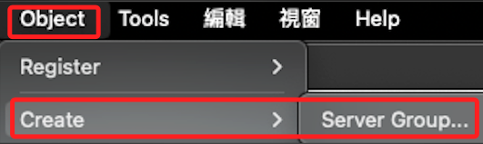
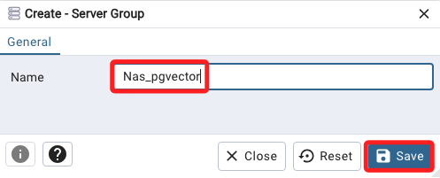
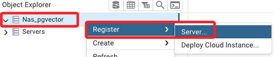
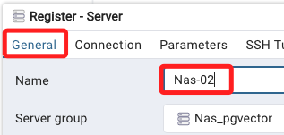
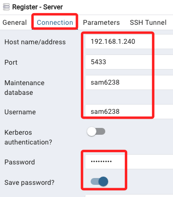
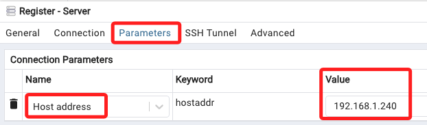

# 快速建立連線

1. 開啟桌面應用。

    

 

2. 命名並且儲存。

    

 

3. 點擊右鍵，註冊新的伺服器。

    

 

4. 在 `General` 頁籤，主要就是命名 `Nas-02`。

    

 

5. 在 `連線 Connection` 頁籤進行設定。

    

 

6. 在 `參數 Paramaters` 頁籤中，選擇 `Host address`，並且將值設定為 `192.168.1.240`。

    

 

7. 其餘不用變動，進行儲存，接著 `刷新 Refresh`。

    

 

___

_END_