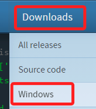
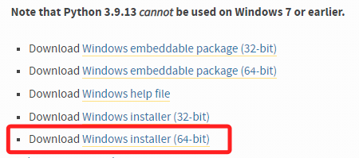
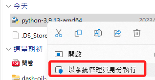
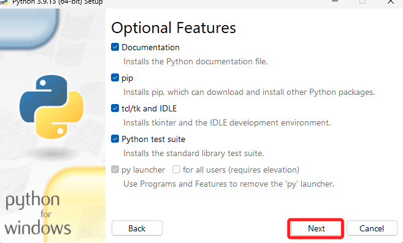
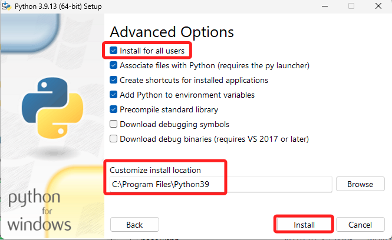
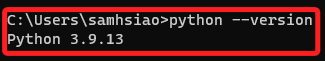
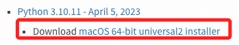

# 安裝 Python

_前往 [官網](https://www.python.org/) 進行安裝_

<br>

## Windows

1. 在下載的頁籤中選擇 Windows。

    

<br>

2. 官網 [下載](https://www.python.org/downloads/windows/) 。

    

<br>

3. 以系統管理員身份執行安裝。

    

<br>

4. 務必勾選添加路徑，然後選擇客製化安裝。

    

<br>

5. 點擊 `NEXT` 。

    

<br>

6. 勾選 `Install for all users`，就是因為要在這裡確認 `路徑中沒有中文`，所以選擇客製化安裝。

    

<br>

7. 安裝完成，關閉即可。

    

<br>

_回到終端機_

8. 查詢版本。

    ```bash
    python --version
    ```

<br>

9. 就會是剛剛安裝完成的版本。

    


<br>

## MacOS

1. [官方下載](https://www.python.org/downloads/macos/) 。

    

---

_END_