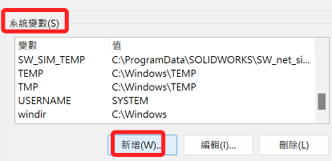
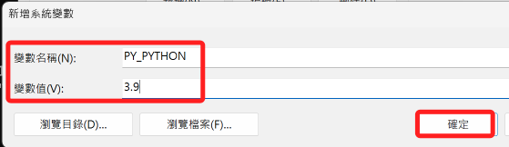
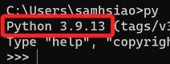
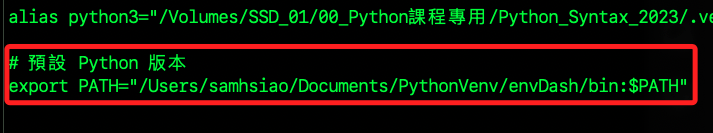
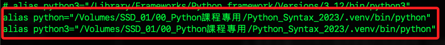

# 預設版本

_設置預設版本，僅供基礎了解使用，之後會透過虛擬環境來隔離開發環境的版本。_

<br>

## Windows

_Windows 系統裝機並未自帶 Python，這裡先忽略這件事，單就如何指定預設版本這個主題說明。_

<br>

1. 編輯系統環境變數。

    

<br>

2. 點擊 `環境變數`。

    

<br>

3. 在 `系統變數` 區塊點擊 `新增` 。

    

<br>

4. 進行新增：設定完成務必逐一確認並且退出。

    _變數名稱_
    ```ini
    PY_PYTHON
    ```
    _變數值_
    ```ini
    3.9
    ```

    

<br>

5. 重啟命令提示字元，輸入指令 `py` 再次查詢，可看到預設版本已經變更為 `3.9.13` 了。

    

<br>

6. 查詢版本。

    ```bash
    python --version
    ```

    

<br>

## MacOS

_三種原生方式設定 Python 預設版本_

<br>

### PATH

_用以定義系統尋找可執行文件的目錄順序，是一個全局的設定。_

<br>

1. 編輯環境參數。

    ```bash
    sudo nano ~/.zshrc
    ```

<br>

2. 假設使用某個環境作為預設的版本。

    ```ini
    export PATH="/Users/samhsiao/Documents/PythonVenv/envDash/bin:$PATH"   
    ```
    
    

<br>

3. 重新載入配置文件。

    ```bash
    source ~/.zshrc
    ```


<br>

### 別名 `alias`

_別名指向指定 Python 版本_

<br>

1. 可在環境參數文件 `~/.zshrc` 中進行指定。

    

<br>

2. `alias` 是在 Unix 和 Unix-like 系統中用來創建命令的快捷，可透過別名設定指向系統中的 Python 解釋器。

<br>

3. `alias` 還可為長命令或特定命令指定一個簡短的名稱。

<br>

### Symbolic Links

_將特定的 Python 版本鏈接別名_

<br>

1. 鏈接符號，用以將指定版本的 Python 指向指定的鏈接符號，請注意， Python 與 Python3 要分別做。

    ```bash
    ln -s /usr/local/bin/python3.10 /usr/local/bin/python
    ```

<br>

2. 假如符號已經存在，要先進行刪除，然後再指定一次。

```bash
rm /usr/local/bin/python
```

<br>

---

_END_