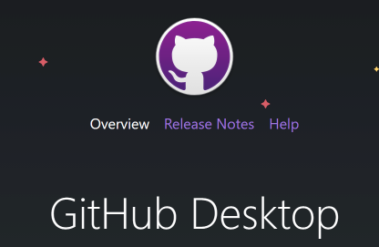
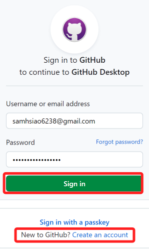

# 雲端工具

 

## Google Meet

    _線上會議與課程廣播工具_

 

## Github

    _版本控制工具_

    

1. [下載](https://desktop.github.com/)

 

2. 登入。

    

 

3. 選擇登入或註冊。

    

 

## Codespace

    _微軟的雲端開發工具_

 

## Colab

    _Google 的雲端開發工具_

 

---

_END_