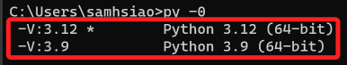
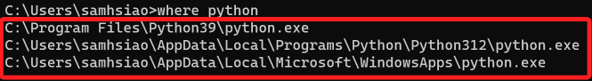

# 查詢當前 Python 環境

<br>

## Windows

1. 查詢當前 Python 版本。

    ```bash
    python --version
    ```

<br>

2. 查詢所有安裝的 Python 版本：請注意參數是數字的 `0`，`py` 是一個 Windows 平台特有的 Python 啟動器，用於管理和切換不同的 Python 版本。

    ```bash
    py -0
    ```

    

<br>

3. 搜索並顯示所有在環境參數的系統路徑（System PATH）上與 python 匹配的可執行文件路徑。

    ```bash
    where python
    ```
    
    

<br>

## MacOS

1. 查詢當前 Python 版本。

    ```bash
    python --version
    ```

<br>

2. 查詢安裝路徑：返回在你的 PATH 環境變數中找到的第一個名為 python 的可執行文件的路徑。

    ```bash
    which python
    ```

    

<br>

3. 查詢安裝路徑：列出所有在 PATH 環境變數中找到的匹配文件的路徑。

    ```bash
    which -a python
    ```

<br>

4. 搜索標準系統目錄中所安裝的 Python。

    ```bash
    whereis python
    ```

<br>

---

_END_


