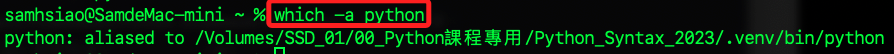
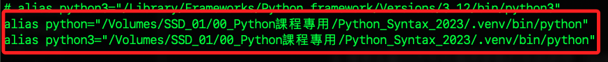

# 查詢當前 Python 環境

_Python 需要正確的版本以建立虛擬環境_

<br>

## Windows

1. 查詢當前 Python 版本。

    ```bash
    python --version
    ```

<br>

2. 查詢所有安裝的 Python 版本：請注意參數是數字的 `0`，`py` 是一個 Windows 平台特有的 Python 啟動器，用於管理和切換不同的 Python 版本。

    ```bash
    py -0
    ```

    

<br>

3. 搜索並顯示所有在環境參數的系統路徑（System PATH）與 python 匹配的可執行文件路徑。

    ```bash
    where python
    ```
    
    

<br>

## MacOS

1. 查詢當前 Python 版本。

    ```bash
    python --version
    ```

<br>

2. 查詢安裝路徑：返回在 PATH 環境變數中找到的第一個名為 python 的可執行文件的路徑。

    ```bash
    which python
    ```

    

<br>

3. 查詢安裝路徑：列出所有在 PATH 環境變數中找到的匹配文件的路徑。

    ```bash
    which -a python3
    ```

    

<br>

4. 若查詢 `Python`。

    ```bash
    which -a python
    ```

    

5. 搜索標準系統目錄中所安裝的 Python。

    ```bash
    whereis python
    ```

<br>

### 別名 Alias 

_`aliased`_

<br>

1. 在 `~/.zshrc` 中所指定的。

    

<br>

2. `alias` 是在 Unix 和 Unix-like 系統中用來創建命令的快捷，在以上查詢結果顯示，系統中 python3 和 python 都透過別名設定指向虛擬環境中的 Python 解釋器。

<br>

3. 以上得知，可透過 `alias` 指令系統預設 Python 所參考的版本為何。

<br>

### Alias、 PATH 以及 Symbolic Links

1. Alias：別名，是命令行的快捷方式，允許為長命令或特定命令指定一個簡短的名稱，例如為特定版本的 Python 創建一個 alias，這是局部的設定，僅影響當前用戶。

<br>

2. PATH：環境參數，用以定義系統尋找可執行文件的目錄順序，是一個全局的設定。

<br>

3. Symbolic Links：鏈接符號， 用以將指定版的 Python 指向指定名稱。

    ```bash
    ln -s /usr/local/bin/python3.10 /usr/local/bin/python3
    ```

<br>

---

_END_


