# 啟動之後

 

## 連結帳號

1. 點擊並展開左下角的人像，選取 `Backup and Sync Settings` 。

    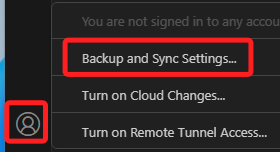

 

2. 預設全選，點擊 `Sign in`。

    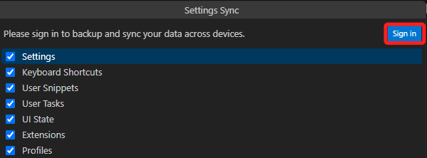

 

3. 使用 Github。

    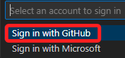

 

4. 開啟

    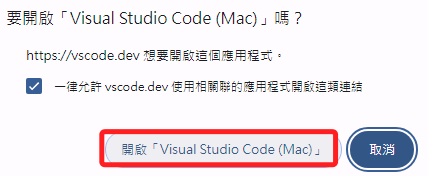

 

## 自動儲存

1. 開啟 VSCode 之後，展開左下角的齒輪圖標，點擊 `Settings`。

    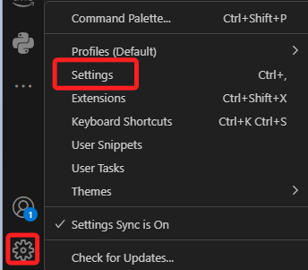

 

2. 第一個項目就是 `Auto Save`，設置為 `afterDelay` 表示會稍作延遲就儲存。這裡特別說明，之後我們在編輯 Dash 的網站時，因為本地服務器是即時更新，所以自動儲存會使得服務器判讀編輯到一半的相關語法是錯誤的，屆時會進行關閉。

    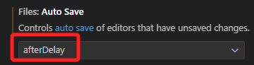

 

3. 當沒有自動儲存時，檔案發生變化後，頁籤上會出現白色圓點，按下 CTL+s 或 command+s 才會自動儲存。

    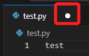

 

## 設置中文顯示

1. 點擊尺存圖標後選取第一個 `Command Palette` 
    
    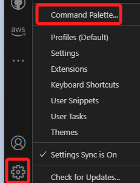

 

2. 輸入 `Display Language` 進行設置。

    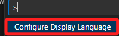

 
    
3. 選取繁體中文。

    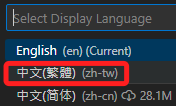

 

4. 設置語言必須重新啟動。

    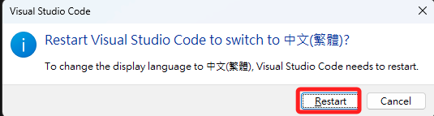

 

---

_END：啟動後大致完成至此即可_
