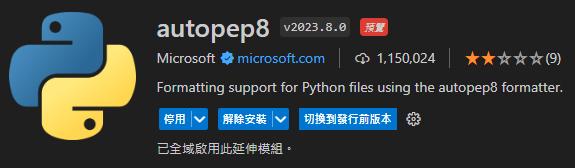

# 必要的模組

_或稱插件_

 

1. 點擊左側邊上的 `延伸模組` 功能圖標。

    

 

2. 進入後就會看到已經安裝以及推薦的插件。

    

 

---

_以下逐一介紹_

## Jupyter

 

## Flake8

_客觀說挺嚴謹的，可以 default 部分設置，如長度限制。_

 

## Black Formatter

 

## Live Server

_對這個課程來說很實用也會很常用_

 

## AWS Toolkit

_有點越來越不怎樣的感覺_

 

## IntelliCode

 

_會自動同時安裝_

 

## Autopep8

 

## Excel Theme

_安裝之後會變成綠色_

 

## Excel Viewer

_不喜歡綠色框可以改用這個_

 

---

_END：持續補充_