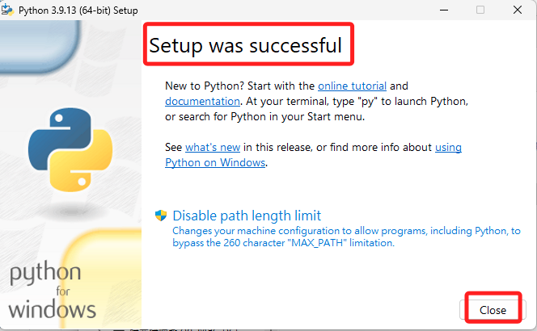
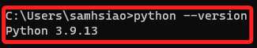

# 安裝 Python

<br>

## Windows

1. 官方  [下載](https://www.python.org/downloads/windows/)

    

<br>

2. 以系統管理員安裝

    

<br>

3. 務必勾選添加路徑，然後選擇客製化安裝

    

<br>

4. 點擊 `NEXT`

    

<br>

5. 勾選 `Install for all users`，就是因為要在這裡確認 `路徑中沒有中文`，所以選擇客製化安裝。

    

<br>

6. 安裝完成，關閉即可。

    

<br>

## 回到終端機

1. 查詢版本

    ```bash
    python --version
    ```

<br>

2. 就會是剛剛安裝完成的版本。

    


<br>

---

_END_