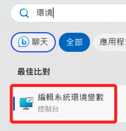
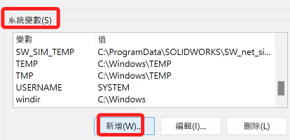
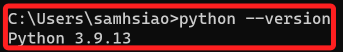
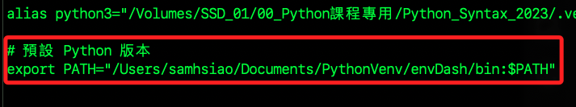

# 預設版本

## Windows

1. 編輯系統環境變數。

    

2. 點擊

    

3. 系統變數

    

4. 新增：設定完成務必逐一確認並且退出

    

5. 重啟命令提示字元之後再次查詢，會發現預設版本變動了。

    

6. 查詢版本

    ```bash
    python --version
    ```

    

## MacOS

1. 編輯環境參數。

    ```bash
    sudo nano ~/.zshrc
    ```

2. 假設使用某個環境作為預設的版本。

    ```ini
    export PATH="/Users/samhsiao/Documents/PythonVenv/envDash/bin:$PATH"   
    ```
    
    

3. 重新載入配置文件。

    ```bash
    source ~/.zshrc
    ```