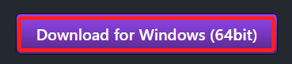
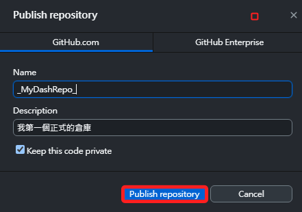
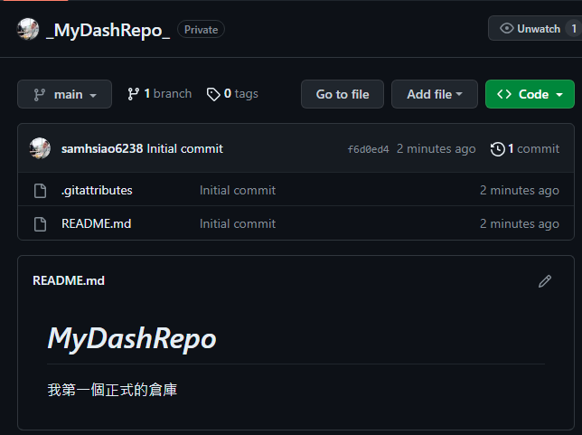

# 使用桌面管理工具

_強烈推薦要使用桌面管理工具進行輔助_

 

## 安裝

1. 前往 [官網下載](https://desktop.github.com/) 。

 

2. 依據作業系統選擇下載版本。

    

 

3. 安裝。

    

 

4. 安裝完成後登入。

    

 

5. 這時顯示的畫面如下，在不同系統中安裝或許會有所不同。

    

 

6. 選擇手動設置。

    

 

## 相關設定

1. 展開 File 可設定 Options。

    

 

2. 比如設置 Dark Mode。

    

 

3. 重新建立一個新的倉庫。

    

 

4. 輸入名稱、描述並且勾選 README.md 檔案，然後建立存放庫。

    

 

5. 發佈。

    

 

6. 確認資訊無誤後就發佈。

    

 

7. 在倉庫點擊右鍵會展開功能列表，選取 `View on Github` 查看。

    

 

8. 完成。

    

 

9. 再回到桌面應用，點擊右鍵後可在 VSCode 中開啟。

    

 

10. 如此便可正確的在倉庫的根目錄上開啟 VSCode 工作區。

    

 

---

_END_