# 版本控制

_Source Control_

<br>

## 安裝步驟

_Windows 與 MacOS 大致相同，除安裝的系統版本不同_

<br>

1. 在左側工具欄位中點擊 `原始碼控制` 圖標。

    

<br>

2. 第一次點擊需要安裝 `Git` 工具。

    

<br>

3. 開啟網頁進行下載。

    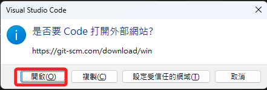

<br>

4. 依照所使用的系統選取版本，以下以 64 位元 Windows 版本的 Installer 作為示範。

    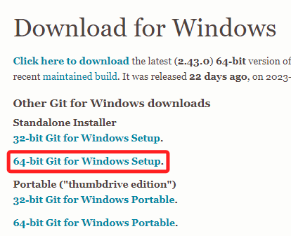

<br>

5. 在檔案管理員中以 `系統管理員身份` 進行安裝。

    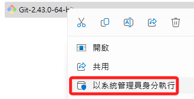

<br>

_以下步驟大多是以預設進行安裝_

<br>

6. NEXT。

    

<br>

7. 預設：路徑 + NEXT。

    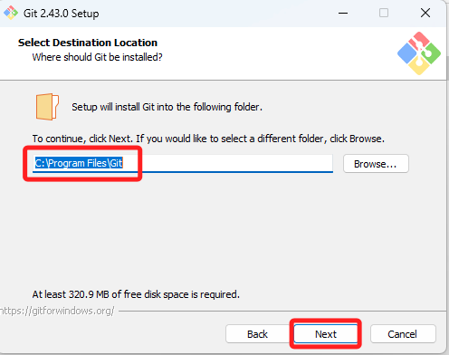

<br>

8. 預設。

    

<br>

9. 預設。

    

<br>


10. ⚠️ 單純因為不喜歡使用 Vim，所以選擇了 Visual Studio Code。

    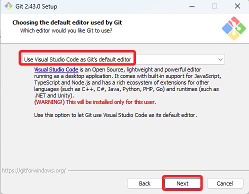

<br>

11. ⚠️ 選擇 `main` 作為預設的名稱。

    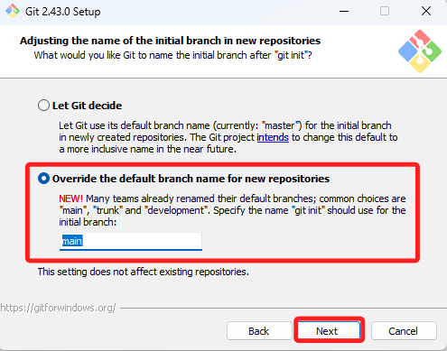

<br>

12. 預設。

    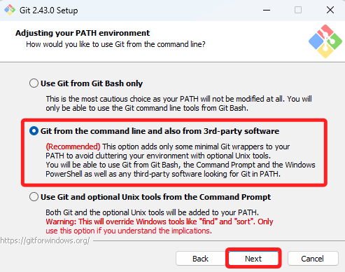

<br>

13. 預設。

    

<br>

14. 預設。

    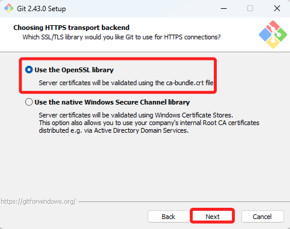

<br>

15. 預設。

    

<br>

16. 預設。

    

<br>

17. 預設。

    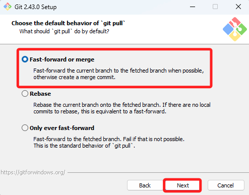

<br>

18. 預設。

    

<br>

19. ⚠️ 勾選 `允許符號連結`，性質類似於 Windows 系統的環境參數設置。

    

<br>

20. ⚠️ 兩項都要手動勾選，然後點擊安裝。

    

<br>

21. 完成。

    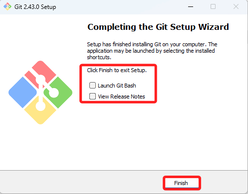

<br>

## 重新啟動

_完成以上步驟，重啟 VSCode。_

<br>

1. 展開 `原始檔控制` 圖標後點擊初始化存放庫（也稱倉庫）。
    
    

<br>

2. 輸入任意文字後點擊提交。

    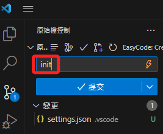

<br>

3. 這個錯誤警告是因為尚未設置帳號資訊，可點擊 `深入瞭解` 查看相關指令。

    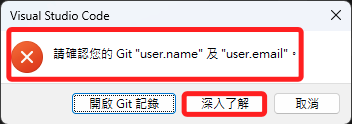

<br>

4. 要執行這兩個指令，替換自己的 name 及 email，假如沒有空格可以不用使用引號包覆字串。

    ```bash
    git config --global user.name "John Doe"
    git config --global user.email johndoe@example.com
    ```

    

<br>

5. 務必記得關閉原本的終端機、啟用新的終端機，然後按照自己的 name、email 輸入以下指令，指令輸入後不會顯示任何訊息。

    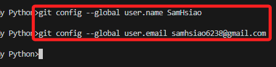

<br>

6. 再提交一次。

    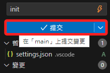

<br>

## 初次發佈

1. 發佈。

    

<br>

2. 可修改倉庫名稱，系統會自動依據命名改變遠端倉庫名稱。

    

<br>

3. 右下角會顯示相關訊息。

    

<br>

4. 選擇在瀏覽器中登入。

    

<br>

5. 直接成功，然後手動回到 VSCode。

    _這裡直接顯示成功可能是因為之前有登入，同學若有不同訊息則逐步完成登入即可。_

    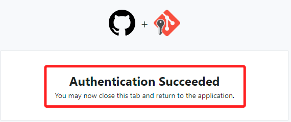

<br>

6. 顯示完成發佈，點擊開啟遠端倉庫進行查看。

    

<br>


## 在遠端倉庫進行編輯

<br>

1. 添加一個 README.md 檔案。

    

<br>

2. 編輯任意文字，然後點擊右上角的 `Commit changes`。

    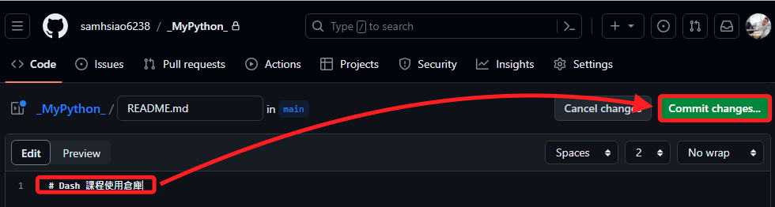

<br>

3. 編輯任意描述文字，點擊右下角的 `Commit changes`。

    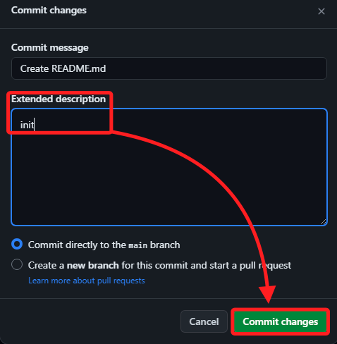

<br>

4. 回到 VSCode ，點擊原始檔控制圖標，會自動顯示有變更，點擊便可進行 Pull。

    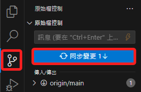

<br>

5. 在本地倉庫中已經將這個遠端的檔案拉下。

    

<br>

## 其他設置

1. 點擊三個小點展開。

    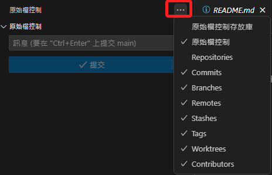

<br>

2. 可將所有項目皆進行選取。

    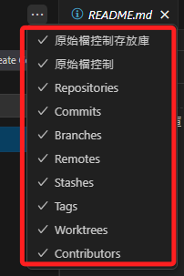

<br>

3. 特別注意，當滑鼠游標移動到原始檔控制上方的時候會出現三個點。

    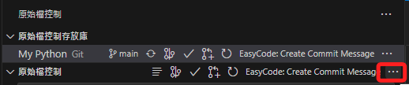

<br>

4. 展開後可發現相關的功能列表都在這裡。 

    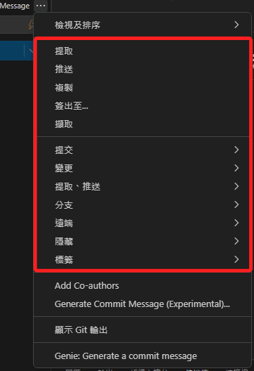

<br>

---

_END：以上暫且完成初次的同步_