# 版本控制

_Source Control_

<br>

## 安裝步驟

_Windows 與 MacOS 大致相同，除安裝的系統版本不同_

1. 在左側工具欄位中。

    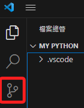

<br>

2. 第一次點擊開啟。

    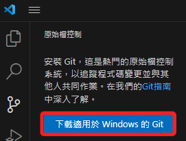

<br>

3. 開啟。

    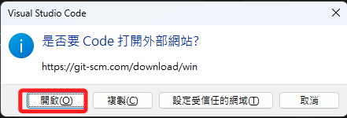

<br>

4. 依照系統選取了 64 位元 Windows 版本的 Installer。

    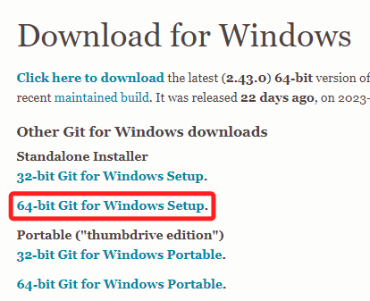

<br>

5. 以系統管理員身份安裝。

    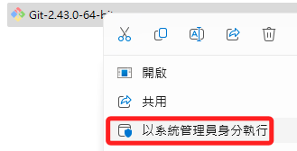

<br>

6. NEXT

    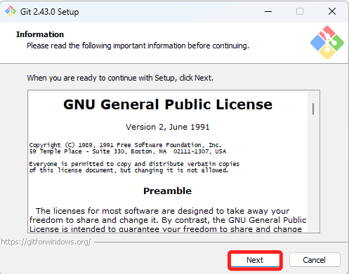

<br>

7. 預設路徑 + NEXT

    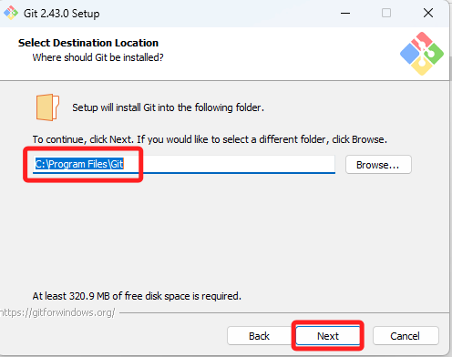

<br>

8. 預設

    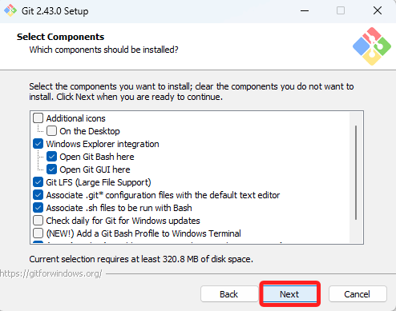

<br>

9. 預設

    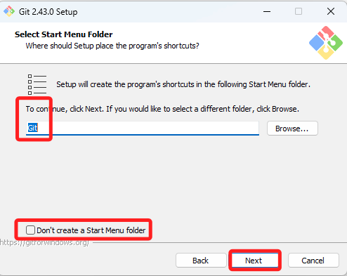

<br>

10. 單純因為不喜歡使用 Vim，所以選擇了 Visual Studio Code。

    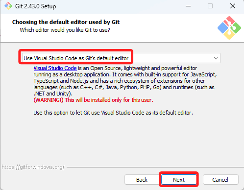

<br>

11. 選擇 `main` 作為預設的名稱。

    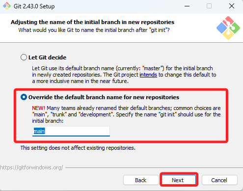

<br>

12. 使用預設。

    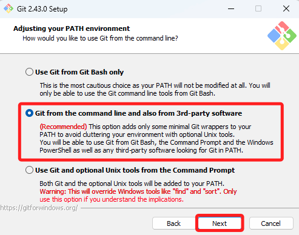

<br>

13. 使用預設。

    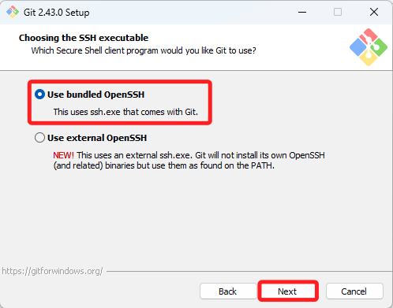

<br>

14. 使用預設。

    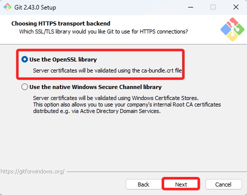

<br>

15. 使用預設。

    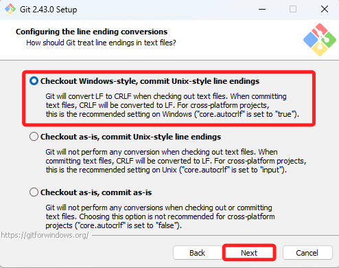

<br>

16. 預設。

    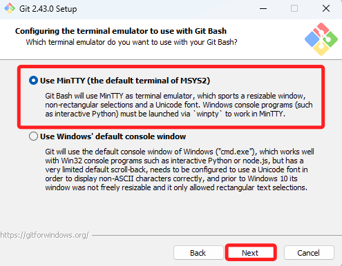

<br>

17. 預設。

    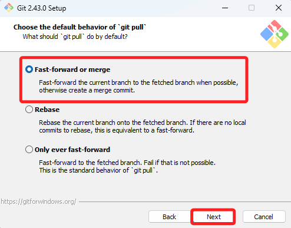

<br>

18. 預設。

    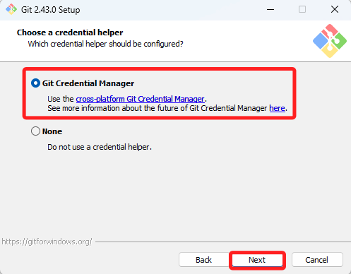

<br>

19. 終於動手勾選了一個預設沒有勾選的。

    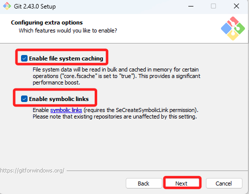

<br>

20. 勾選，然後安裝。

    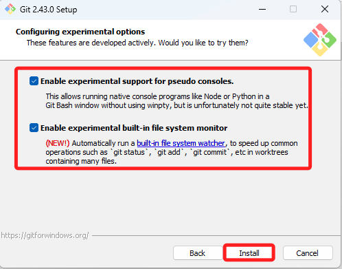

<br>

21. 完成。

    

<br>

22. 重啟 VSCode，然後選取 `原始檔控制`。


## 重新啟動

1. 點擊初始化倉庫。
    
    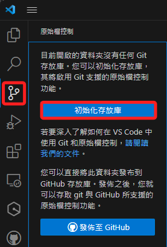

<br>

2. 輸入任意文字。

    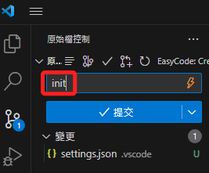

<br>

3. 尚未設置帳號資訊，點擊深入瞭解會提供相關指令。

    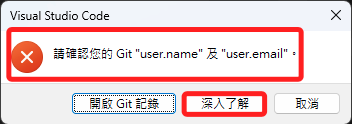

<br>

4. 要執行這兩個指令，替換自己的 name 及 email，假如沒有空格可以不用使用引號包覆字串。

    ```bash
    git config --global user.name "John Doe"
    git config --global user.email johndoe@example.com
    ```

    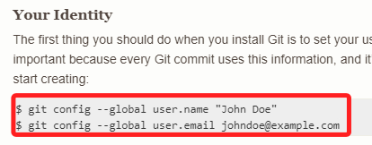

<br>

5. 務必記得關閉原本的終端機、啟用新的終端機，然後按照自己的 name、email 輸入以下指令，指令輸入後不會顯示任何訊息。

    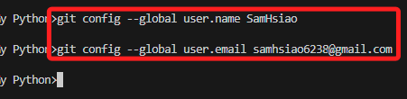

<br>

6. 再提交一次。

    

<br>

## 初次提交

1. 發布。

    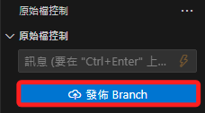

<br>

2. 可修改名稱，系統會自動依據命名改變遠端倉庫名稱。

    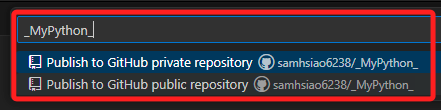

<br>

3. 右下角會顯示相關訊息。

    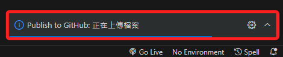

<br>

4. 選擇在瀏覽器中登入。

    

<br>

5. 會直接成功，然後手動回到 VSCode。

    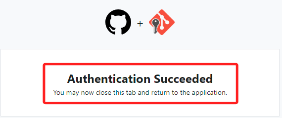

<br>

6. 完成部署，開啟遠端倉庫進行查看。

    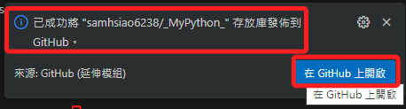

<br>

7. 添加一個 README.md 檔案。

    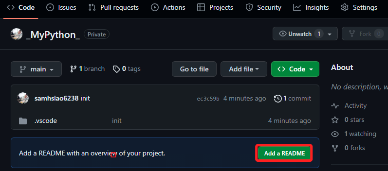

<br>

8. 編輯任意文字，然後點擊右上角的 `Commit changes`。

    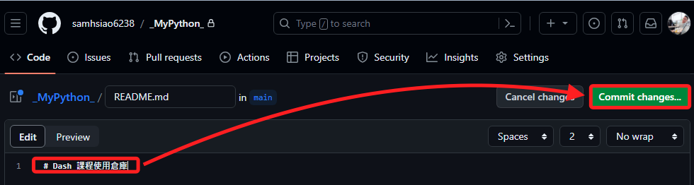

<br>

9. 編輯任意描述文字，點擊右下角的 `Commit changes`。

    

<br>

10. 回到 VSCode 點擊原始控制圖標，可進行 Pull。

    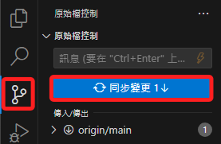

<br>

11. 在本地倉庫中已經將這個遠端的檔案拉下。

    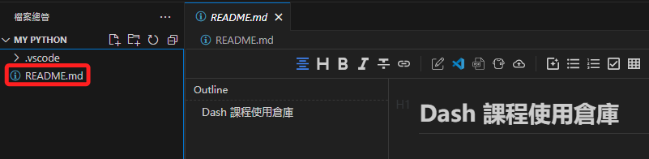

<br>

---

_END：以上暫且完成初次的同步_