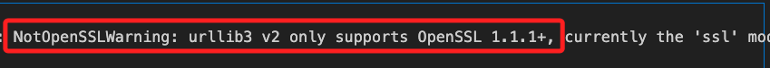
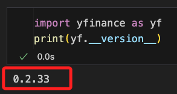
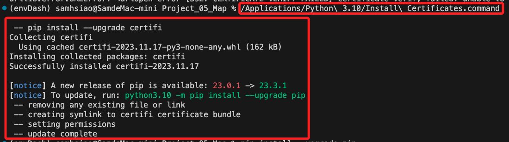

# SSL 相關

<br>

## NotOpenSSLWarning

1. 錯誤訊息。

   ```ini
   NotOpenSSLWarning: urllib3 v2 only supports OpenSSL 1.1.1+, currently the 'ssl' module is compiled with 'LibreSSL 2.8.3'.
   ```

   

<br>

2. 檢查版本

   ```python
   import ssl
   print(ssl.OPENSSL_VERSION)
   ```

   

<br>

3. MacOS 系統以 `brew` 更新方式進行排除。

   ```bash
   brew upgrade openssl
   ```

<br>

4. Windows 系統可參考 [官方網站](https://www.openssl.org/source/) 或直接從 [第三方網站下載](https://slproweb.com/products/Win32OpenSSL.html) 並安裝 OpenSSL 的最新版本。

<br>

5. 完成。

   

<br>

## SSL: CERTIFICATE_VERIFY_FAILED

1. 錯誤訊息。

    ```bash
    urllib.error.URLError: <urlopen error [SSL: CERTIFICATE_VERIFY_FAILED] certificate verify failed: unable to get local issuer certificate (_ssl.c:1007)>
    ```

<br>

2. 說明：SSL證書驗證失敗的問題，這通常發生在 Python 無法驗證所訪問網站的 SSL 證書時。

<br>

3. MacOS 排除方法。

    ```bash
    /Applications/Python\ 3.10/Install\ Certificates.command
    ```
    
    

<br>

4. 接著執行更新。

    ```bash
    python -m pip install --upgrade pip
    ```

<br>

5. 也可以直接禁用證書來排除：請注意這會降低安全性，只建議在信任的資料來源上使用。

    ```python
    #
    import ssl
    #
    ssl._create_default_https_context = ssl._create_unverified_context
    ```

<br>

---

_END
