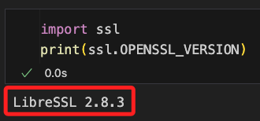

# 出現

<br>

## 說明

1. 出現關於 `SSL` 的問題。

    ```ini
    NotOpenSSLWarning: urllib3 v2 only supports OpenSSL 1.1.1+, currently the 'ssl' module is compiled with 'LibreSSL 2.8.3'.
    ```

    

<br>

2. 檢查版本

    ```python
    import ssl
    print(ssl.OPENSSL_VERSION)
    ```

    

<br>

3. MacOS 系統以 `brew` 更新方式進行排除。

    ```bash
    brew upgrade openssl
    ```

<br>

4. Windows 系統可參考 [官方網站](https://www.openssl.org/source/) 或直接從 [第三方網站下載](https://slproweb.com/products/Win32OpenSSL.html) 並安裝 OpenSSL 的最新版本。

<br>

5. 完成。

    

<br>

---

_END