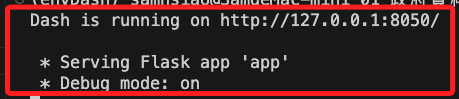
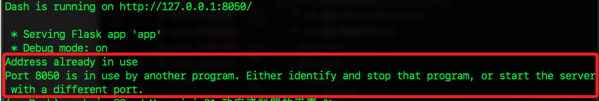
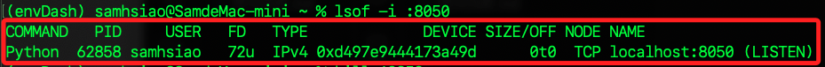
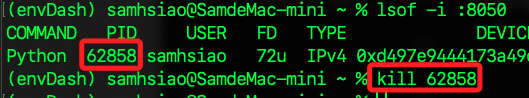

# 端口管理

因為 Dash Web 服務器涉及到在指定端口運行的情境，所以需要進行端口管理避免佔用。

<br>

## 說明

1. 服務器正常運行時，會顯示如下訊息。

    

<br>

2. 若出現端口佔用。

    

<br>

## Mac

1. 查詢指定端口如 `8050` 的使用狀況。

    ```bash
    lsof -i :8050
    ```

    

<br>

2. 停止佔用端口的進程 `PID`。

    ```bash
    kill <進程編號>
    ```

    

<br>

## Windows

1. 查詢指定端口如 `8050` 的使用狀況。

    ```bash
    netstat -ano | findstr :8050
    ```

<br>

2. 停止佔用端口的進程。

    ```bash
    taskkill /F /PID <進程編號>
    ```

<br>

---

_END_