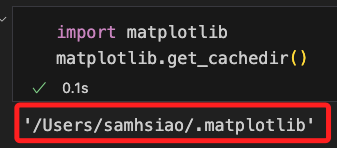
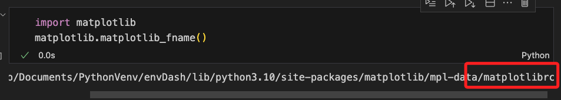

# matplotlib 繪圖的亂碼

<br>

## 說明

<br>

1. 出現亂碼的狀況很多，有時候甚至在透過 Python 執行 `.py` 檔案的時候可正常顯示中文字體，但是在運行 `.ipynb` 的時候卻是亂碼。

<br>

## 通用步驟

<br>

1. 檢查字體緩存文件路徑是否正確。

    ```bash
    ls ~/.matplotlib
    ```

<br>

2. 確認無誤，刪除字體緩存文件。

    ```bash
    rm -rf ~/.matplotlib
    ```

<br>

3. 也可以透過 Python 腳本查詢。

    ```python
    import matplotlib
    matplotlib.get_cachedir()
    ```

<br>

4. 結果與前步驟相同。

    

<br>

5. 修改 `matplotlibrc` 文件，先查看文件位置。

    ```python
    import matplotlib
    matplotlib.matplotlib_fname()
    ```

<br>

6. 結果如下。

    

<br>

7. 切換到路徑後再開啟 VSCode。

    ```bash
    cd /Users/samhsiao/Documents/PythonVenv/envDash/lib/python3.10/site-packages/matplotlib/mpl-data/ && code .
    ```
<br>

8. 針對以下部分進行修改，其餘維持註解狀態。

    ```python
    font.family:  sans-serif
    font.sans-serif: SimHei, DejaVu Sans, Bitstream Vera Sans, Computer Modern Sans Serif, Lucida Grande, Verdana, Geneva, Lucid, Arial, Helvetica, Avant Garde, sans-serif
    # 取消註解並設置為 False
    axes.unicode_minus: False
    ```

<br>

9. 網路下載 [SimHei.ttf 字型](https://github.com/StellarCN/scp_zh/blob/master/fonts/SimHei.ttf)。

    

<br>

10. 存放在以下路徑中。
    
    ```bash
    /Users/samhsiao/Documents/PythonVenv/envDash/lib/python3.10/site-packages/matplotlib/mpl-data/fonts/ttf/
    ```

<br>

11. 確認存在。

    ```bash
    ls /Users/samhsiao/Documents/PythonVenv/envDash/lib/python3.10/site-packages/matplotlib/mpl-data/fonts/ttf/SimHei.ttf
    ```

<br>

12. 腳本中添加代碼。

    ```python
    import matplotlib.pyplot as plt
    plt.rcParams["font.sans-serif"] = ["SimHei"]
    ```

<br>

13. 刷新字體緩存。

    ```bash
    fc-cache -fv
    ```

<br>

14. 假如尚未安裝 `fc-cache`，運行以下指定進行安裝。

    ```bash
    brew install fontconfig
    ```

<br>

15. 最後務必記得重新啟動 Jupyter Notebook。

<br>

___

_以上為完整程序，基本上應該都可以排除_