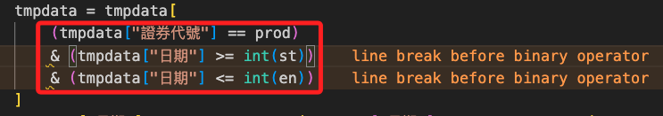

# 斷行

<br>

## 說明

1. 狀況

    

    ```python
    tmpdata = tmpdata[
        (tmpdata["證券代號"] == prod)
        & (tmpdata["日期"] >= int(st))
        & (tmpdata["日期"] <= int(en))
    ]
    ```

<br>

2. 以下這樣的修改在 Flake8 中是錯誤的，不過我個人是建議這樣排版，嚴格說來比較具有易讀性。

    ```python
    tmpdata = tmpdata[
        (tmpdata["證券代號"] == prod) &
        (tmpdata["日期"] >= int(st)) &
        (tmpdata["日期"] <= int(en))
    ]
    ```

<br>

3. 所以要在 settings.json 中將 `W504` 取消紅色警告。

    ```json
    {
        "flake8.args": [
            // 斷行規範
            "--ignore=E504"
        ],
    }
    ```

<br>

---

_END_