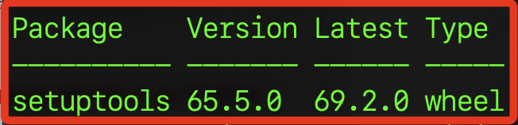

# 批次更新

<br>

## 說明

<br>

1. 列出所有可更新的庫。

    ```bash
    pip list --outdated
    ```

<br>

2. 會顯示已安裝並可更新的庫的當前版本以及最新版本。

    

<br>

3. 批次更新。

    ```bash
    # ：MacOS
    pip list --outdated | grep -v 'Package' | awk '{print $1}' | xargs -n 1 pip install -U

    # Windows
    pip list --outdated --format=freeze | %{$_.split('==')[0]} | %{pip install --upgrade $_}
    ```

<br>

___

_END_