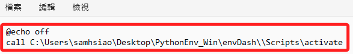
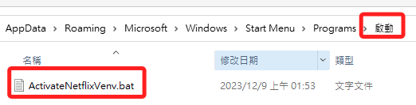

# 開機啟動虛擬環境

<br>

## Windows

1. 取得 `activate` 所在絕對路徑。

<br>

2. 建立批次檔，任意命名如 `ActivateNetflixVenv.bat` 。

<br>

3. 編輯內容。
    
    ```ini
    @echo off
    call .\<虛擬環境所在資料夾>\Scripts\activate
    ```

    

<br>

4. `Win + R` 輸入 `shell:startup`，將 `ActivateNetflixVenv.bat` 拖曳到這個資料夾中。

    

<br>

---

_END_