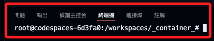
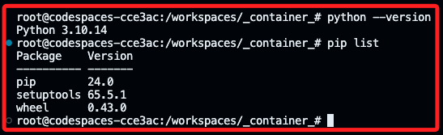
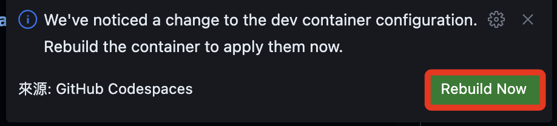
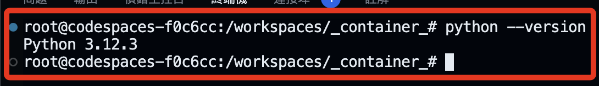
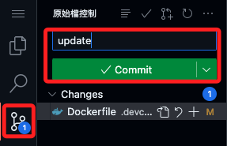
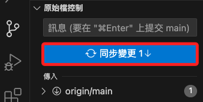
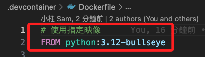
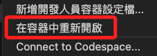
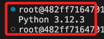

# 重建容器

_以下展示在遠端重建倉庫_

<br>

## 啟動 Codespace

1. 初次建立。

   

<br>

2. Codespace 會自動識別倉庫中的 `.devcontainer` 配置來建立開發環境，這包含 `devcontainer.json` 和 `Dockerfile` 。

   

<br>

3. 運行後等待完成連線會顯示如下視窗，接著可能會跳出關於插件安裝的視窗，特別注意，由於 Codespace 可能會有些限制導致插件未能正確安裝或使用。

   

<br>

4. 查詢版本與已套件。

    

<br>

_可知容器的重建伴隨 Codespace 啟動同步完成_

<br>

## 在遠端修改倉庫

_以更換 Python 版本號為例_

<br>

1. 進入 [Docker Hub](https://hub.docker.com/) 查詢可用的 Python 鏡像的版本號，正確的版本號可確保容器成功建立。

   

<br>

2. 在倉庫中開啟 `Dockerfile`，當前版本號是 `3.10-bullseye`，修改為 `3-12-bullseye`；特別注意，若參考官網的  `Dockerfile`  進行標準安裝會太耗時，以下採用簡易的自動化文件進行安裝即可。

   ```dockerfile
   # 使用指定鏡像
   FROM python:3.12-bullseye

   # 安裝必要庫
   RUN apt-get update && apt-get install -y git zsh && rm -rf /var/lib/apt/lists/*
   ```

<br>

3. 嘗試重新建立。

   

<br>

4. 重建完成後查詢版本號，會顯示新的版本號 `3.12.3`。

   

<br>

5. 提交更新後的文件並完成同步。

   

<br>

_回到 VSCode 中_

<br>

6. 在本機的 VSCode 中點擊 `Fetch`，假如點不到顯示更多 `...`，將導覽列橫向拉寬即可。

   

<br>

7. 完成同步。

   

<br>

8. 這時 Dockerfile 的版本已經更新。

   

<br>

9. 假如沒有連線容器，下選取 `在容器中重新開啟`。

   

<br>

10. 然後再次 `重建容器`。

   

<br>

11. 如此便完成容器的同步，版本號重新回到 `3.12.3`。

   

<br>

___

_以上完成將遠端倉庫同步到本地_