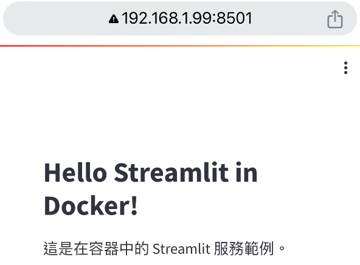

# 外部訪問

_從外部訪問容器中的 Streamlit 服務，使用之前的相同範例腳本 `app.py` 。_

<br>

1. 修改 `Dockerfile`，在容器建立時就啟動服務。

   ```Dockerfile
   # 使用指定鏡像
   FROM python:3.12-bullseye

   # 安裝必要庫，並清理快取以減少鏡像體積
   RUN apt-get update && \
       apt-get install -y git zsh && \
       rm -rf /var/lib/apt/lists/*

   # 設定工作目錄
   WORKDIR /app

   # 複製目前目錄內容到容器中的 /app
   COPY . /app

   # 安裝 Streamlit
   RUN pip install --no-cache-dir streamlit

   # 使得 8501 連接埠在容器外部可存取
   EXPOSE 8501

   # 在容器啟動時執行 Streamlit
   CMD ["streamlit", "run", "app.py"]
   ```

<br>

2. 修改 `docker-compose.yml`，因為文件中的 `command` 會覆蓋 `Dockerfile` 的 `cmd`，所以對其進行註解。

   ```yaml
   services:
   streamlit:
      build:
         # 使用 Dockerfile
         context: .
         dockerfile: Dockerfile
      # 當前目錄掛載位置
      volumes:
         - .:/app
      working_dir: /app
      ports:
         - "8501:8501"
      # command: streamlit run app.py
   ```

<br>

3. 可在 VSCode 中重建容器。

   

<br>

4. 如果想要禁用緩存，可先透過以下指令指定在建構鏡像的時候不使用緩存；特別注意，如果確實需要禁用緩存，就必須分開兩步驟運行，就是先 `build` 然後 `up`。

   ```bash
   docker-compose build --no-cache
   ```

<br>

5. 透過 `up` 啟動服務。

   ```bash
   docker-compose up -d
   ```

<br>

6. 完成時會顯示。

   

<br>

7. 透過宿主機的瀏覽器訪問。

   

<br>

8. 查詢宿主機的 IP。
   
   _MacOS_
   
   ```bash
   ifconfig
   ```

   _Windows_
   ```bash
   ipconfig
   ```

   

<br>

9. 從區網中的手機中訪問。

   

<br>

---

_END_