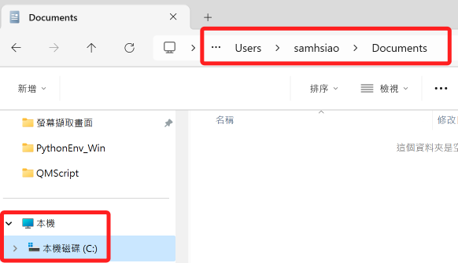
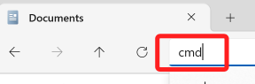
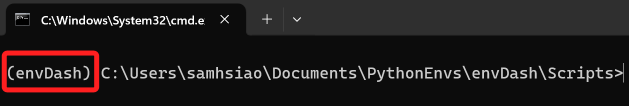

# 建立虛擬環境

<br>

## 基本介紹

1. 虛擬環境可以在不同系統與情境下建立與使用，例如在本機或雲端環境中建立，或是在不同作業系統如 MacOS、Windows 、Linux 等作業系統中建立。

<br>

2. 在本機建立虛擬環境的方式非常多，以下將介紹透過 Python 原生指令在全局建立虛擬環境，以及在 VSCode 中使用預設虛擬環境功能建立。

<br>

3. 與上一項相同，在雲端也可分為全局環境以及 Codespace 預設建立虛擬環境的指令。

<br>

## 共用指令

_Windwos 使用的 CMD 與 MacOS 使用的 Terminal 有不同操作指令，而其中有部分是相同的，以下無排序介紹。_

<br>

1. 退出虛擬環境。

    ```bash
    deactivate
    ```

<br>

2. 查詢 Python 版本。

    ```bash
    python --version
    ```

<br>

3. 建立資料夾。

    ```bash
    mkdir <資料夾名稱>
    ```

<br>

4. 切換路徑。

    ```bash
    cd <資料夾名稱>
    ```

<br>

## 在 MacOS 建立虛擬環境

1. 切換路徑到指定路徑如 `Documents`。

    ```bash
    cd ~/Documents
    ```

<br>

2. 建立並進入管理虛擬環境的資料夾如 `PythonEnvs`。

    ```bash
    mkdir PythonEnvs && cd PythonEnvs
    ```

<br>

3. 查詢當前版本。

    ```bash
    python --version
    ```

<br>

4. 建立虛擬環境。

    ```bash
    python -m venv envDash
    ```

<br>

5. 進入虛擬環境。

    ```bash
    cd envDash
    ```

<br>

6. 啟動虛擬環境。

    ```bash
    source ./bin/activate
    ```

<br>

## 在 Windows 建立虛擬環境

1. 開啟命令提示字元。

    

<br>

2. 從檔案管理員進入要建立虛擬環境的資料夾並點擊上方路徑。

    

<br>

3. 輸入 `cmd` 開啟終端機。

    

<br>

4. 建立並進入資料夾：統一管理虛擬環境。

    ```bash
    mkdir PythonEnvs && cd PythonEnvs
    ```

<br>

5. 查詢當前 Python 版本。

    ```bash
    python --version
    ```

<br>

6. 建立虛擬環境。

    ```bash
    python -m venv envDash
    ```

<br>

7. 進入虛擬環境的啟動腳本所在位置。

    ```bash
    cd envDash\Scripts
    ```

<br>

8. 啟動虛擬環境。

    ```bash
    activate
    ```

<br>

9. 啟動後在路徑前方會出現括號包覆的虛擬環境名稱，這就表示目前已經處在指定的虛擬環境中。

    

<br>

10. 特別說明，當然也可以使用絕對路徑啟動虛擬環境，這裡主要是讓同學知道虛擬環境的結構。

    ```bash
    Scripts\activate
    ```

<br>


## 在雲端