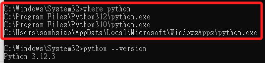
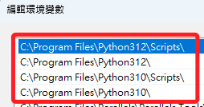
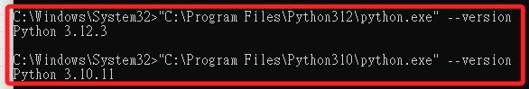
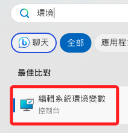
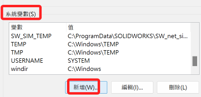
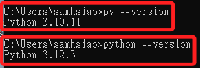
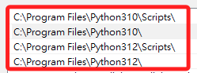
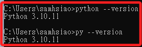
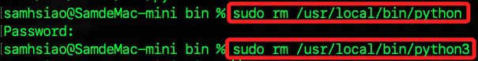
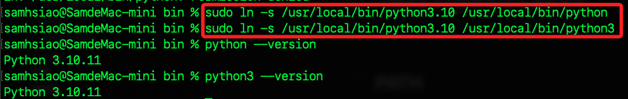

# 預設版本

_設置預設版本，僅供基礎了解使用，之後會透過虛擬環境來隔離開發環境的版本。_

<br>

## Windows

<br>

### 狀況說明

1. 當安裝兩個版本以上的 Python，系統會依據環境參數設置的先後順序來決定使用哪個路徑中的執行檔。

    

<br>

2. 透過環境參數設定可觀察順序。

    

<br>

3. 可透過絕對路徑來執行以獲取正確的版本。

    

<br>

4. 特別注意，因為預設路徑有空格，所以要將完整路徑以引號包覆。

    

<br>


### 新增系統變數

_透過 py 啟動器來執行_

<br>

1. 編輯系統環境變數。

    

<br>

2. 點擊 `環境變數`。

    

<br>

3. 在 `系統變數` 區塊點擊 `新增` 。

    

<br>

4. 進行新增：設定完成務必逐一確認並且退出。

    _變數名稱_
    ```ini
    PY_PYTHON
    ```
    _變數值_
    ```ini
    3.10
    ```

    

<br>

5. 重啟命令提示字元，輸入指令 `py --version` 再次查詢，可看到預設版本已經變更為 `3.10.11` ，特別注意，若執行 `python --version` 則依舊會以 `PATH` 中所設定的順序為主。

    

<br>

6. 若要透過環境變數設置來修改 `python` 指令的執行版本，必須更改 `PATH` 的順序來達成，如下將 `3.10.11` 的設置上移。



7. 查詢版本。

    ```bash
    python --version
    ```

    

<br>

## MacOS

_三種原生方式設定 Python 預設版本_

<br>

### PATH

_用以定義系統尋找可執行文件的目錄順序，是一個全局的設定。_

<br>

1. 編輯環境參數。

    ```bash
    sudo nano ~/.zshrc
    ```

<br>

2. 假設使用某個環境作為預設的版本。

    ```ini
    export PATH="/Users/samhsiao/Documents/PythonVenv/envDash/bin:$PATH"   
    ```
    
    

<br>

3. 重新載入配置文件。

    ```bash
    source ~/.zshrc
    ```


<br>

### 別名 `alias`

_別名指向指定 Python 版本_

<br>

1. 可在環境參數文件 `~/.zshrc` 中進行指定。

    

<br>

2. `alias` 是在 Unix 和 Unix-like 系統中用來創建命令的快捷，可透過別名設定指向系統中的 Python 解釋器。

<br>

3. `alias` 還可為長命令或特定命令指定一個簡短的名稱。

<br>

### Symbolic Links

_將特定的 Python 版本鏈接別名_

<br>

1. 鏈接符號，用以將指定版本的 Python 指向指定的鏈接符號，請注意， Python 與 Python3 要分別做。

    ```bash
    sudo ln -s /usr/local/bin/python3.10 /usr/local/bin/python
    ```

<br>

2. 假如符號已經存在，要先進行刪除。

    ```bash
    sudo rm /usr/local/bin/python
    ```

    

<br>

3. 然後記得重新指定。

    

<br>

---

_END_