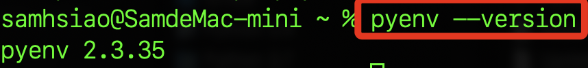
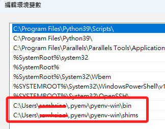
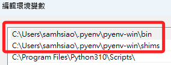
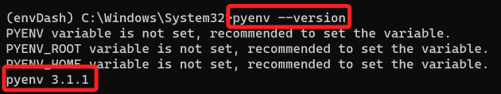
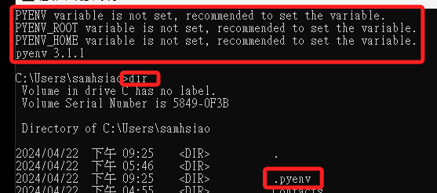
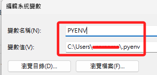
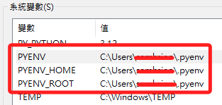
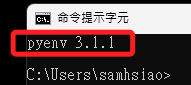
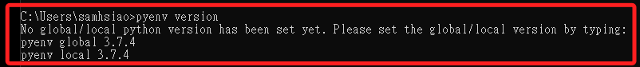

# pyenv

_可透過 pyenv 套件協助管理 Python 多版本安裝，至於版本的支配建議還是使用虛擬環境管理。_

<br>

## 說明

1. `pyenv` 是用於在 Unix-like 系統上管理多個 Python 版本的工具，而在 Windows 系統則使用另一個分支 `pyenv-win` 。

<br>

##  MacOS

1. 安裝。

    ```bash
    brew update && brew install pyenv
    ```

<br>

2. 檢查 pyenv 的版本。

    ```bash
    pyenv --version
    ```

    

<br>

3. 其餘指令與 Windows 相同，直接參考下方說明即可。

<br>

##  Windows

1. 使用 `pyenv-win` 這個專門為 Windows 環境設計的分支版本，可參考 [官網安裝說明](https://github.com/pyenv-win/pyenv-win/blob/master/docs/installation.md#python-pip)。

<br>

2. 安裝。

    ```bash
    pip install pyenv-win --target %USERPROFILE%\\.pyenv
    ```

<br>

3. 添加兩個環境參數：特別注意，假如還沒用 pyenv 安裝過 Python 的話， `shims` 資料夾還不存在。

    ```ini
    C:\Users\<使用者名稱>\.pyenv\pyenv-win\bin
    C:\Users\<使用者名稱>\.pyenv\pyenv-win\shims
    ```

    
    
    _上面畫紅線橫槓的部分是要提醒同學務必改為自己的帳號名_

<br>

4. 特別注意，pyenv 依賴於 shims 目錄來控制 Python 版本，所以要確保 shims 目錄的路徑在 PATH 環境變數中的其他 Python 安裝路徑之前，設定好路徑之後務必上移到頂部。

    

<br>

5. 檢查 pyenv 版本號：透過檢查版本可確認 pyenv 是否完成安裝。

    ```bash
    pyenv --version
    ```

    

<br>

6. 會顯示變數並未被設定，可先透過 `dir` 指令確認 `.pyenv` 路徑的絕對位置。

    

<br>

7. 設定三個系統變數 `PYENV`、`PYENV_HOME`、`PYENV_ROOT`，路徑設置為 `C:\Users\<使用者名稱>\.pyenv`，務必確保更換其中 `使用者名稱` 為自己的字串。

    

<br>

8. 設定完成顯示如下。

    

<br>

9. 再次運行 `pyenv --version` 查詢得到以下結果，不再有其他警告或提示。

    

<br>

## 使用說明

1. 列出所有可透過 pyenv 安裝的應用版本：不限於 Python。

    ```bash
    pyenv install --list
    ```

<br>

2. 目前使用的版本：會以安裝 pyenv 時使用的版本為預設版本。

    ```bash
    pyenv version
    ```

<br>

3. 目前已安裝的全部版本：指透過 pyenv 安裝的版本。

    ```bash
    pyenv versions
    ```

<br>

4. 初次執行會顯示如下提示。

    

<br>

5. 安裝指定版本：比如說 `3.9.0`。

    ```bash
    pyenv install 3.9.0
    ```

<br>

6. 指定全局版本。

    ```bash
    pyenv global
    ```

<br>

7. 指定當前目錄版本。

    ```bash
    pyenv local 3.9.0
    ```

<br>

## 補充

_`pyenv` 在管理 Python 版本時不會干涉系統自帶的 Python 版本_。

<br>

---

_END_