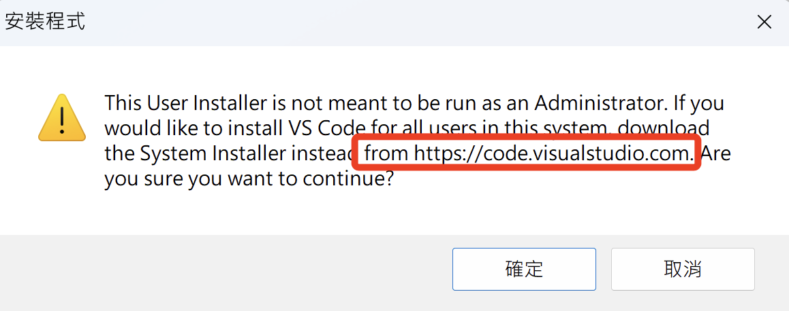
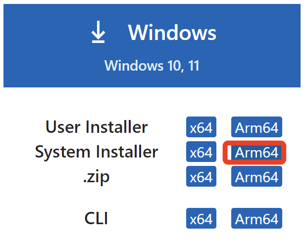
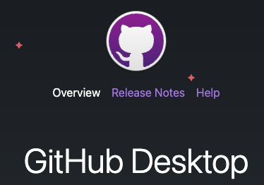
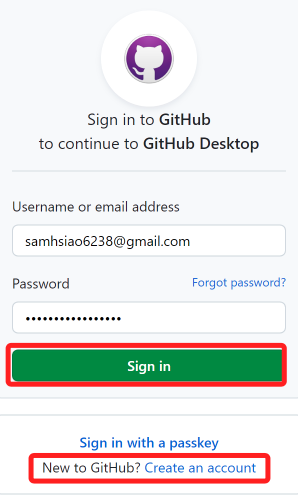
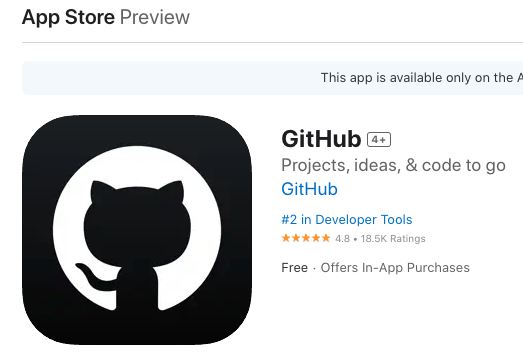

# 本機開發工具與軟件

_簡介安裝會在電腦上的開發工具。_

 

## VSCode

1. [官網](https://code.visualstudio.com/) 下載安裝。

    

 

2. Windows 用戶特別注意，假如安裝時出現以下訊息。

    

 

3. 返回下載頁面，重新下載對應版本即可。

    

_進行安裝時，過程皆採用預設設定即可。_

 

## GitHub Desktop

1. [官網](https://desktop.github.com/) 下載安裝。

    

 

2. 登入。

    

 

3. 選擇登入或註冊。

    

 

## 安裝 Githiub Mobil 手機應用

1. App Store

    

 

2. Google Play

    

 

---

_END_