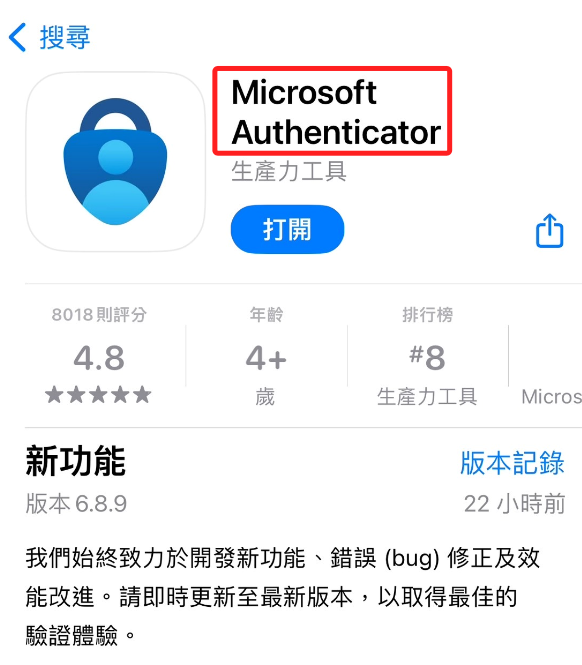

# 本機開發工具與軟件

_簡介安裝會在電腦上的開發工具。_

 

## VSCode

1. [官網](https://code.visualstudio.com/) 下載安裝。

    

 

2. Windows 用戶特別注意，假如安裝時出現以下訊息。

    

 

3. 返回下載頁面，重新下載對應版本即可。

    

_進行安裝時，過程皆採用預設設定即可。_

 

## GitHub Desktop

1. [官網](https://desktop.github.com/) 下載安裝。

    

 

2. 登入。

    

 

3. 選擇登入或註冊。

    

 

## 安裝 GitHub Mobil 手機應用

1. App Store

    

 

2. Google Play

    

 

## 安裝兩階段驗證工具

1. 特別注意， `Authenticator` 的 APP 很多，這裡推薦的是微軟的驗證工具。

    

 

2. 這個 App 可提供 `Microsoft、Google、FB、IG、Github、Twitch、ngrok、PyPI` 等等的軟件與服務作為驗證工具，實用性很高。

    

 

## 其他

1. Git CLI 將在後續步驟再進行安裝。

    

 

---

_END_