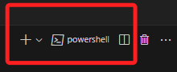
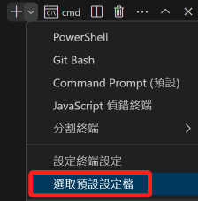
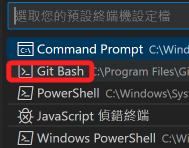
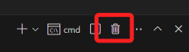
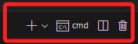

# Windows 使用 bash

 

## 步驟說明

1. 在 VSCode 開啟終端機。

    

 

2. 當前的預設 _可能是_ `powershell`。

    

 

3. 展開向下箭頭圖標，點擊 `選取預設設定檔`。

    

 

4. 上方導覽中選取 `Command prompt`，這就是 `cmd`。

    

 

5. 將開啟中的 `powershell` 刪除。

    

 

6. 再次開啟終端機，就會是熟悉的 `cmd` 了。

    

 

---

_END_