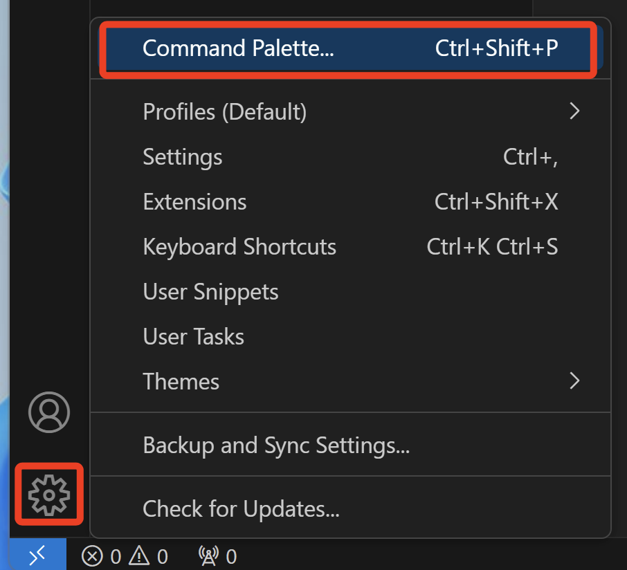
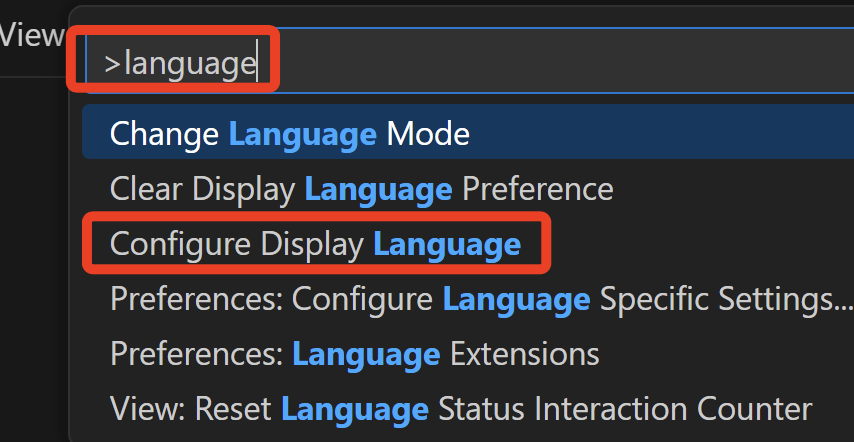
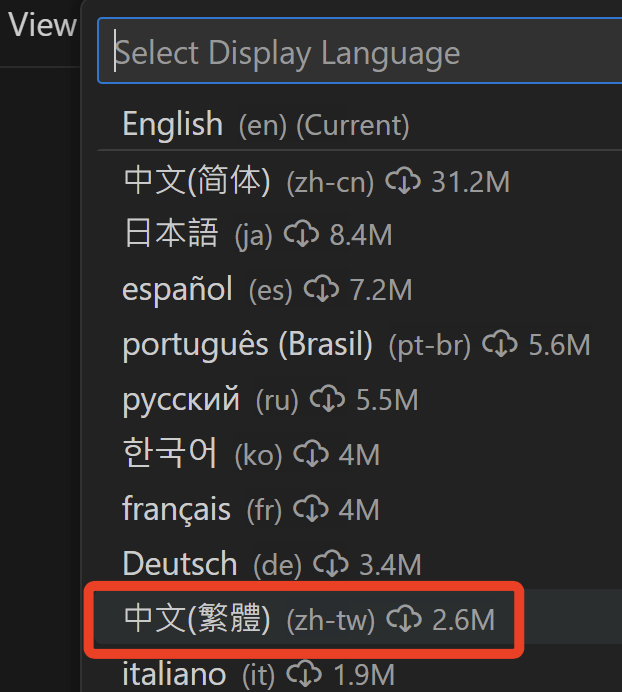
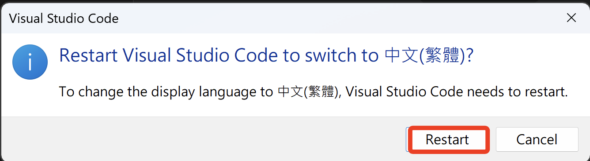

# 顯示語言

_基本設定_

 

1. 點擊左下角的齒輪，選取命令調色盤 `Command Palette`。

     

 

2. 輸入關鍵字 `language`，並選取 `Configure Display Language`。

    

 

3. 接著選擇想設定的語言，這裡以 `繁體中文` 為例。

    

 

4. 安裝好之後令其重新啟動即可。

    

 

___

_END_
