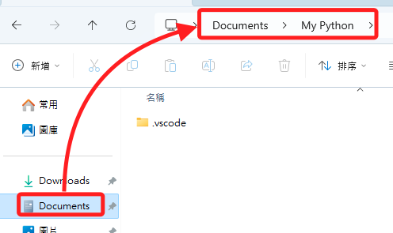
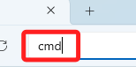
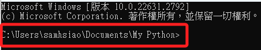
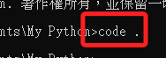
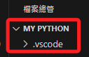
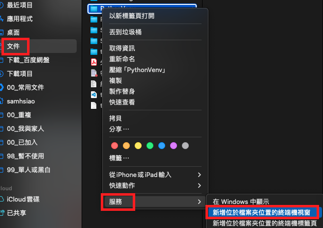
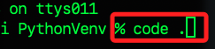
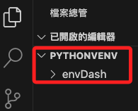

# 快速啟動

 

## Windows 啟動 VSCoode

1. 在檔案管理員中進入指定專案資料夾。

    

 

2. 輸入 `cmd` 。

    

 

3. 可快速啟動所在路徑的 CMD。

    

 

4. 輸入指令 `code .`。

    

 

5. 就會開啟指定目錄的工作區。

    

 

## MacOS 啟動 VSCode

1. 透過 Finder 在終端機中開啟指定路徑。

    

 

2. 同樣使用 `code .` 指令開啟 VSCode。

    

 

3. 同樣會開啟指定目錄的工作區。

    

 

---

_END_