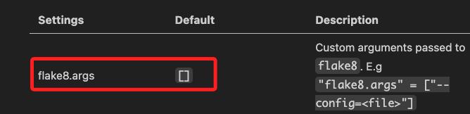
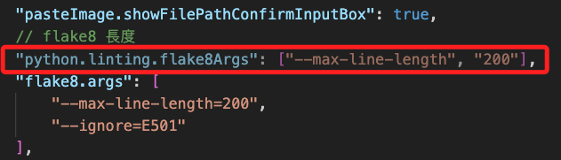

# VSCode 環境設定

<br>

## 從 VSCode 介面進行設置

1. 點擊左下角的齒輪可進入設定的介面操作。

    

<br>

2. 在面板進行各項的操作如 `Font Size`，會自動寫入預設的設置文件 `settings.json` 中。

    

<br>

3. 可以輸入 `settings` 後開啟設定文件查看與編輯。

    

<br>

## 自訂的設定

1. 先選定或建立一個專案資料夾如 `My Python`。

    

<br>

2. 在根目錄建立一個 .vscode 資料夾。
    
    

<br>

3. 在資料夾內建立一個 settings.json 設定檔案。

    

<br>

## 設定

_以 Flake8 插件為例_

<br>

1. 首先可參考插件說明。

    

<br>

2. 舊版的參數設置為 `python.linting.flake8Args`，若寫錯會呈現淡色。

    

<br>

3. 正確設置：Flake8 長度限制。

    ```json
    {
        "flake8.args": [
            "--max-line-length=200",
            // 要取消的其他項目代碼，以逗號相隔即可
            // "--ignore=E501, E502"
        ],
    }
    ```

<br>


## 其他設定

_不說明細節_


<br>

1. 關於插件 `PasteImage`。

    ```json
    {
        // 設定貼上相片的預設路徑
        "pasteImage.path": "${currentFileDir}/images/", 
        // 圖片前綴
        "pasteImage.namePrefix": "img_",
        // 預設名稱
        "pasteImage.defaultName": "0",
        // 已經存在就彈出視窗自訂名稱
        "pasteImage.showFilePathConfirmInputBox": true,
    }
    ```

<br>

---

_END：持續補充_