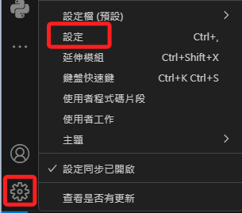
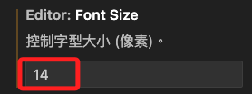
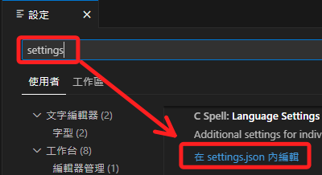
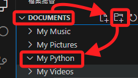
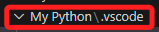

# VSCode 環境設定

<br>

## 從 VSCode 介面進行設置

1. 點擊左下角的齒輪可進入設定的介面操作。

    

<br>

2. 在面板進行各項的操作如 `Font Size`，會自動寫入預設的設置文件 `settings.json` 中。

    

<br>

3. 可以輸入 `settings` 後開啟設定文件查看與編輯。

    

<br>

## 自訂的設定

1. 先選定或建立一個專案資料夾如 `My Python`。

    

<br>

2. 在根目錄建立一個 .vscode 資料夾。
    
    

<br>

3. 在資料夾內建立一個 settings.json 設定檔案。

    

<br>

## 常用設定

1. Flake8 長度限制。

    ```json
    {
        // flake8 長度
        "python.linting.flake8Args": ["--max-line-length", "200"]
    }
    ```

<br>

---

_END：持續補充_