# VSCode 的終端機

_可使用多種不同的終端機_

<br>

## Windows 切換為 cmd

<br>

### 步驟說明

1. 在 VSCode 開啟終端機。

    

<br>

2. 當前的預設 _可能是_ `powershell`。

    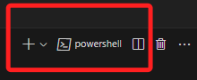

<br>

3. 展開向下箭頭圖標，點擊 `選取預設設定檔`。

    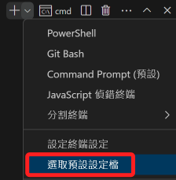

<br>

4. 上方導覽中選取 `Command prompt`，這就是 `cmd`。

    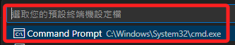

<br>

5. 將開啟中的 `powershell` 刪除。

    

<br>

6. 再次開啟終端機，就會是熟悉的 `cmd` 了。

    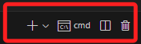

<br>

### 在 Windows 中使用 Bash

_若慣用 MacOS 的 Bash 或 Z Shell，可切換為 Git Bash，Windows 預設的系統中並未安裝。_

<br>

1. 進入 [官網](https://git-scm.com/) 進行下載，假如使用的是 Windows 系統將會看到以下畫面。

    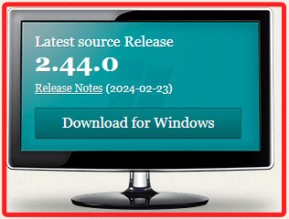

<br>

2. 可依據系統版本進行下載，針對下載安裝檔的操作可參考後續筆記的 [說明](https://github.com/samhsiao6238/PythonFinance_2024/blob/main/D01_準備工作/03_Git%20版本控制/01_初次安裝.md)。

    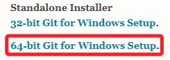

<br>

3. 這裡示範在 cmd 或 Powershell 中使用指令進行下載並安裝。

    ```bash
    winget install --id Git.Git -e --source winget
    ```

<br>

4. 安裝成功會看到以下訊息。

    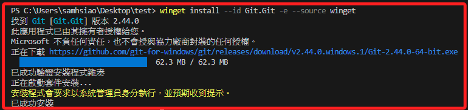

<br>

5. 若要使用手動設定預設終端機，可透過指令查詢安裝路徑。

    ```bash
    where git
    ```

<br>

6. 預設路徑如下。

    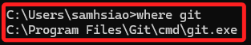

<br>

7. 重新開啟 VSCode 進行前述終端機設定，就會多了 Git Bash 選項。

    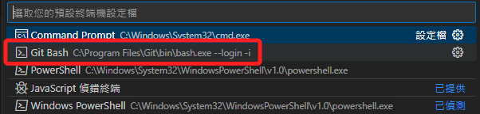

<br>

8. 完成時顯示。

    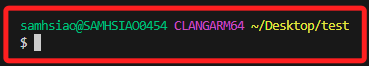

<br>

9. 就可以在 Windows 中使用 Unix shell 的指令了。

    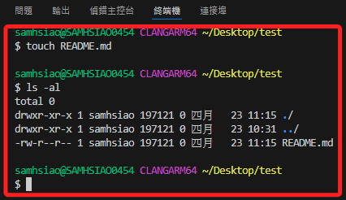

<br>

___


_END_